El post de hoy se basa en algo en lo que he estado reflexionando últimamente y me gustaría compartir contigo:

## ¿Por qué estoy aprendiendo código y tu también deberías?

En el blog suelo hablar de marketing y negocio de videojuegos, y si bien es cierto que en la actualidad puedes realizar casi cualquier cosa sin tocar una línea de código, es precisamente así porque alguien lo ha programado. Existe un código que te permite no tener que escribir código. Si tienes la capacidad de modificar el código (no estoy hablando ni siquiera de crearlo, sino de entenderlo) puedes conseguir cosas increíbles.

Es algo complicado de explicar sin embargo mi visión es la siguiente:

## \[bctt tweet="Aprender a programar será tan importante en 5 años como saber Inglés"\]

En la actualidad la mayoría de las cosas funcionan por ordenador, en el futuro casi todo estará robotizado o automatizado. ¡Adivina qué lenguaje usa un ordenador! Los ordenadores funcionan con código, el código va a convertirse en uno de los mayores lenguajes del mundo.

Ta vez pienses que se me ha ido la cabeza un poco, pero párate a pensar. ¿No tiene lógica entender el lenguaje con el que todo va estar automatizado en el futuro todo?

Pensando en qué te puede beneficiar ahora mismo existen varias razones por las que creo firmemente que aprender a escribir código es una decisión correcta.

## 7 Razones para aprender a programar

\[caption id="attachment_1277" align="aligncenter" width="300"\] Situación normal tras intentar entender PHP por primera vez\[/caption\]

### 1- Saber código es como saber de electricidad

Se lo puedes pedir a alguien pero vas a tener que pagar dinero por algo que puedes aprender a hacer dedicando un poco de tiempo.

### 2- El código te obliga a pensar de una manera lógica

Pensar como lo hace un ordenador te ayuda a entender cómo funcionan, entender como los ordenadores dividen las tareas y el funcionamiento lógico de éstas te puede ayudar en tu vida diaria. Dividir tareas que parecen colosales en pequeñas victorias ayuda a conseguir los objetivos.

### 3- Saber código te otorga poder

No necesito de nadie para poder cambiar el color de mi blog, tengo el poder de poder hacer un rediseño mi blog sin tener que pedírselo a nadie. Si se me ocurre una nueva idea, tengo la posibilidad de construir un prototipo sin depender de nadie.

### 4- Se abre un mundo nuevo de posibilidades

Cuando entiendes el funcionamiento del código, es parecido a cuando entiendes por primera vez una conversación en Inglés o aprender a tocar la primera canción con un instrumento, el mundo esta a tus pies únicamente tienes que seguir caminando.

### 5- El código hace mucho mejor las tareas repetitivas que tú

Tienes que hacer cada día 10 tareas que te llevan 30 minutos, aprender a programar y crea en una semana una aplicación que lo haga por ti por el resto de tu vida.

### 6- Aprender código puede suponer hacer tus propios juegos wow!

Dime que no te gustaría poder hacer tu propio juego, aunque fuese uno tan cutre como el que hice yo.

### 7- La mayoría de los CEO de las compañías de tecnología tienen un pasado relacionado con la programación

Casi todos tiene un background técnico, no es por casualidad, entienden mejor que nadie el funcionamiento de sus productos y además tienen la visión de hacia dónde quieren llevarlo.

## ¿Qué tipo de lenguaje de programación debo aprender?

Existen muchas más razones por las que aprender a escribir código me parece una idea inteligente en la actualidad, no te voy a mentir, estoy aprendido a escribir y entender código y es muy complicado. Voy a necesitas mucho esfuerzo, tenacidad y motivación para hacerlo, las tengo y lo voy a hacer. No quiero volverme el mejor programador, pero **quiero tener la suficiente confianza en mi mismo en los apartados técnicos como para saber que voy a entender a un programador cuando me cuenta un problema**.

Una duda que va a surgir una vez te has decidido a aprender es elegir el tipo de lenguaje de programación, existe muchos y cada uno de ellos se especializa en algo diferente, por ello me gustaría enseñaros las siguientes imágenes para que os os resulte más fácil decidiros.

### PHP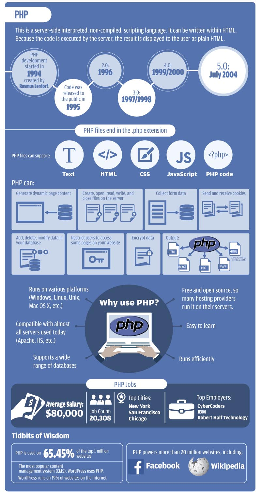

### OBJETIVE C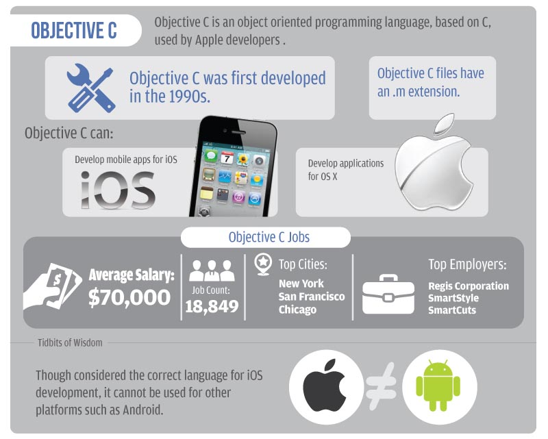

### SQL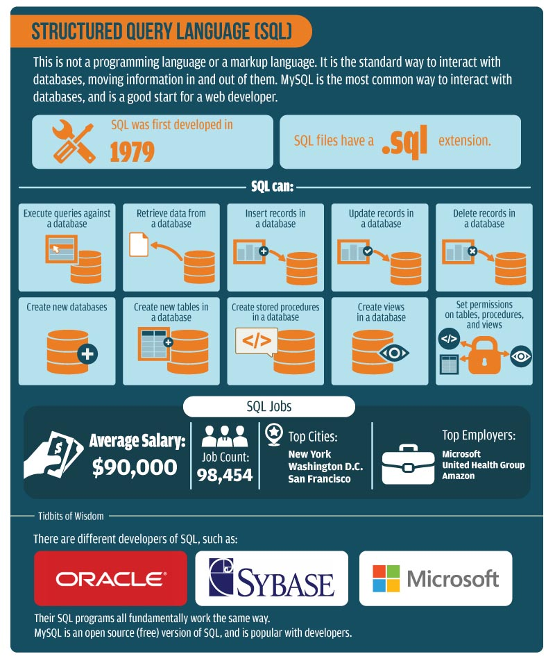

### PYTHON  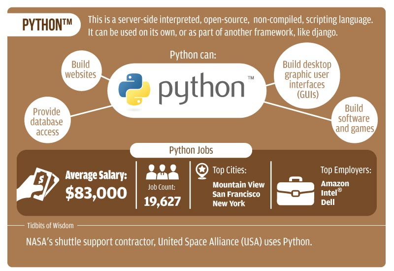

### RUBY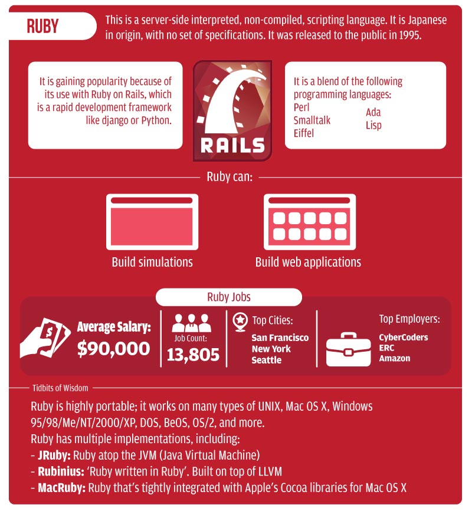

### JAVASCRIPT 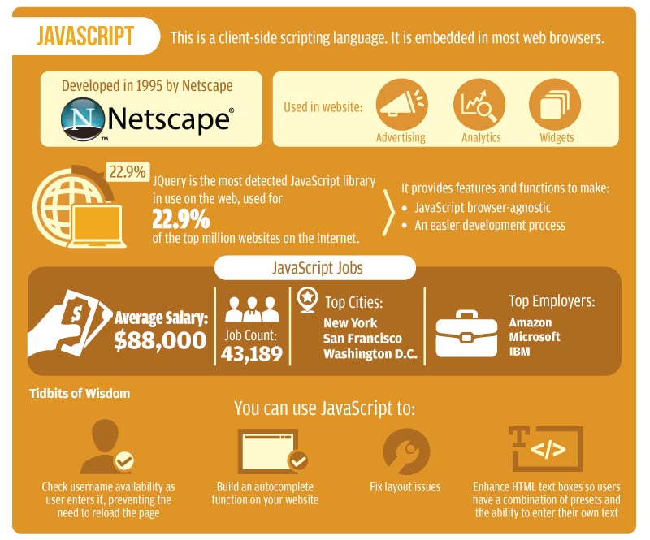

### JAVA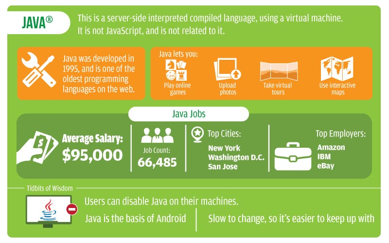

### C++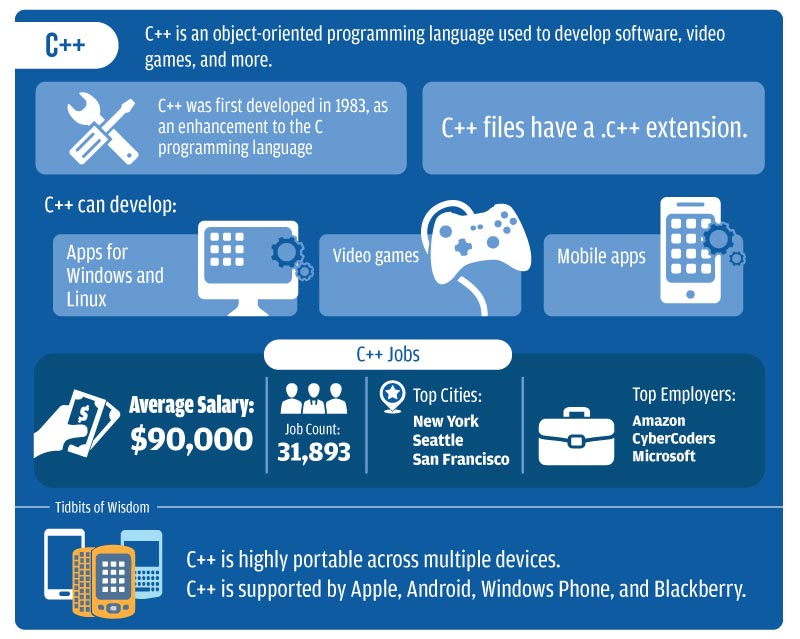

### ASP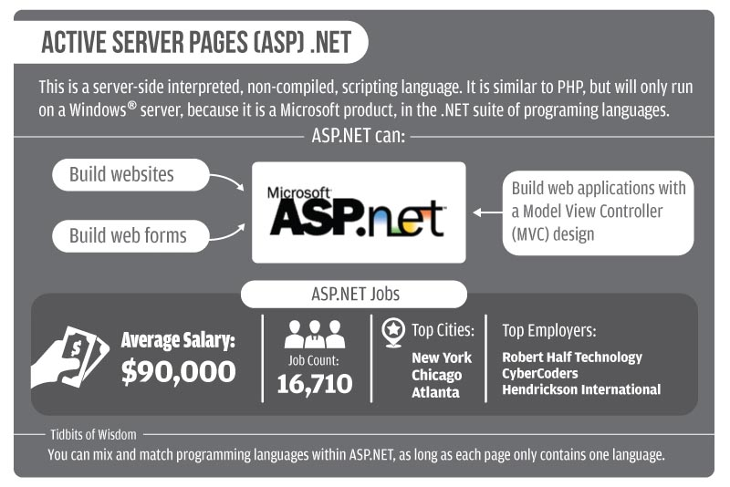

### AJAX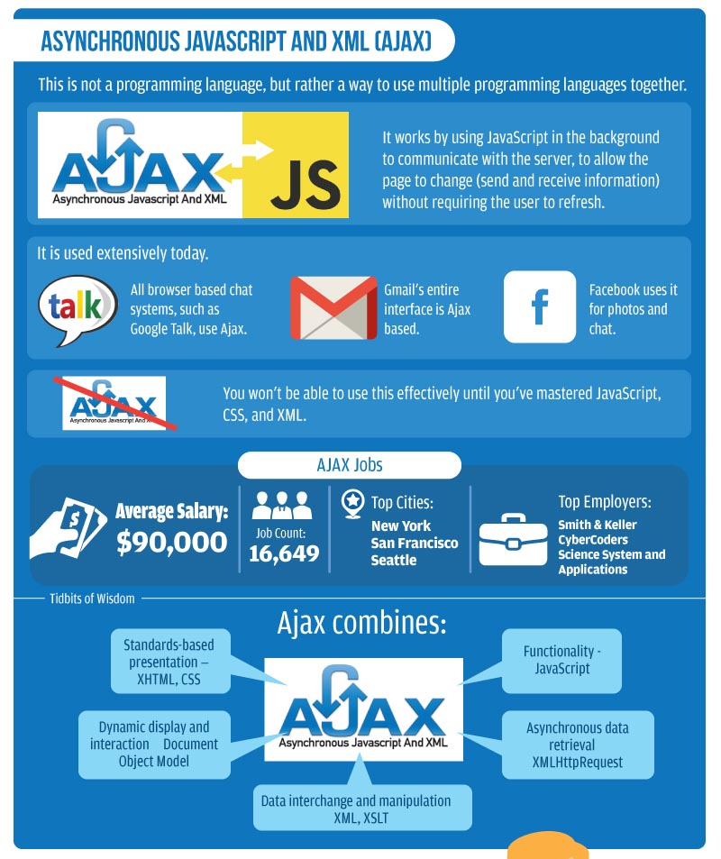

### Como comentamos antes, dependido del tipo de cosas que quieres hacer se deben elegir un tipo de lenguaje u otro, en la siguiente imagen podéis ver según el camino que queráis seguir el lenguaje más conveniente.

### 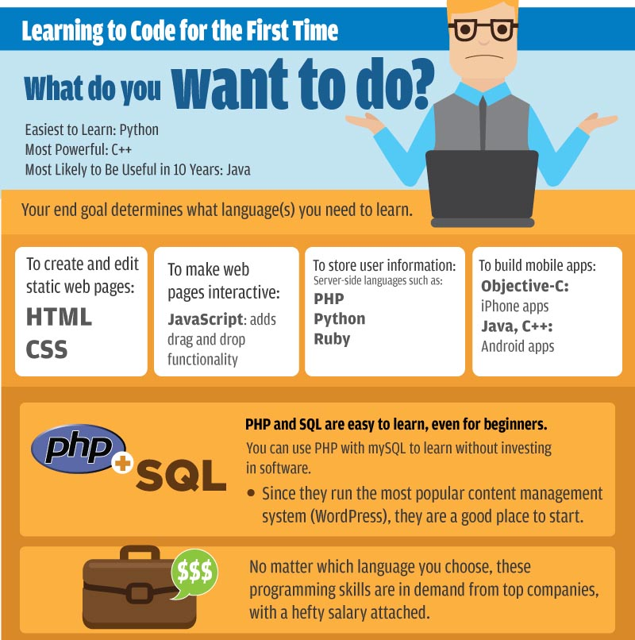](http-You-Learn.jpg)Fuente infografías: [Whoishostingthis](http://www.whoishostingthis.com/blog/2014/09/04/learn-to-code/)

Una vez elegido el lenguaje de programación que queremos aprender podemos acudir a diversas fuentes para empezar, en ésta lista encontraréis suficientes recursos como para aprender de manera básica el funcionamiento de los diferentes lenguajes de programación.

## Páginas para aprender a escribir código:

**\-[Codeacademy](https://www.codecademy.com/es/learn)** es para todos aquellos que queráis empezar, sin duda la mejor opción, es gratuita y ofrece cursos de la mayoría de lenguajes que hemos visto, muy recomendada.

**\-[Dash](https://dash.generalassemb.ly)** es similar a Codeacademy pero menos completa, merece la pena darle un vistazo, es gratis.

**\-[FreeCode Camp](http://freecodecamp.com/)** es un proyecto muy interesante, aprendes código a la vez que construyes aplicaciones para organizaciones sin ánimo de lucro ahorrando a dichas organizaciones dinero. Gratuita.

**\-[The Odin Project](http://www.theodinproject.com)** es un proyecto muy completo para aprender durante un curso de unas 1000 horas (6 meses a 40 horas semanales) todo lo básico sobre programación con especial énfasis en Ruby.

**\-[Udacity](https://www.udacity.com)** ofrece cursos muy completos sobre todo tipo de temáticas, son de pago y ofrecen muy buen contenido.

**\-[TreeHouse](https://teamtreehouse.com/)** es una comunidad de pago, por 25$/mes el pack básico o 50$/mes el pack premium entras en una comunidad donde puedes aprender a crear apps o videojuegos.

\-**[Stuk.io](https://stuk.io/)** es similar a TreeHouse, por 15$/mes o 37$/mes puedes aprender a crear un marketplace o una dating app.

**\-[Code4Startup](https://code4startup.com)** te enseña a crear aplicaciones web de diferente tipo, muy interesante, tienen cursos de pago y gratis.

**\-[One Month](https://onemonth.com/)**, como dice el nombre, cursos que te permiten en un mes tener un conocimiento básico sobre diferentes especialidades de programación.Los cursos son de pago.

Ahora solo falta una cosa, la motivación. Para ello te aconsejo escuchar éste podcast donde [Víctor Martín](http://victormartinp.com/) entrevista a [Víctor Campuzano](http://www.vcgs.net/blog/), todo un ejemplo de motivación.

<iframe src="https://w.soundcloud.com/player/?url=https%3A//api.soundcloud.com/tracks/187236142&amp;color=ff5500&amp;auto_play=false&amp;hide_related=false&amp;show_comments=true&amp;show_user=true&amp;show_reposts=false" width="100%" height="166" frameborder="no" scrolling="no"></iframe>

Un abrazo y espero que el post os haga reflexionar sobre algo muy importante, entender la importancia de estar atentos al futuro cercano y adelantarte a las habilidades que vas necesitar.

Si el post te ha gustado me haces un gran favor compartiéndolo en redes sociales para llegar a más gente.
