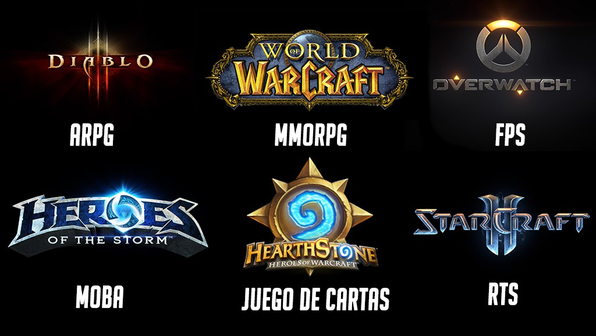

En el post de hoy me gustaría tocar un tema que me parece muy interesante, una de las estrategias que esta usando Blizzard para promocionar sus videojuegos. Y no es otra que usar cada una de sus franquicias como trampolín para la otra.

Pongamos un poco de contexto para entender mejor la estrategia.

## [Blizzard Entertainment](http://blizzard.com/)

_**Blizzard Entertainment, Inc.** es una empresa [desarrolladora](https://es.wikipedia.org/wiki/Desarrollador_de_videojuegos 'Desarrollador de videojuegos') y [distribuidora](https://es.wikipedia.org/wiki/Distribuidor_de_videojuegos 'Distribuidor de videojuegos') de [videojuegos](https://es.wikipedia.org/wiki/Videojuegos 'Videojuegos') [estadounidense](https://es.wikipedia.org/wiki/Estadounidense 'Estadounidense') con sede en [Irvine](https://es.wikipedia.org/wiki/Irvine_%28California%29 "Irvine (California)"), [California](https://es.wikipedia.org/wiki/California 'California') y fundada el 1 de junio de 1994. Conocida y fundada originalmente como **Silicon & Synapse** en 1991, la empresa comenzó realizando [portabilidades](https://es.wikipedia.org/wiki/Portabilidad 'Portabilidad') de juegos para otros estudios antes de desarrollar sus propios videojuegos en 1993, entre los que destacaron [Rock N' Roll Racing](https://es.wikipedia.org/wiki/Rock_N%27_Roll_Racing "Rock N' Roll Racing") y [The Lost Vikings](https://es.wikipedia.org/wiki/The_Lost_Vikings 'The Lost Vikings'). En 1994 la compañía se renombró **Blizzard Entertainment, Inc.**, su nombre actual, y poco después lanzó su primer gran éxito comercial, [Warcraft: Orcs & Humans](https://es.wikipedia.org/wiki/Warcraft:_Orcs_%26_Humans 'Warcraft: Orcs & Humans'). Desde entonces, Blizzard ha logrado cosechar un gran éxito con las sagas [Warcraft](https://es.wikipedia.org/wiki/Warcraft 'Warcraft'), [Diablo](https://es.wikipedia.org/wiki/Diablo_%28videojuego%29 'Diablo (videojuego)') y [StarCraft](https://es.wikipedia.org/wiki/StarCraft_%28serie%29 'StarCraft (serie)'), así como el [MMORPG](https://es.wikipedia.org/wiki/MMORPG 'MMORPG') [World of Warcraft](https://es.wikipedia.org/wiki/World_of_Warcraft 'World of Warcraft'), convirtiéndose en un referente de los géneros de [estrategia en tiempo real](https://es.wikipedia.org/wiki/Estrategia_en_tiempo_real 'Estrategia en tiempo real')[3](https://es.wikipedia.org/wiki/Blizzard_Entertainment#cite_note-b20-3) y MMORPG.\_

_El 9 de julio de 2008, [Activision](https://es.wikipedia.org/wiki/Activision 'Activision') se fusionó con [Vivendi Games](https://es.wikipedia.org/wiki/Vivendi_Games 'Vivendi Games'), incluyendo a Blizzard en la compañía resultante, [Activision Blizzard](https://es.wikipedia.org/wiki/Activision_Blizzard 'Activision Blizzard'), pese a que Blizzard Entertainment se mantiene como una compañía que se gestiona de manera independiente.[4](https://es.wikipedia.org/wiki/Blizzard_Entertainment#cite_note-Activision_Blizzard_Close_English-4) La empresa también administra un servicio gratuito de juego a través de internet llamado [Battle.net](https://es.wikipedia.org/wiki/Battle.net 'Battle.net')._

Fuente: Wikipedia

Actualmente Blizzard cuentan con seis productos:

A pesar de ser diferentes tipos de juegos todos tienen algo en común, y es el **toque Blizzard**, la manera que tienen de desarrollar juegos es tan única que es difícil de comparar. Los juegos de Blizzard tienen dos características habituales, la primera es que **los juegos creados por la compañía son juegos que los empleados de la compañía querrían jugar**, es decir, son creados por y para los empleados. La clave es que tanto Blizzard como sus empleados tienen algo especial, la pasión y la experiencia de crear juegos que aman y que son amados igualmente por sus fans. Otro aspecto importante entorno a Blizzard es su filosofía mundialmente conocida:

Y es que los videojuegos de Blizzard tienen algo único, y es que son increíblemente sencillos de aprender a jugar, pero cuando vas adquiriendo cierta experiencia entiendes que el juego tiene un trasfondo mucho mas profundo que al principio, y vas a necesitar cada vez más tiempo para conseguir alcanzar el siguiente peldaño del ranking.

\[bctt tweet="Blizzard desarrollar curvas de aprendizaje prácticamente perfectas"\]

## ¿Cómo hace Cross Promotion Blizzard?

Blizzard aprovecha algo que muy pocas compañías tienen, y es un modelo de negocio con 6 IP muy potentes como eje de su negocio. Si algo se le puede acercar tal vez sea Nintendo con Mario.

Veamos:

El 10 de Noviembre salío a la venta la tercera y última expansión de StarCraft,  [Legacy of the Void](http://eu.battle.net/sc2/es/legacy-of-the-void/), si decides comprarla obtienes al personaje Artanis en Heroes of the Storm, éste personaje tiene un precio de 9,95 euros.

Con ésta estrategia Blizzard consigue una serie de cosas muy importantes:

1. En primer lugar reconoce a las personas que juegan sus juegos mediante regalos exclusivos en los otros juegos.
2. Crea una conexión para que los jugadores de una franquicia prueben otra, y en caso de que les guste sigan sobre el paraguas de Blizzard.
3. Crea una sentimiento de fans, no exclusivamente por el videojuego, sino por la compañía en sí.

Pongamos un ejemplo con métricas para conocer el impacto que puede tener una campaña de éste tipo.

## Ejemplo Cross Promotion con Heroes of Storm y Starcraft

AVISO:DUMMY DATA

Los datos son inventados pero sirven para hacernos una idea del impacto que puede tener.

El total de ventas de la franquicia StarCraft alcanza los 3 millones de unidades, suponiendo que uno 20% de las personas que compraron StarCraft adquieran la tercera expansión, obtendríamos alrededor de 600.ooo unidades vendidas de la expansión.

Ahora viene lo divertido, al comprar la expansión obtenemos gratis a Artanis, (personaje muy conocido de StarCraft) en Heroes of the Storm, si tomamos con referencia que el 40% de los jugadores probarán al menos a jugar con él en Heroes of Storm, obtenemos un influjo de 240.000 nuevos jugadores para el MOBA de Blizzard.

Entiendo que parece una cifra bestial pero la gran mayoría de jugadores no terminará jugando a Heroes of the Storm, pongamos que únicamente el 30% termina jugando asiduamente, esto significa que la promoción de regalar a Artanis con la compra de la expansión (con la que ya sacan dinero) genera 72.000 jugadores nuevos en Heroes of Storm.

<iframe style="border: 1px solid #CCC; border-width: 1px; margin-bottom: 5px; max-width: 100%;" src="//es.slideshare.net/slideshow/embed_code/key/w5oByZ8ln8azGX" width="595" height="485" frameborder="0" marginwidth="0" marginheight="0" scrolling="no" allowfullscreen="allowfullscreen"></iframe>

Blizzard no da datos sobre éste tipo de estrategias, sin embargo creo que se entiende el poder de éste tipo de promociones

Ahora imaginaros la cantidad de estrategias que se pueden usar teniendo 6 IP potentes.

Algunos ejemplos recientes son:

- [Obsequio de Heroes of Storm para Diablo III](http://eu.battle.net/d3/es/forum/topic/15161310931)
- [Promoción conjunta entre World of Warcraft, Heroes of Storm y Hearthstone](http://eu.battle.net/heroes/es/blog/19508180/)
- [Desbloquea a Artanis en Heroes con Legacy of the Void](http://us.battle.net/heroes/es/blog/19914036/desbloquea-a-artanis-en-heroes-con-legacy-of-the-void-6-10-2015)

## Conclusión

Blizzard es una compañía única, también en lo que se refiere a estrategias de marketing, y estamos asistiendo a un refinamiento de las estrategias de marketing muy potente. Destacar que el tipo de recompensas que ofrecen en éstas campañas son cosméticas, no afectan a tus posibilidades de ganar.

Un saludo compañeros y no os olvidéis que podéis descargaros de manera gratuita la **Guía de Community Manager de Videojuegos** pinchando en éste enlace.

PD: Si quieres compartir el post lo puedes hacer con [éste simple tweet](https://twitter.com/dangguillen/status/667148817230340096).
