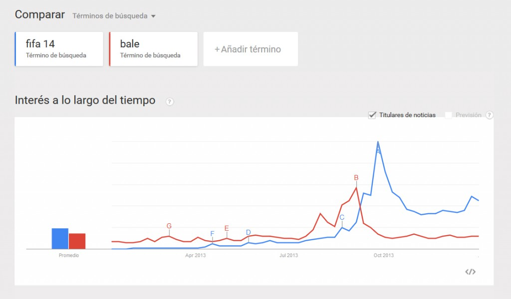

¿Sabéis como aprovechar determinados fenómenos virales o acontecimientos específicos para generar oportunidades de marketing en los videojuegos?

Hoy toca una ración de creatividad y astucia para potenciar el marketing de un videojuego.

En la actualidad las redes sociales son el caldo de cultivo de **fenómenos virales** que tienen una **repercusión brutal**, es en ese momento donde se debe aprovechar la oportunidad de intentar generar marketing viral con la finalidad de generar un gran impacto. No voy a negar que es muy muy complicado crear algo viral, sin embargo debemos estar prevenidos cuando la oportunidad se presente para tener mayores posibilidades.

En el caso de hoy me gustaría comentar una acción de marketing realizada para FIFA 14 que nos explicó el responsable de marketing de [Electronics Arts](http://www.ea.com/es/) en el curso de Gameketing organizado por [DreamersTalk.](http://dreamerstalk.es/)

## Crear Marketing Viral: FIFA 14

Para ponernos en antecedentes nos remontamos al verano de 2013, aquel verano el rumor deportivo más grande fue el posible fichaje de Gareth Bale por el Real Madrid, tras duras negociaciones a final de agosto los rumores iban en aumento hasta que al final se produce la noticia del acuerdo por parte del Real Madrid y el Tottenham.

Lo interesante es que [Electronics Arts](http://www.ea.com/es/) tiene firmados acuerdos con algunos clubs de fútbol, entre ellos el Real Madrid, tanto es así que el club tenía informando a [Electronics Arts](http://www.ea.com/es/) de a qué hora se realizaría el anuncio. Los responsables de marketing de [Electronics Arts](http://www.ea.com/es/) estaban preparados para el anuncio, y paralelamente con el comunicado lanzaron un trailer de su próximo próximo videojuego FIFA14 quedando así.

Imaginaros el impacto social, en este momento no existían imágenes de Gareth Bale vestido de blanco, sin embargo el videojuego ya lo mostraba como parte del club. Esto propició que algunos **telediarios** de aquel día **usarán imágenes** del **trailer** para ilustrar la llegada al club del jugador consiguiendo que millones de personas vieran imágenes del juego.

Esta acción de marketing sirvió para apoyar la precampaña de FIFA 14, fijaros la evolución de los términos de búsqueda a finales de agosto y principios de septiembre. Esta claro que esta acción de marketing se encuadra en un plan de marketing del producto, sin embargo este tipo de acciones crean un impacto muy grande en campañas de pre-lanzamiento.

Me parece una estrategia brillante, esta claro que los recursos de [Electronics Arts](http://www.ea.com/es/) son muy grandes, sin embargo el aprovechamiento de este tipo de acontecimientos tienen más que ver con tener una **actitud proactiva** que con la capacidad monetaria del estudio, un buen estratega tiene que tener olfato para poder aprovechar oportunidades que se presentan.

¿ Qué opinión os merece esta estrategia?
