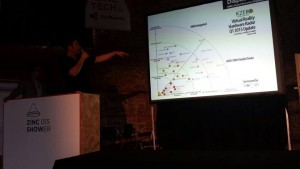
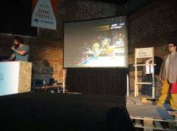
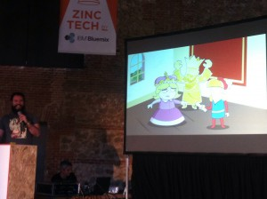
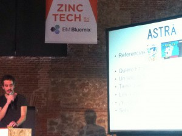
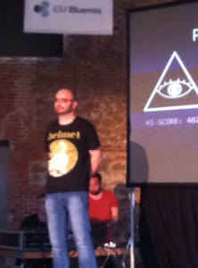

Esta entrada va de marketing, pero no de videojuegos, sino del marketing que se debe hacer sobre uno mismo para poder entrar en la industria o mejor dicho, esto va de [ZeroUno](http://www.meetup.com/Amigos-del-Videojuego-por-Madrid/) networking.

El sábado pasado tuve la oportunidad de asistir por primera vez a la [Meetup ZeroUno](http://www.meetup.com/Amigos-del-Videojuego-por-Madrid/) realizada en el Matadero de Madrid. En primer lugar decir que el término [Meetup](http://www.meetup.com/) se refiere a una plataforma donde se realizan quedadas entre gente con intereses similares de forma real, existen [Meetups](http://www.meetup.com/) de geeks, apasionados por la historia o el deporte, es una forma muy recomendable de conocer gente nueva con la que compartes aficiones. En segundo lugar hablar sobre el [ZeroUno](http://www.meetup.com/Amigos-del-Videojuego-por-Madrid/), esta [Meetup](http://www.meetup.com/) en concreto tiene como título Emprende y descubre el Sector del Videojuego, y así fue. En esta ocasión la cita se realizó dentro de una feria de emprendimiento llamada [Zinc Shower.](http://zincshower.com/en)

Teniendo esto claro ¿por qué realizo este post? Porque me apetece compartir algo con vosotros muy personal.

## El ZeroUno, networking perfecto en Madrid.

Si tras asistir al [ZeroUno](http://www.meetup.com/Amigos-del-Videojuego-por-Madrid/) algo me ha quedado claro es que para entrar en un mercado tienes que conocer a la gente que lo integra, y diréis que soy un genio por decir esto, pero te pregunto:

\[bctt tweet="¿Conoces a alguien que sólo este buscando trabajo desde su casa? Seguro que sí."\]

En España toda la vida ha existido la idea del enchufado, la persona que por amistad con el jefe o por ser sobrino entra en un puesto donde otro empleado quería acceder por sus méritos.  Buscando una analogía es muy complicado encontrar trabajo en una industria en la que nadie te conoce, ponerse las pilas y empezar asistir a eventos, presentaciones, convenciones y **conocer a la gente que esta donde tú quieres estar** es fundamental. Hice la analogía con el enchufe porque hasta cierto punto tienen similitudes, al igual que un enchufado tu debes estar en la cabeza de las personas de la industria para que cuando necesite a alguien tu aparezcas en su cabeza.

Hablando específicamente sobre el [ZeroUno](http://www.meetup.com/Amigos-del-Videojuego-por-Madrid/), me pareció buena la organización de la [Meetup](http://www.meetup.com/). En primer lugar tres ponentes expusieron sus ideas y luego se pudo hacer un turno de preguntas, tras esto se hace Game Glory donde cualquier persona que quiera exponer su juego tiene 90 segundos para enseñar su proyecto.

### Los tres ponentes principales fueron:

\- **Víctor Ruiz  CEO de [Lakento](http://www.lakento.com/index-es.html)**

Víctor nos hablo sobre la revolución que va suponer la Realidad Virtual a corto plazo, existe un mercado enorme y según nos expuso ahora es el momento de subirse al carro para aprovechar la oportunidad. Tuve la oportunidad de hablar con él durante unos cuantos minutos y pude ver la experiencia, el saber hacer y la capacidad productiva de Víctor, una persona con más de 20 años de experiencia en el sector y que se mostró totalmente accesible.

\- **Fernando Piquer  CEO de [Bitoon Games](http://www.bitoon.com/)**

Fernando nos expuso su visión del emprendedor, fijándose en las motivaciones que llevan a las personas a montar su propio estudio. Me pareció un genial ejemplo de emprendedor con la valentía de crear su propio estudio y así poder hacer el resto de tu vida algo que le guste. ¿Cuánta gente conocéis que haya hecho esto?

Al igual que con Víctor tuve la oportunidad de hablar detenidamente con Fernando, totalmente accesible y una persona que tiene la capacidad de hacerte sentir cómodo al instante. Totalmente colaborador y atento. Un placer.

\- **Fran Gálvez  CEO de [Unusual Studios](http://www.unusualstudios.com/)**

Fran realizó la que personalmente fue la exposición más interesante, y no porque las otras no lo fuesen, sino porque para mi sorpresa tocó un tema que me apasiona, el apartado de negocio de las empresas de videojuegos. Este aspecto es algo que no suele tratarse y nos dio unos consejos que son oro en paño. He creado un slideshare de la misma presentación que hizo Fran para que podáis verla, por supuesto todos los derechos son suyos.

\[sociallocker\]

<iframe style="border: 1px solid #CCC; border-width: 1px; margin-bottom: 5px; max-width: 100%;" src="//www.slideshare.net/slideshow/embed_code/key/AZx6KkeCIQfu3C" width="425" height="355" frameborder="0" marginwidth="0" marginheight="0" scrolling="no" allowfullscreen="allowfullscreen"> </iframe>

\[/sociallocker\]

## Game Glory

Tras las ponencias se realiza Game Glory, donde 5 proyectos tiene la posibilidad de darse a conocer durante 90 segundos, en esta ocasión los invitados fueron:

\- Luis Díaz de [AlpixelGames](http://www.alpixelgames.com/) presentando su juego Missing Translation.

Me pareció muy profesional la forma en la que Luis presentó el juego, claro, conciso y remarcando los puntos claves fuertes de su juego.

<iframe src="https://www.youtube.com/embed/NcrJoWwMV_o" width="560" height="315" frameborder="0" allowfullscreen="allowfullscreen"></iframe>

- Pablo J. Beneyto del estudio [DamnCode](http://damncode.com) presentando [Golden Midas](http://damncode.com/es/games/golden-midas/).

Aunque la presentación de Pablo me pareció algo mas floja que la de Luis, me encantó la sonrisa que no se le borró en ningún momento. Por el simplemente hecho de subir al escenario y contarnos sobre su juego se mereció mi aplauso.

\- Carlos Molina de [89 bits](http://www.89bits.es/) presentando PitLane Manager.

Me pareció increíble el producto que presento Carlos, una mezcla de simulador de carreras con estrategia para usar a la vez que se corren las carreras reales de Fórmula Uno. Me quedé con las ganas de conocer como gestionan las licencias, me pondré en contacto con él a ver si nos lo puede contar.

<iframe src="https://www.youtube.com/embed/gA17_bcRmMY" width="560" height="315" frameborder="0" allowfullscreen="allowfullscreen"></iframe>

\- Pablo Molina de [Fabuloso Games](http://www.fabulosogames.com/) presentando [Astrå](http://www.astra.fabulosogames.com/)

Pablo fue el ganador de Game Glory (quien tenga más aplausos gana), lo que le da el derecho a poder presentar su juego en el próximo [ZeroUno](http://www.meetup.com/Amigos-del-Videojuego-por-Madrid/), lo presentó bastante bien y el juego entra por lo ojos gracias a un bonito aspecto artístico.

\- Jorge Augusto de [Ubikware](https://twitter.com/ubikware)  presentando Polygo!

Finalmente Jorge nos presentó su proyecto Polygo! que tenía buena pinta y espero poder ver más información dentro de poco.

En resumen, me encantó asistir al [ZeroUno](http://www.meetup.com/Amigos-del-Videojuego-por-Madrid/), a pesar de ser más corta de lo habitual por enmarcarse dentro de otro evento pude ver que si quieres entrar en la industria es el camino a seguir. Asistir, hablar con los desarrolladores, interesarte por ellos y conocer en que puedes ayudarlos es realmente importante.

Agradecer especialmente a Fernando de [Made in Spain](http://mispgames.com/es/) y a Bernardo de [videojuegos y cons­olas](http://www.videojuegosyconsolas.com/) por la organización del evento.

Un saludo cordial y espero vernos en la próxima.
