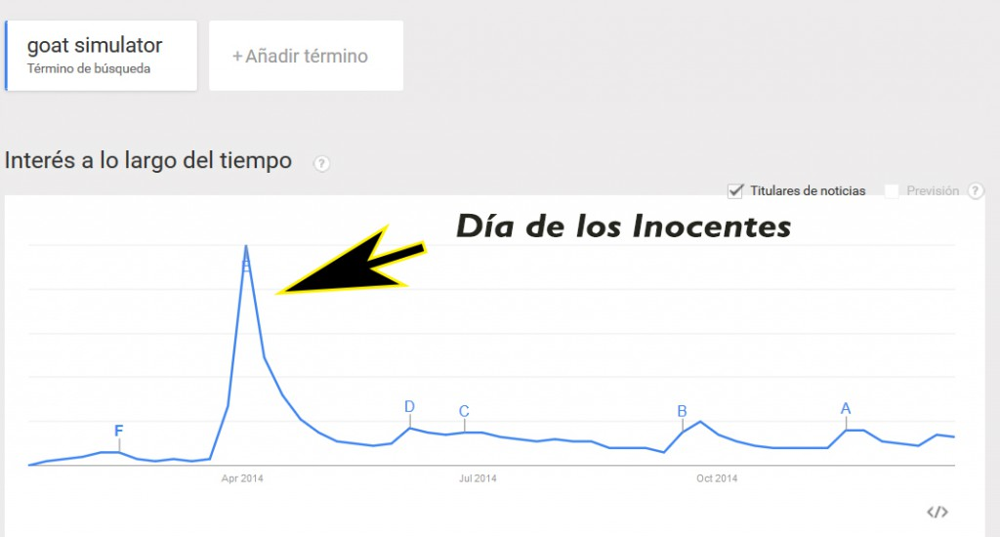

Hoy vamos a analizar un caso muy interesante relacionado con el contenido viral.

_\`\` Goat Simulator es un juego pequeño, estúpido y roto. Fue hecho en un par de semanas así que no esperes un juego del tamaño y la profundidad de un GTA con cabras, no esperes nada remotamente parecido. Para ser honesto, sería mejor si te gastases tus 10\$ en un hula hoop, una pila de ladrillos o una cabra real´´ _[Coffee Stain Studios](http://www.coffeestainstudios.com/)

¿No te parece increíble la aclaración del estudio? Investiguemos más a fondo:

##  Un cabra y un estudio, la historia.

[Coffee Stain Studios](http://www.coffeestainstudios.com/) es una desarrolladora de videojuegos sueca creadores de los videojuegos [Sanctum](http://www.coffeestainstudios.com/games/sanctum) y [Sanctum 2](http://www.coffeestainstudios.com/games/sanctum-2),  dichos juegos forman parte del género [first person tower defense](http://en.wikipedia.org/wiki/Tower_defense).

Tras lanzar [Sanctum 2](http://www.coffeestainstudios.com/games/sanctum-2) y cosechar cierto éxito en Steam, el CEO de la compañía Anton Westbergh propuso en Enero de 2014 realizar un lluvia de ideas para la realización de un juego totalmente diferente. Durante dos semanas parte del equipo y los nuevos empleados tuvieron la oportunidad de hacer lo que quisieran, sin ningún tipo de planificación y pudiendo variar de posición dentro del equipo.

Durante dicho período surgieron varias ideas como juegos de rol extensos o juegos donde el diseño/apariencia fuese lo fundamental, de todas las ideas la más loca fue crear un [sandbox](http://es.wikipedia.org/wiki/Videojuego_no_lineal) donde controlases a una cabra que se dedica a destruir objetos.

Posteriormente eligieron una idea (sin relación con el concepto de la cabra) para llevar a preproducción, paralelamente crearon una alpha muy básica donde se podía ver como manejabas a una cabra en un escenario muy básico. Les pareció gracioso crear un vídeo sobre la alpha para subierlo a YouTube y de repente boom! El fenómeno viral llegó.

Primer Trailer Goat Simulator

<iframe src="https://www.youtube.com/embed/WgTQglGvNUs" width="560" height="315" frameborder="0" allowfullscreen="allowfullscreen"></iframe>

## **Goat Simulator se vuelve viral**

Según comenta [Armin Ibrisagic](http://www.gamasutra.com/blogs/author/ArminIbrisagic/922531/), PR Manager del estudio, la mañana siguiente tras subir el vídeo a YouTube ya tenía 70k de visitas, tras la tarde habían llegado a 200k (ya eran más visitas que todos los vídeos de sus anteriores juegos juntos) y tras ser enlazado por [Kotaku](http://kotaku.com/) explotó llegando a 1M de visitas en poco tiempo.

En ese momento muchos medios empezaron a contactar con ellos, no solo desde el ámbito de videojuegos, la comunidad estaba ansiosa por poder probar el simulador de cabras.

Empezaron a gestionar este fenómeno viral de manera que ante los diferentes comentarios de la comunidad el responsable de relaciones públicas contestaba con chistes tontos sin tomarse las cosas demasiado enserio. Este acercamiento a la comunidad funcionó de tal manera que actualmente su [página de fans de facebook](https://www.facebook.com/GoatSimulator) tiene 211.00 likes.

## **Goat Simulator, hacer el cabra para triunfar.**

Al sobrepasar el 1M de visitas en YouTube el equipo rápidamente cambió de focus y movió parte del equipo del proyecto principal a [Goat Simulator](http://www.goat-simulator.com/). Viendo el conllevado éxito de la alpha tomaron una serie de decisiones que harían el **desarrollo mucho más rápido**, consiguiendo algo clave, **reducir el tiempo del lanzamiento** para **aprovechar el fenómeno viral** que habían conseguido.

**Puntos claves para el desarrollo de [Goat Simulator](http://www.goat-simulator.com/).**

- No tener multiplayer, lo que supone reducir a la mitad el tiempo de desarrollo.
- Crear el juego únicamente para PC y aprovechar Steam como plataforma de difusión.
- 4 Semanas de desarrollo: acortar el tiempo para aprovechar el impacto que tenían.
- Pocas reuniones:  según comentan muchas veces se convierten en una pérdida de tiempo además de resultar en tomas de decisiones erróneas.
- Usar los bugs en vez de quitarlos: la disparidad de bugs hacían que [Goat Simulator](http://www.goat-simulator.com/) fuese divertido, por ello se dejaron tal y como estaban.
- Uso de Unreal Engine 3, motor gráfico en el cual tienen experiencia.

Con estos puntos anteriores consiguieron reducir muchísimo el tiempo de de desarrollo.

## **Lanzamiento Goat Simulator, la cabra tira al monte.**

[April Fools Day](http://es.wikipedia.org/wiki/D%C3%ADa_de_las_bromas_de_abril) (día de los inocentes en América) fue el día indicado, esto derivó en una multitud de páginas de todo el mundo haciendo referencia al simulador de cabras como una broma.

\[caption id="attachment_529" align="aligncenter" width="1024"\] Búsquedas de Goat Simulator en Google\[/caption\]

El precio en Steam fue de 9,99 € y se consiguió posicionar como top 1 durante unos días para posteriormente estar en el top 10 durante otros tantos. A día de hoy las cifras son impresionantes. [Goat Simulator](http://www.goat-simulator.com/) ha vendido 2.5M de copias entre Android, PC e iOS.

Tras seis meses del lanzamiento de la versión Pc sacaron la versión para dispositivos móviles, comenta [Armin Ibrisagic](http://www.gamasutra.com/blogs/author/ArminIbrisagic/922531/) que fue un gran fallo tardar tanto dado que a los pocos días de que el vídeo del trailer se hiciese viral ya existían muchas apps no oficiales similares.

[Coffee Stain Studios](http://www.coffeestainstudios.com/) ha generado ingresos por 25 Millones de dólares mediante un simulador de cabras, increíble pero cierto.

De hecho la comunidad de [Goat Simulator](http://www.goat-simulator.com/) en Steam tiene unos 43.000 miembros, además incluyeron Steam Workshop para poder realizar mods.

## **La cabra sigue siendo trasquilada**

Según comenta [Armin Ibrisagic](http://www.gamasutra.com/blogs/author/ArminIbrisagic/922531/) PR Manager de [Coffee Stain Studio](http://www.coffeestainstudios.com/) su política de actualizaciones del juego es gratuita en base a algunos conceptos:

- La importancia de tener una buena relación con los jugadores a medio-largo plazo se mejora si tus actualizaciones son gratuitas, el ser un estudio pequeño hace que el boca a boca sea algo muy importante.
- La actualización gratuita de un juego hace que tu objetivo sea mayor al de la propia base de jugadores.
- La sensación de mantenimiento del juego mediante actualizaciones gratuitas hace pensar a los posibles compradores que el juego esta siendo cuidado.
- Lanzar parches de pago necesita mucho tiempo debido al marketing necesario para hacerlos rentables.
- Va en contra del mercado actual donde los juegos aparecen en el mercado con DLC´s de pago ya predefinidos.

Como podéis ver esta desarrolladora tuvo una oportunidad y la aprovecharon, cierto es que no es el juego que todo el mundo quisiera crear, pero la visibilidad que les ha dado y el aporte económico que han conseguido han merecido la pena. A la hora de realizar un nuevo juego existirá mucha expectación por verlo, y el problema de financiación será mucho menor.

La verdad es que gracias a [Goat Simulator](http://www.goat-simulator.com/) [Coffee Stain Studios](http://www.coffeestainstudios.com/) ha conseguido posicionarse en el mapa de desarrolladores aún siendo un estudio pequeño.

### **Características curiosas de Goat Simulator**

- El diseño de la cabra fue comprado por el estudio en [TurboSquid](http://www.turbosquid.com/) por 25 dólares.
- Recientemente han incluido un modo MMO donde puedes elegir clases como asesino, tanque etc...
- Existe la posibilidad de equipar a la cabra con un Jet Pack.

- El próximo juego publicado (que no desarrollado)por [Coffee Stain Studios](http://www.coffeestainstudios.com/) será The Wesport Independent y te pondrá en la piel de un editor de periódico independiente en un escenario post nuclear en un país totalitario.
- Cuando preguntaron al CEO sobre si se había documentado sobre el comportamiento de las cabras para realizar el videojuego comentó que este vídeo le ayudó mucho.

<iframe src="https://www.youtube.com/embed/Dp0Bt2cbcc8" width="420" height="315" frameborder="0" allowfullscreen="allowfullscreen"></iframe>

Si habéis llegado aquí  !Enhorabuena! Espero os haya gustado este repaso al fenómeno [Goat Simulator](http://www.goat-simulator.com/) y lo compartáis en redes sociales por el bien de la cabra.

**Data Box:**

- Desarrollador: Coffee Stain Studios
- Publicado por: Coffee Stain Studios
- Fecha de salida: Abril 1st, 2014
- Plataformas: PC, Mac, Linux, iOS and Android
- Numero desarrolladores: ~10
- Duración desarrollo: 10 semanas
- Herramientas desarrollo: Unreal Engine 3, Notepad & MS paint
- Presupuesto: 5 Kg de hierba orgánica
- Número de patas: cuatro
- Número de cuernos: dos
- Cola: Si
- Sonido: Bääaaa
