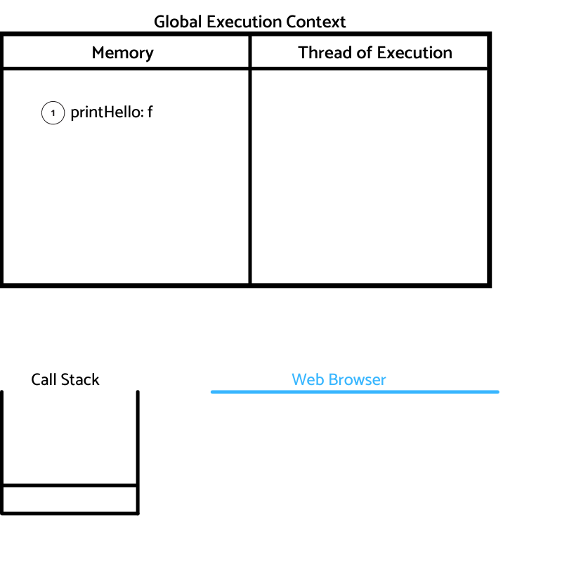
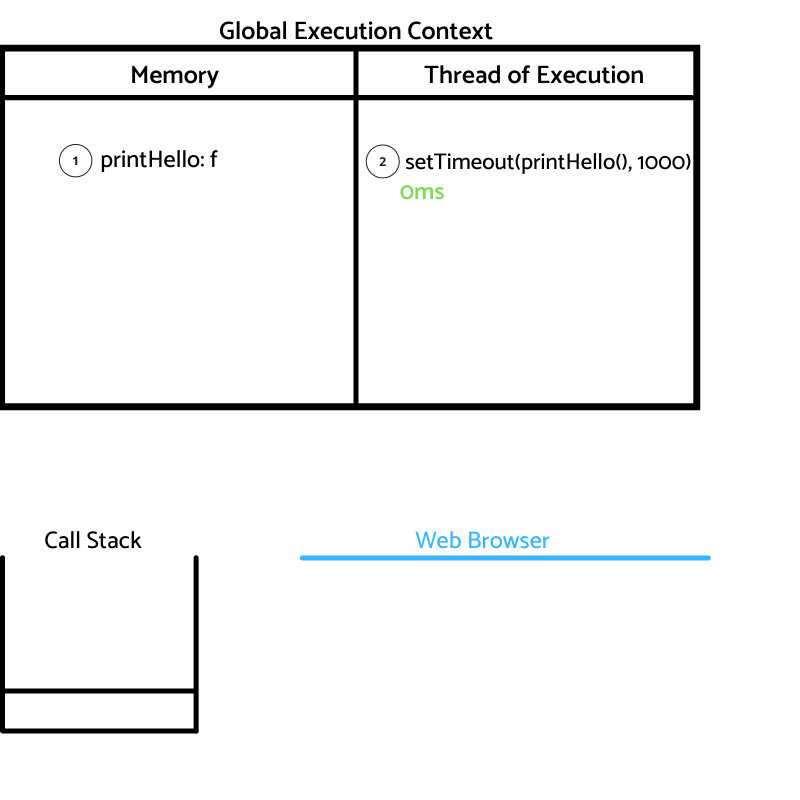
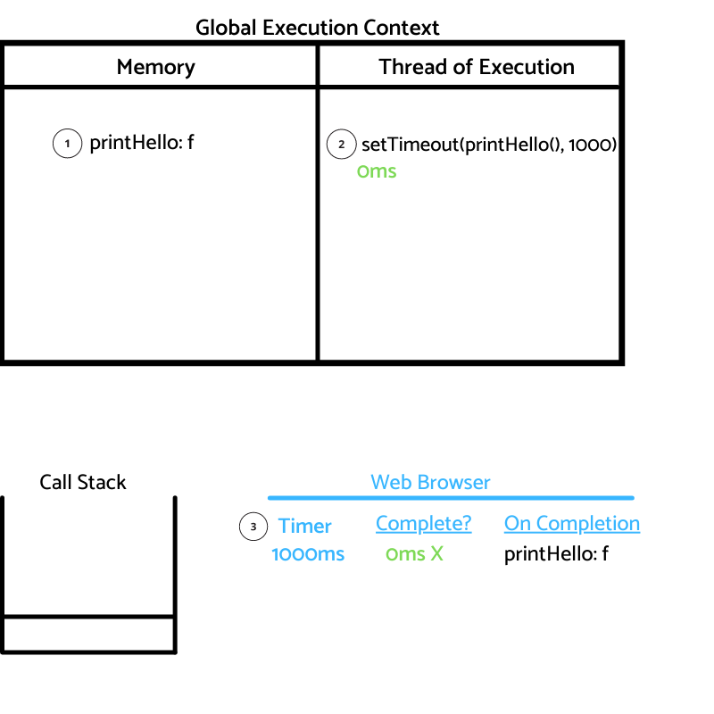
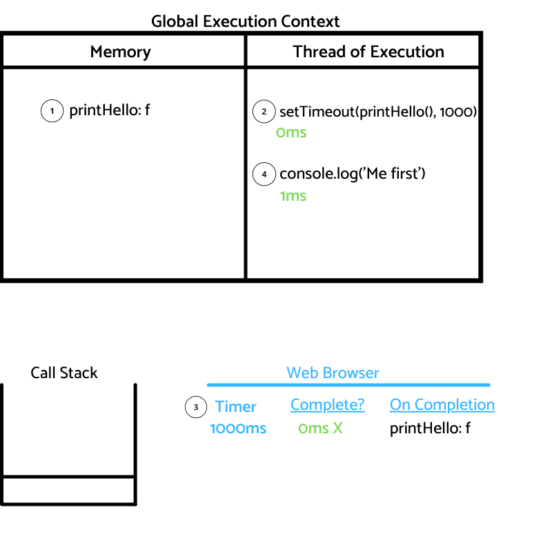

# Introduction

On this post, we are continuing to learn how JS works. 

From the [How JS works, basics](https://danielgg.com/how-javascript-works-basically//)
post, we know that 3 core pieces of the Javascript engine are:

-   Thread of Execution
-   Memory
-   Call Stack

We also know that JS executes the code line by line.
Now, imagine you are opening a website, and this website needs to load some data coming from a backend, what do we do?
If we are waiting for this data to come, do we hold the execution of the rest of the code until the data gets in?
It doesn't seem like the best idea.

How does JS handle it?

We are going to learn how JS manages asynchronous code.

Apart from the previous 3 core pieces of the JS engine, we need some <b>new components</b>.
- Web Browser API's/Node background API's
- Promises
- Event loop, Callback/Task queue and micro task queue.

These are some examples of the features that the Web Browser API provides with its matching name on Javascript:

- HTML DOM => document
- Network request => fetch
- Timer => setTimeout

Let's create a basic example to see how Javascript manages asynchronous code.

# JS Asynchronous Basics

```javascript
1: function printHello(){ console.log("Hello") }
2:
3: setTimeout(printHello(), 1000);
4:
5: console.log("Me first")
```

What do you think will log first `Hello` of `Me first`?

Our intuition says `Me first`, because we see a `setTimeout` of one second for the `printHello` function.

But...

If JS runs code line by line, how could it be possible?

Let's take a look to a Web API example.

On blue, things that are happening on the Web Browser.

On green, the time (just for illustration purposes) where code executes.

<b>Step 1</b>: At line 1, identifier `'printHello'` is store in memory with the function f.




<b>Step 2</b>: At line 3, `setTimeout(printHello(), 1000)` is invoked, this is a command for the Web Browser's feature Timer. The job of the function `setTimeOut` is then <b>done!</b>




<b>Step 3</b>: Timer is invoked on the Web Browser with two arguments, the callback function to run on completion, and the time to wait. At 0ms, the timer is not yet complete.



<b>Step 4</b>: At line 5, the execution context executes `console.log("Me first")` at 1ms time mark. As mentioned on Step 2, `setTimeOut` function job is done, so the execution context is free to continue executing line by line.




<b>Step 5</b>: When time passes and we get to 1000ms, the Timer knows the onCompletion clause is now valid, and the callback function gets returned, `printHello()` function gets added to the Call Stack.
Then `printHello()` is executed on the execution context and gets deleted from the Call Stack.


Wow.

Isn't it amazing?

Instead of blocking the execution of the rest of the code, it can keep running thanks to the Web Browser API!

Let's try something else.

## Asynchronous Caveats

What if instead of using 1000ms on the timeout, we use 0.

```javascript
1: function printHello(){ console.log("Hello") }
2:
3: setTimeout(printHello(), 0);
4:
5: console.log("Me first")
```

🤯🤯🤯

What do you think will happen?

Let me tell you, there is not much difference with our previous example, the order of execution will be the same, the only difference is that `printHello()` will be executed at 2ms instead of at 1000ms.

But... why?

The rule for <b>asynchronous JS</b> is that it <b>will get executed</b> when the <b>execution context is done</b>!

There are some missing parts of the puzzle that we need to discuss to understand how these rules gets apply.

<b>The Callback Queue</b>

The Callback Queue is where `printHello()` gets pushed and waits for the Call Stack to be empty and the execution context to be done.

Ok, but how does JS know when it's time to move `printHello()` from the Callback Queue to the Call Stack?

<b>The Event Loop</b>

The Event Loop checks if the Call Stack is empty and if there is no code to execute on the global execution context. If so, then checks the Callback Queue, if the Callback Queue has code to execute, it pops it to the Call Stack.

And that's was the basics for asynchronous code until [es6](https://www.w3schools.com/js/js_es6.asp), where promises were introduced.

## Conclusion

I am amazed how JS being a synchronous language, manages to execute asynchronous code.
I also like the set of rules that manages how it works!

On the next post, we are going to take a dive into promises.

This is part 3 of the <b>How JS works series</b>.

Check out the other post of the series:

[Part 1 - How JS works, basics](https://danielgg.com/how-javascript-works-basically//)

[Part 2 - How JS works, closure](https://danielgg.com/how-javascript-works-closure/)

Thanks for reading!
