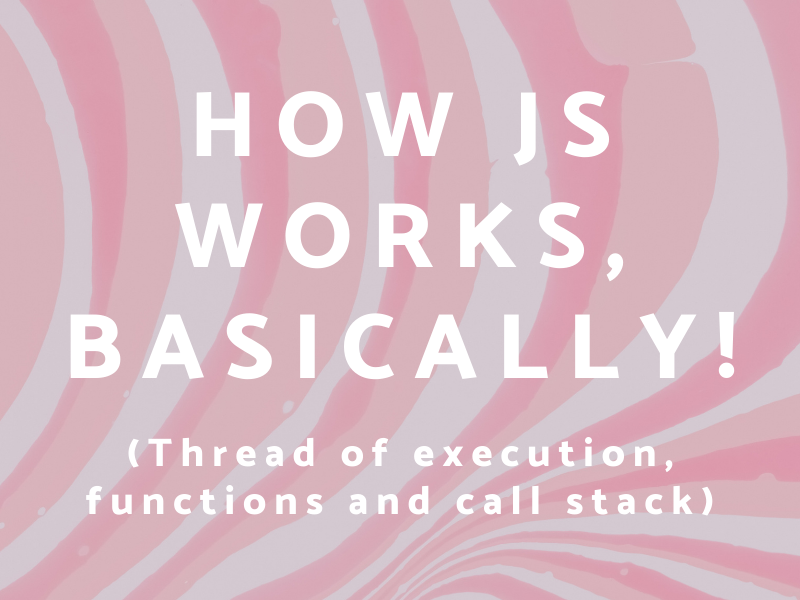
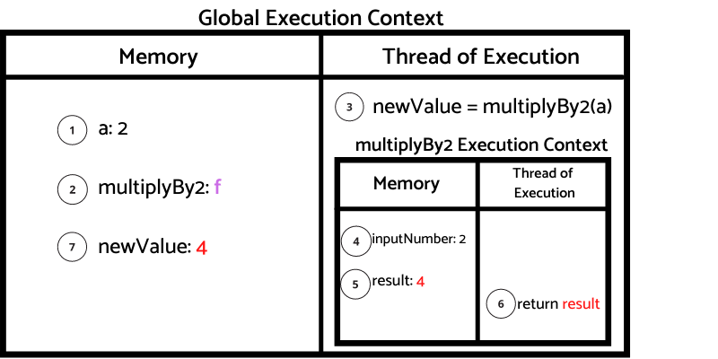

# Introduction

On my last performance review, my boss suggested that I should focus this year on getting better at JS fundamentals.

I agreed with him, being self taught has it's pros and cons.

I don't enjoy much the technical aspects of front end development, so I usually lean more towards learning the design parts of the job.

But...

I want to push myself, so there are no excuses.

I payed for the yearly subscription on [Front End Masters](https://frontendmasters.com/), that's 600$, so I have to make it worth it!

The first course I picked is [JavaScript: The Hard Parts, v2](https://frontendmasters.com/courses/javascript-hard-parts-v2), taught by [Will Sentance](https://frontendmasters.com/teachers/will-sentance/).
Three hours in and I can say this course alone is worth those 600$ bucks.

On this post I am going to use pretty similar explanations to the one's Will use on the course.

I don't pretend to make it look like this is all my original content.

But this post helps me understand what I am learning on the course, and you will find it useful too!

We are going to talk about how JS works under the hood.

To do this, we need to understand a few principles first.

## JS Execution Basics

- When JS code runs, it goes through the code line-by-line and executes each line.

- It also saves data in its memory, strings, arrays or it can even be functions!

Ok, but this can't be this easy right?

Correct, there are a few more thing you should know.

### The Execution Context

The execution context is the environment where the code runs. It is the place where the code gets evaluated and executed.
Any JS code is always run on an execution context.

The execution context consist on two parts:

- Tread of execution
- Memory

### The Call Stack

JS keeps track of what function is current running ( where is the thread of execution).

The Call Stack on JS is Last in, First out, meaning, the last function added to the call stack would be the first function to execute.
When executed, it gets removed from the stack.

If there are no more functions to be run, the global execution context still will be on the Call Stack.

Ok, so now we have the building blocks to understand a basic example on how JS will execute a program.

# How JS works, basically!

This is the code that we are going to analyze.

It is a pretty simple code where we create a `const a` with value 2.

Then we create `function multiplyBy2` where the parameter pass is going to be multiplied by 2 and returned. 

Last, we assigning the result of running the function to the `const newValue`.


```javascript
const a = 2

function multiplyBy2(inputNumber) {
    const result = inputNumber * 2;
    return result;
}

const newValue = multiplyBy2(a)
```

This diagram is going to guide us step by step on what going on under the hood when JS is executing the code.

Remember, JS executes the code line by line, and that's what we are going to do!




<br/>

<b>Step 1</b>: Starting with the first line, Identifier `'a'` is store in memory with the value `2` and the Call Stack gets initialize with Global().

<b>Step 2</b>: Identifier `multiplyBy2` is store on memory with the function f. We are defining the function, not invoking it yet.

<b>Step 3</b>: Identifier `newValue` is store on memory with no value until Step 7 (forget there is a red 4 in there for now please).

<b>Step 4</b>: `multiplyBy2(a)` is now invoked, and is going to
create a <b>new Execution Context</b>. 
Also `multiplyBy2(a)` gets added to the Call Stack and it takes priority to get executed.

<b>Step 5</b>: Now we are inside the multiplyBy2 Execution Context. The parameter `inputNumber` is assigned the argument `a` stored on global memory.

<b>Step 6</b>: The identifier `result` is stored in memory with no value until `inputNumber * 2` is evaluated, then the value 4 is assigned to it.

<b>Step 7</b>: When `result` is returned, the execution context looks on the local memory for the result value (result: 4). Then the evaluation of newValue is resolve with the value 4. The use of return in a function indicates that the thread of execution of the function is done and can be removed from the call stack.

<b>Step 8</b>: The End

## Conclusion

I hope this explanation gives you an idea of how JS works under the hood for a simple block of code. I am am going to create more content as I advance on the course.

If you are interested on the topic, I recommend you to grab a subscription on [Front End Master](https://frontendmasters.com/) and give it a chance!

