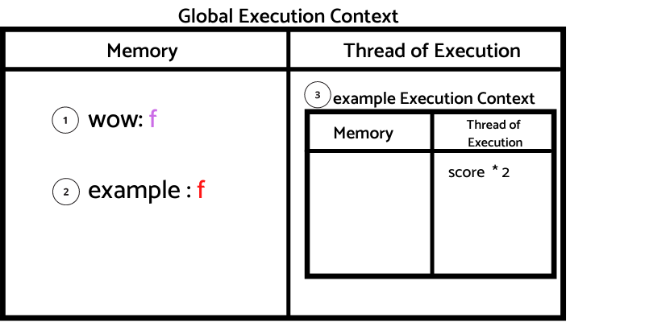

# Introduction

Continuing to improve my understanding of JS, I want to take a look at how closure works.

I think not many junior/mid-level developers understand the concept of closure.

I want to create on this post a reference for it, so whenever you want to refresh what was closure about, you can check it!

This is part of my How JS works series, to understand this post, I recommend you first read [Part 1](https://danielgg.com/how-javascript-works-basically/) if you haven't done it.

## What is closure?

From MDN:

>A closure is the combination of a function bundled together (enclosed) with references to its surrounding state (the lexical environment). In other words, a closure gives you access to an outer function’s scope from an inner function. In JavaScript, closures are created every time a function is created, at function creation time.

Probably you are thinking the same I did when I read that.

I don't have any idea what are they talking about...

We are going to create a simple example!

# How JS works, closure!

This is the code that we are going to analyze.

```javascript

1:  function wow(){
2:    let score = 5;
3:    function duplicateNumber (){score * 2;}
4:    return duplicateNumber;
5:  }
6:
7:  const example = wow();
8:
9:  example();
10: example();
```

These diagrams are going to guide us step by step on what going on under the hood when JS is executing the code.

Remember, JS executes the code line by line, and that's what we are going to do!

<b>Step 1</b>: Starting with the line 1, Identifier `'wow'` is store in memory with the function f.


<b>Step 2</b>: At line 7, identifier `example` is not yet initialize until `wow()` is resolve. Since we see a (), it means that we are invoking a function. 

This function `wow()` goes on top of the call stack and it creates a brand new execution context.

In wow execution context, we first create an identifier `score` with the value `5` and an identifier `duplicateNumber` with the function f as value. 


JS then jumps to the thread of execution and returns `duplicateNumber`. On the local memory of wow execution context, JS find `duplicateNumber`, identifier `example` gets created with the function f as value. 

The execution context for `wow()` gets deleted and JS pop out `wow()` from the call stack.


<b>Step 3</b>: At line 9, JS executes `example()`, since we know this is an invocation, we push it to the call stack and we create a brand new execution context. We know that invoking `example` is the same as invoking what used to be `duplicateNumber`.

The key to understanding closure is coming, hang on tight.

JS wants to execute `score * 2`, JS looks for value `score`, but as you can see, we don't have the score value anywhere on memory...



Or do we?

Let's got back to the MDN definition of closure:

>A closure is the combination of a function bundled together (enclosed) with references to its surrounding state (the lexical environment). In other words, a closure gives you access to an outer function’s scope from an inner function. In JavaScript, closures are created every time a function is created, at function creation time.

Ok, so what this means?

The function `duplicateNumber` has access to variables that are defined in its calling context/lexical environment as the closure definition mentioned.

Remember, when JS calls `example`, JS is calling what used to be `duplicateNumber`, if you go back to Step 2, you can see that on the lexical environment of `duplicateNumber`, exist on memory `score: 5`, and this is what we call the <b>BACKPACK</b>.

On the `example` identifier, not only the function f was saved, but also the attached <b>BACKPACK</b>!   

🤯🤯🤯🤯🤯


JS looks for the score value on the <b>BACKPACK</b> and multiply it by 2, the value `score` is updated on the <b>BACKPACK</b> to 10, the example execution context gets deleted and `example()` is push out from the stack.


<b>Step 4</b>: At line 10, JS executes `example()` again, we push it to the call stack and we create a brand new execution context. 

JS does the same as step 3, but when looking for `score` on the <b>BACKPACK</b>, the value is 10.


The `score` value `10` gets multiplied by 2.

The example execution context gets deleted and `example()` is pushed out from the call stack while the score value is updated to 20.


Wow.

## Conclusion

I hope this explanation gives you an idea of how JS closure works under the hood and resolves some of the mysteries associated with it.

This is Part 2 of the How JS works, I recommend you to check [Part 1](https://danielgg.com/how-javascript-works-basically/) too!