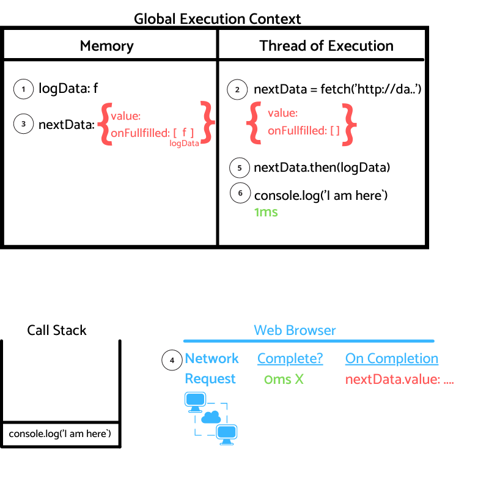
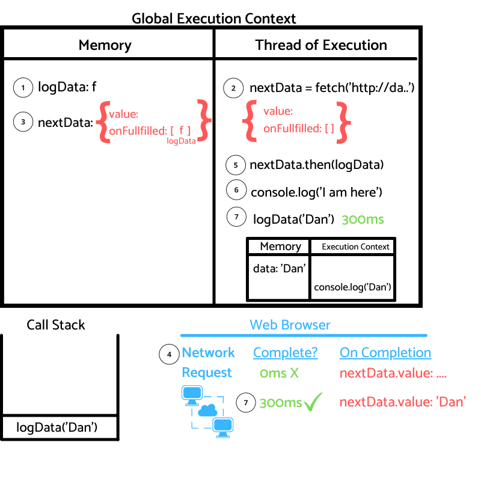

# Introduction

On the [previous post](https://danielgg.com/how-javascript-works-asynchronous/), we learnt how JS manages asynchronous code.

In this post we continue to build on that knowledge to understand one of the core updates to JS, <b>Promises</b>.

## What are Promises?

From MDN:

>A Promise is a proxy for a value not necessarily known when the promise is created. It allows you to associate handlers with an asynchronous action's eventual success value or failure reason. This lets asynchronous methods return values like synchronous methods: instead of immediately returning the final value, the asynchronous method returns a promise to supply the value at some point in the future.

Ok!

It seems like Promises can help us handle asynchronous code by giving us some superpowers!

Let's create an example!

# How JS works, Promises!

This is the code we are going to work on today.

```javascript
1:  function logData(data){
2:   console.log(data)
5:  }
6:
7:  const nextData = fetch('https://danielgg.com/info');
8:  nextData.then(logData);
9: 
10: console.log('I am here!')
```

<b>Step 1</b>: Starting on line 1, Identifier `logData` is store in memory with the function f.


<b>Step 2</b>: At line 7, `nextData` value will be the result of running `fetch` function on Javascript.
Remember, until the function resolves the identifier won't be initialized.

`Fetch` is added to the call stack and executed.

The `fetch` function will perform work both on Javascript and the Web browser.

On the JS side, `fetch` will return a promise object with two properties, `value` with an undefined value and `onFullfilled` with an empty array assigned to it.


<b>Step 3</b>: The promise object is assigned to `nextData` and the work of `fetch` on the Javascript side is now complete.

`Fetch` is deleted from the call stack.


<b>Step 4</b>: Now we are going to focus on the Web Browser work that `fetch` does.
From the previous post, we know that `fetch` is equivalent to Network Request on the browser.

The network request is going to perform the duty of going to the server to grab the data we need, this takes some time, so a 0ms is not done yet.

An important note is that On Completion, the response of the server will get assigned to the `value` property of the promise object, in our case, `nextData.value`.

At this moment, the Web Browser is waiting for the data to come back.

Let's go back to the Javascript side.


<b>Step 5 </b> On line 8, we add `nextData.then(logData)` to the call stack and execute it.

Here is where one of the powerful features of promises comes in.

If you remember, when we create the promise object, we create an identifier `onFullfilled` with an empty array as a value.
The magic of `onFullfilled` property is that any function inside the array will be executed when the `nextData.value` resolves. Not only that, but the function inside the array will also get the `nextData.value` passed to it.

On our case, `logData` will get passed `nextData.value`.

Now `nexData.then(logData)` gets removed from the Call Stack.


<b>Step 6</b> On line 9, we add the `console.log('I am here!')` to the call stack and execute it.

This line will print `I am here` to the console, then it gets removed from the call stack.




<b>Step 7</b> Finally, the information that we were waiting from the API call to `https://danielgg.com/info` has returned at the timestamp 300ms!

 🥳  🥳  🥳 

To simplify, let's imagine the value returned from the API is how my friends call me, `Dan`.

Now `nextData.value` value changes to `Dan`, the response we were waiting for is now back, any function on the `onFullfilled` array will get executed, and `nextData.value` will be passed as a parameter, as seen on step 6.

That's why now `logData('Dan')` gets added to the call stack and executes creating a new execution context for the function.

On the memory of `logData` execution context, the identifier `data` gets assigned the value `Dan`, and then `Dan` is console logged.

The execution of the function is over and it gets removed from the call stack.




That's everything happening on the example code!

## Conclusion

As you have seen, <b>Promises</b> are really powerful, we have now the ability to pass a function that will get access to the returned value when it comes back!

If you liked the post you may enjoy other parts of the [How JS works series](https://danielgg.com/how-javascript-works-asynchronous/).
