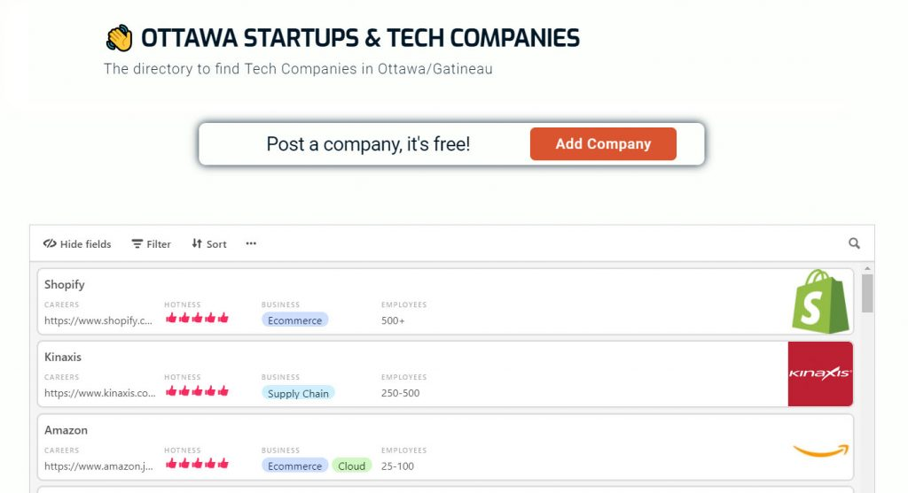

Hello everybody!

I am going to make a confession.

I used to think that to achieve something in life, it meant that it had not been done before.

My mindset changed when I came across a quote from Dharmesh Shah:

> Success occurs when we shift our efforts from making a million dollars to helping a million people.

It’s a powerful statement.

To be honest, I had witnessed the message in Shah’s wise words before without taking notice.

Let me give you two examples.

When I was playing WoW, I organized raids to get equipment for lower-level characters. I did this because my friends and I needed some specific items for my level 70 shaman.

After a few months, my shaman had the best gear possible, and a lot of people I helped had the same stuff, too.

Then my character acquired fame in the community because I was the one person to go to if you wanted a level 70 item.

The second scenario where I saw the power of focusing my efforts to help people was on a game called Guild Wars 2.

I was totally hooked with a mode called World vs World (large scale PvP).

I didn't know how to play this mode, so I joined a guild. After understanding how this mode worked, I decided to organize events where I taught new players the mechanics.

These events became a huge success (80+ people on TeamSpeak), leading my guild to become one of the strongest on the server.

Furthermore, these events were the seed to something more important. I proposed a meeting with all the guild leaders to bring the entire server under one TeamSpeak. We created 500+ people community with one goal: Become the best Europe server on Guild Wars 2.

With the community united under TeamSpeak, we were able to do that. It was an amazing experience.

As we grow older, priorities change. But the philosophy I think still prevails.

As I mentioned in [this blog post](http://danielgg.com/front-end-developer-soon/), I want to get a job as Software Developer in Ottawa, and I am going to do it by empowering other people to break into tech. With this purpose, I created:

## [OttawaTech.io](http://ottawatech.io)

This side project helps me find companies that are looking for front-end developer jobs in Ottawa and I believe it will also help thousands of people who want to break into tech.

I want this website to be the definitive directory of Tech Companies and Startups in the Ottawa-Gatineau area.

I am planning to add more functionality to the project. There are many companies missing, but I believe it is useful for anyone looking to break into tech in the region. And more so, as it grows.

I am interested in hearing your thoughts about my approach.

Please leave a comment below with your opinion!
