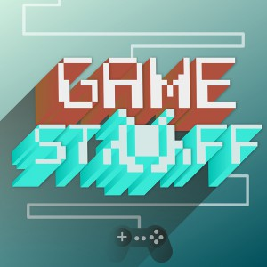

Es un placer poder anunciarte el estreno del **primer episodio** de [**Game Stuff**](http://www.ivoox.com/ep-1-game-stuff-jose-raluy-de-audios-mp3_rf_4592987_1.html).

[**Game Stuff**](http://www.ivoox.com/ep-1-game-stuff-jose-raluy-de-audios-mp3_rf_4592987_1.html) es un **podcast semanal** dedicado a **entrevistar a profesionales de la industria de los videojuegos** con un fin, aprender de primera mano sus conocimientos, motivaciones, herramientas y visión sobre la industria de los videojuegos..

En el podcast me gustaría abarcar desde los aspectos más profesionales a los personales. Para ello tengo pensado ir entrevistando a diferentes perfiles siempre con la intención de hacer de [**Game Stuff**](http://www.ivoox.com/ep-1-game-stuff-jose-raluy-de-audios-mp3_rf_4592987_1.html) un podcast que nos permita aprender nuevos conocimientos y herramientas que podamos usar para nuestro crecimiento profesional y personal.

En el primer episodio de [**Game Stuff**](http://www.ivoox.com/ep-1-game-stuff-jose-raluy-de-audios-mp3_rf_4592987_1.html) contamos con la presencia de **[José Raluy](https://twitter.com/Jose_Raluy)**, **Senior Producer de Mercury Steam** y parte fundamental del desarrollo de los **Castlevania Lords of Shadow 1 y 2**. En la entrevista José nos hablará sobre su rol como Senior Producer, su labor como líder y motivador y otros aspectos que os serán de muchísimo interés.

<iframe id="audio_4592987" style="border: 1px solid #EEE; box-sizing: border-box; width: 100%;" src="https://www.ivoox.com/player_ej_4592987_4_1.html?c1=ff6600" width="300" height="200" frameborder="0" scrolling="no" allowfullscreen="allowfullscreen"></iframe>

Me gustaría agradecer a José su participación en [**Game Stuff**](http://www.ivoox.com/ep-1-game-stuff-jose-raluy-de-audios-mp3_rf_4592987_1.html), desde el primer momento se ofreció a realizar la entrevista colaborando en todo momento. Es un placer haberle entrevistado y me parece que José es un muy buen ejemplo de superación y desarrollo profesional. ¡Gracias José!

> Nota: El podcast ya se encuentra en Itunes os dejo el [enlace](https://itunes.apple.com/es/podcast/game-stuff/id1001925699?l=es)

En el episodio de hoy de [**Game Stuff**](http://www.ivoox.com/ep-1-game-stuff-jose-raluy-de-audios-mp3_rf_4592987_1.html) hacemos referencia a:

- [Sid Meier](http://es.wikipedia.org/wiki/Sid_Meier) (programador y diseñador de videojuegos)
- Víctor Ruiz (FX Interactive y [Lakento](http://www.lakento.com/index-es.html))
- [Stratos](http://www.stratos-ad.com/) (web de anuncios de trabajo en la industria de videojuegos española)
- [The Game Producer´s Handbook](http://www.amazon.com/The-Game-Producers-Handbook-Irish/dp/1592006175)
- [Bussines & Legal Primer for Game Development](http://www.amazon.com/Business-Legal-Primer-Game-Development/dp/1584504927)
- [User Stories Applied for Agile Software Development](http://www.amazon.com/User-Stories-Applied-Software-Development/dp/0321205685)
- [How to Lead](http://www.amazon.com/How-Lead-3rd-Jo-Owen/dp/0273759612/ref=sr_1_1?s=books&ie=UTF8&qid=1433376572&sr=1-1&keywords=How+to+Lead)
- [How to Manage](http://www.amazon.com/How-Manage-3rd-Jo-Owen/dp/0273759620/ref=sr_1_1?s=books&ie=UTF8&qid=1433376593&sr=1-1&keywords=How+to+Manage)
- [GDC Vault](http://www.gdcvault.com/)

En el episodio de hoy de [**Game Stuff**](http://www.ivoox.com/ep-1-game-stuff-jose-raluy-de-audios-mp3_rf_4592987_1.html) hacemos referencia a los siguientes juegos:

- [Blade: The Edge of Darkness](http://es.wikipedia.org/wiki/Blade:_The_Edge_of_Darkness)
- [Clive Barker´s Jericho](http://es.wikipedia.org/wiki/Clive_Barker%27s_Jericho)
- [Portal 2](http://es.wikipedia.org/wiki/Portal_2)
- [Diablo III](http://es.wikipedia.org/wiki/Diablo_III)
- [Deux Ex. Human Revolution](http://es.wikipedia.org/wiki/Deus_Ex:_Human_Revolution)
- [Wolfestein The New Order](http://es.wikipedia.org/wiki/Wolfenstein:_The_New_Order)

Podéis encontrar a José en su twitter [@Jose_Raluy](https://twitter.com/Jose_Raluy)

Si os ha gustado el podcast y pensáis que merece la pena la mejor manera que tenéis de ayudarme es compartirlo en redes sociales.¡Mil gracias!

PD: Si es la primera vez que entras al blog me gustaría recomendarte dos post que creo que te pueden ser de mucha utilidad.

- La batalla MOBA del siglo: LOL vs HOTS
- Guía Community Manager de Videojuegos
