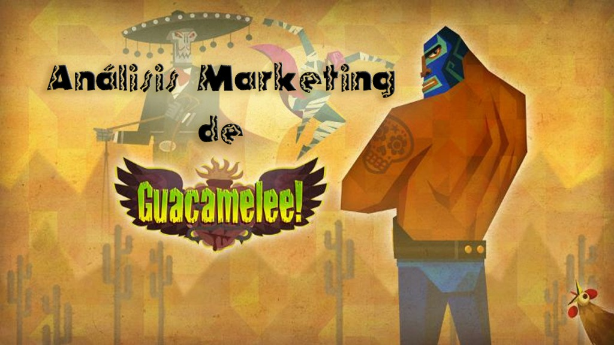
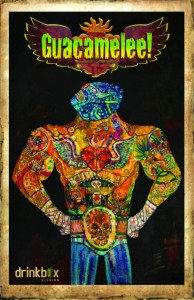
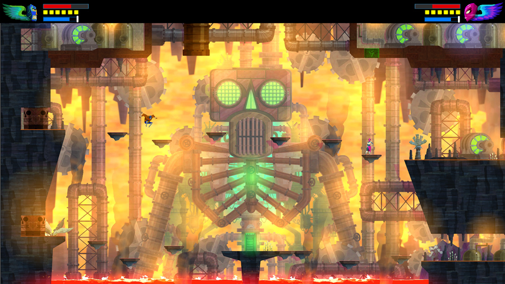
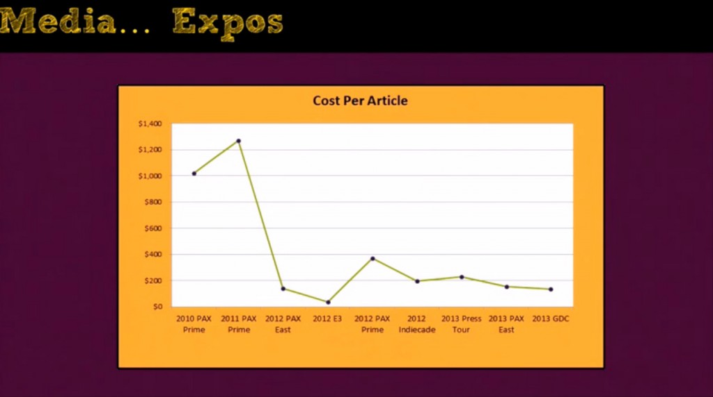

¡Hola jugones!

Hoy es el día de ver algunos aspectos de la campaña de marketing de [_Guacamelee!_](http://guacamelee.com/)  juego creado por el estudio [DrinkBox](http://www.drinkboxstudios.com/).

## Introducción: DrinkBox Studios y _Guacamelee!_

En el año 2008 se funda [DrinkBox Studios](http://www.drinkboxstudios.com/) en Toronto (Canadá), los socios del estudio provienen del cierre del estudio donde trabajaban, [Pseudo Interactive](http://www.pseudointeractive.com/). Hasta el momento han sacado tres títulos y tienen uno planeado para 2015:

- [_Tales from Space: About a Blob_](http://aboutablob.com/) 2010
- [_Tales from Space: Mutant Blobs Attack_](http://mutantblobsattack.com/) 2011
- [_Guacamelee!_](http://guacamelee.com/) 2013
- _[Severed](http://severedgame.com/)  2015_

En este post vamos a conocer cómo realizaron la campaña de marketing en su último juego lanzado. [_Guacamelee!_](http://guacamelee.com/) es un juego tipo Metroid/ Castlevania que toma elementos del folklore mejicano, en él tendremos que pasar por diferentes fases derrotando a enemigos y jefes finales usando nuestros poderes de luchador de wrestling.

_      Trailer Guacamelee!_ 

<iframe src="https://www.youtube.com/embed/_CRsdiEICFI" width="560" height="315" frameborder="0" allowfullscreen="allowfullscreen"></iframe>

### Marketing en compañías Indie

Ajustando más al caso que hoy nos ocupa, [DrinkBox Studios](http://www.drinkboxstudios.com/) es una **desarrolladora Indie**, cuando hablamos de Indie nos referimos a un estudio relativamente pequeño con **recursos** bastante **limitados**. Esta limitación hace que la labor de comunicación del videojuego tenga como objetivo **conseguir la mayor repercusión al menor coste monetario posible**.

## Análisis Guacamelee! El marketing de Juan Aguacate

Nos vamos a centrar en la campaña de marketing de _[Guacamelee!](http://guacamelee.com/)_ sin embargo tenemos que tener en cuenta que al ser un estudio de nueva creación a medida que lanzan videojuegos nos permite ver como ha variado su forma de hacer marketing, y se esto se verá reflejado en las gráficas posteriores.

Como veremos las métricas son parte imprescindible al realizar una campaña y nos ayudan a tomar decisiones o cambiar estrategias para la mejor consecución de nuestro propósito.El análisis está dividido en 4 partes:

- Medios
- Distribuidores
- Agencias de relaciones públicas
- Fans

**Here we go!!**

### **Medios (IGN, Gamespot, Kotaku etc...)**

> "¿ Estas creando el camino con menor resistencia para que los medios puedan hablar fácilmente de tu juego?"

Con esta frase el estudio ilustra su propósito en torno a la comunicación con los medios especializados, veamos más detenidamente qué significa esto.

La idea se resume en que los **medios** especializados **necesitan contenido** que entretenga a sus lectores, si la desarrolladora quiere que se hable de su juego es necesario **facilitar** la **tarea** a los **medios** para que lo difundan a sus lectores. Parece sencillo y lógico a primera vista, pero comparemos dos opciones de notas de prensa mandadas a los medios con la finalidad de dar a conocer _Guacamelee!_

** Ejemplos:**

- **Opción A)**  _[Guacamelee!](http://guacamelee.com/)_ es un juego donde serás un luchador de wrestling mexicano en busca de la hija del presidente.
- ** Opción B)**_[Guacamelee!](http://guacamelee.com/)_ es un juego tipo metroid ambientando en el folklore mejicano donde nos convertiremos en un héroe usando nuestras habilidad especiales de wrestling.

La **opción B** es más atractiva de leer para el medio y ayuda a que éste pueda difundir mejor el contenido a sus lectores.

En resumen, crear los puntos de interés concretos y proveer de las herramientas necesarias a los medios para que puedan entretener a sus lectores.

Otro aspecto de los medios es referido a las **convenciones de videojuegos** y como **aprovechar al máximo el desembolso** que suponen. Mencionan determinadas estrategias que usaron en su asistencia a diferentes convenciones:

- **Contactar con los medios dos semanas antes** de que la convención se realice y añadir imágenes del juego para aumentar su interés y facilitar el trabajo.
- Crear un **stand divertido** al cual la gente se acerque porque vea que los propios desarrolladores lo están pasando bien.
- Intentar **posicionar tu stand** en un Indie Mega booth, este espacio está formado por un conjunto de desarrolladores indie que se agrupan para poder tener un puesto más visible en la convención.
- No poner un puesto de juego libre, sino crear un puesto privado donde se invite a la gente a probar el videojuego.
- **Analizar el coste por artículo**, esta medida refleja el coste total de asistir a la convención dividido por los artículos referentes a tu juego creados por los medios.

\[caption id="attachment\_434" align="aligncenter" width="1024"\] Coste por Artículo Guacamelee!\[/caption\]

Como vemos los anteriores puntos les han funcionado bastante bien reduciendo el coste por artículo a lo largo de la vida del estudio.

### **Distribuidores (App Store, Xbox Live, Steam…)**

Los distribuidores son aquellas compañías que tienen **plataformas** donde poder **lanzar** un **videojuego**.La **actitud** con los distribuidores debe ser **proactiva**, esto quiere decir que tenemos que tener una comunicación activa con nuestros posibles distribuidores que nos permita encontrar oportunidades que de otro modo no aprovecharíamos.

La fecha de salida del videojuego debe ser estudiada en profundidad, es muy recomendable buscar una fecha en la que no coincida con juegos parecidos.  _[Guacamelee!](http://guacamelee.com/)_ fue el único juego nuevo en Playstation Plus durante su semana de salida.  Además si estas suscrito a PlayStation Plus cada mes regalan algún juego y uno de ellos fue _[Guacamelee!](http://guacamelee.com/)_. Comentan que a pesar de no recibir dinero derivado de la venta les ayudó muchísimo a dar a conocer la compañía.

Otras oportunidades que aprovecharon gracias a su contacto constante con las distribuidoras fue tener la oportunidad de estar en un Indie MegaBooth en la Pax o en la zona de juegos Indie de Sony en el E3.

### **Agencias de relaciones públicas**

Nos referimos a empresas que nos ayuden en la comunicación de nuestro videojuego, no son esenciales, pero ayudan mucho a mejorar la comunicación. Estas agencias se encargan de realizar algunas de las tareas que son propias del equipo de marketing del equipo, sin embargo determinadas acciones las pueden realizar mejor que el propio estudio.

Para identificar un poco como colaboraron con la agencia de relaciones públicas he creado esta tabla que nos muestra las fortalezas de cada uno:

**DrinkBox**     **Agencias de Relaciones Públicas**

Notas Prensa/Press Kits

Crear impacto en los medios

Hablar sobre su juego

Contactar con medios que no asisten a las reuniones pactadas

Lista de contactos

Tour de prensa

Negociar exclusivas

El estudio se ve reforzado

<Añadir legitimidad a la campaña

Según comentan la contratación de la firma de relaciones públicas fue muy buena idea ya que se beneficiaron de la experiencia y los contactos que las firmas tienen ya establecidos.

### **Fans**

La creación de un diálogo bidireccional con la comunidad es especialmente importante para conseguir mayor repercusión. Aprovechar el contenido que tus fans crean como pueden ser [cosplays](http://es.wikipedia.org/wiki/Cosplay) o dibujos y recompensarlos por su fidelidad mediante la difusión de dicho contenido es otra acción importante.

Relacionado con las convenciones invitar a tus fans a pasar por el stand, por ejemplo para _[Guacamelee!](http://guacamelee.com/)_ [DrinkBox Studios](http://www.drinkboxstudios.com/) recreó una villa mejicana y se vistieron de fiesta, esto hacía que la gente se interesase por conocer el videojuego.

Además crearon un hashtag para twitter con el nombre de [#foodeogames](https://twitter.com/search?src=typd&q=%23foodeogames) donde enlazaban nombres de videojuegos con comida, se volvió bastante viral y ayudo en la promoción. Algunos ejemplos graciosos que he encontrado:

- Fallout New Veggie
- League of Legumes
- Spice of Invaders
- Calamario Kart

 

* * *

Como vemos la visión de marketing que he hecho es muy generalista, sin embargo da algunos consejos muy buenos que no debemos dejar de tener en cuenta. Gracias a ellos _[Guacamelee!](http://guacamelee.com/)_ se ha convertido en un título muy conocido y ha puesto a [DrinkBox Studios](http://www.drinkboxstudios.com/) en el panorama internacional de desarrolladores.

El contenido descrito anteriormente se encuentra en un vídeo muy interesante donde Chris McQuinn, encargado de marketing de [DrinkBox Studios](http://www.drinkboxstudios.com/) nos hace un repaso de cómo ha realizado su compañía marketing a lo largo de su historia. Totalmente recomendable de ver. Esta en inglés.

[Marketing en DrinkBox Studios](http://www.gamasutra.com/view/news/233901/Video_Painful_PR_lessons_learned_on_the_way_to_Guacamelee.php)

Espero que os haya gustado y me encantaría poder leer comentarios sobre que os parece las estrategias de marketing que han utilizado.

** Data Box**

- **Desarrollador:** DrinkBox Studios Inc.
- **Editor:** DrinkBox Studios Inc.
- **Fecha de salida:** 9 de Abril, 2013 para PS Vita y PS +
- **Tamaño del equipo al iniciar el proyecto:** 5
- **Tamaño del equipo al acabar el proyecto:** 13
- **Duración del desarrollo:** 8 meses en preproducción, 11 meses en producción
- **Líneas de código:** 350,000
