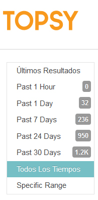
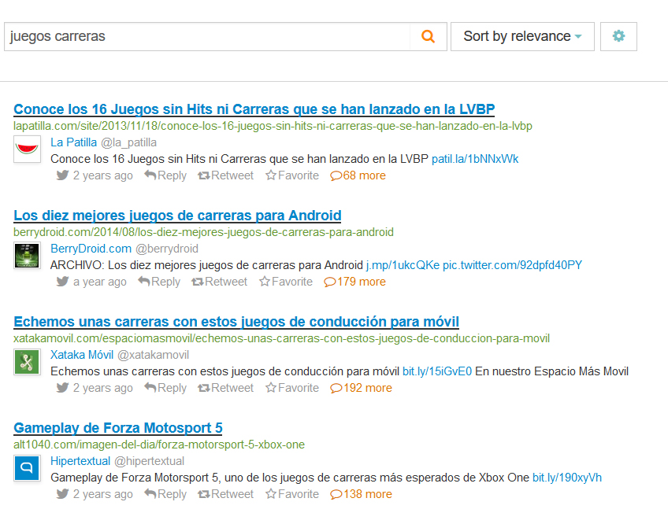
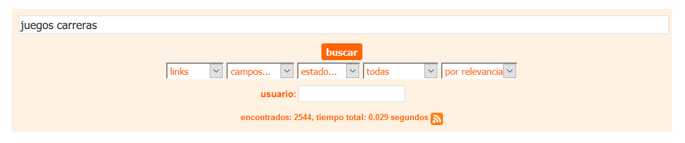
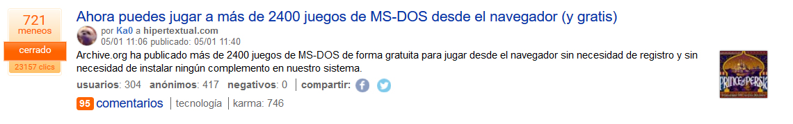
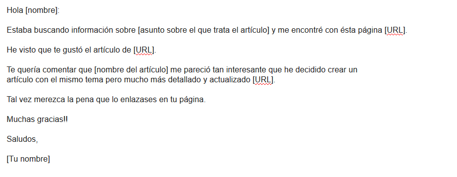

El post de hoy va de marketing de contenidos o Inbound Marketing, específicamente voy a explicar cómo crear contenido que te permitan aumentar las visitas de la web de tu juego y por ende conseguir mayor repercusión y posibles jugadores. Un muy buen ejemplo nos los dio Luis Oliván de Fictiorama Studios en el último episodio de Game Stuff, Luis fue capaz de crear contenidos útiles generando una comunidad que le ayudó a poder sacar adelante el primer título del estudio.

Ésta estrategia **nos puede ayudar cuando estamos en la etapa de promoción de nuestro videojuego**, de manera que podamos conseguir mayor atención y repercusión, como se dice habitualmente el contenido es el rey, es de vital importancia conocer estrategias que nos permitan crear contenido épico para incrementar el número de visitas a nuestro blog.

## Técnica Skyscraper

Está técnica creada por [Brian Dean](https://twitter.com/Backlinko) se basa en hacer [Link Building](https://es.wikipedia.org/wiki/Link_building), ésto significa conseguir que otras páginas nos enlacen y de ésta manera hacer notar a Google que nuestro contenido es relevante y posicionar mejor en el ranking. Además si lo hacemos bien nos permite alcanzar relevancia en las Redes Sociales generando otro influjo de jugadores a nuestra página web.

La técnica Skyscraper consta de tres pasos:

1. **Encontrar buen contenido que haya sido linkeado por varias páginas.**
2. **Mejorar ese contenido de forma sustancial**
3. **Hacer llegar el contenido a la gente adecuada.**

¿Sencillo verdad? Bueno... tiene más chicha de lo que parece pero vamos a verlo paso por paso.

## 1.Encontrar contenido que haya sido linkeado por varias páginas.

En la primera fase de la estrategia debemos focalizar nuestros esfuerzo en encontrar contenido que haya tenido una repercusión grande y haya sido enlazado una gran cantidad de veces. Ademas debemos encontrar contenido que nos valga para el blog de nuestra página web/videojuego. Para ello podemos usar varias medios que nos permitan identificar contenido con éstas características.

- **Topsy**

Topsy nos permite encontrar contenido con gran repercusión en las Redes Sociales de manera que seguramente contenga un montón de enlaces hacia dicho contenido.Para ello simplemente debemos poner los términos que queramos buscar en la caja de búsqueda.

Tras realizar la búsqueda elegimos la opción de todos los tiempos.

Ahora vemos como para el ejemplo de búsqueda juegos de carreras tenemos resultados que han tenido bastante repercusión y nos pueden valer.

- **[Menéame](https://www.meneame.net/)**

Al igual que Topsy, Menéame es una fuente muy interesante de artículos que han sido muy compartidos por la comunidad y además nos permite conocer la cantidad de clicks que han tenido. Para realizar una búsqueda en Menéame pon el término que te interese en la caja de búsqueda y a continuación elige para todo el período tal como hicimos en Topsy.

Para el ejemplo de juegos de carreras vemos que en la primera página no hay nada relevante, sin embargo si vamos hacia la segunda página vemos esto:

23157 Clicks tiene dicho enlace, debe tener bastantes enlaces entrantes también.

- [**Búsqueda de Google**](https://www.google.es/)

Otra forma sencilla es buscar por artículos que tengan buen ranking en Google, seguramente tengan bastantes enlaces y nos puedan valer. Una vez veamos un resultado que nos parezca interesante podemos usar herramientas como [Ahref](https://ahrefs.com/) para ver los enlaces entrantes que tiene.

## 2.Mejorar el contenido de forma sustancial

Para ello podemos hacer varias cosas:

- Hacerlo más largo incluyendo más información.

Para ello podemos hacerlo de varias formas, si por ejemplo encuentras que el artículo dice los 10 mejores juegos de carreras, si tu post tiene los 25 mejores juegos de carreras estas aumentado el valor incluyendo más información útil.

- Actualizar el contenido.

Si encuentras un contenido que ha sido relevante pero se encuentra desactualizado aprovecha la oportunidad y crea uno acorde a la actualidad y tendrás muchas posibilidades de posicionarte como referente.

- Mejorar el diseño del contenido.

Algunas veces el contenido que encontramos tiene un diseño pésimo o no es visualmente atractivo, si consigues que tu contenido sea atractivo para los lectores tendrás media batalla ganada.

Por último, si haces que tu contenido sea mejor que el que encontraste en éstos tres apartados tus probabilidades serán mucho mayores.

## 3\. Hacerlo llegar a la gente correcta.

Tras mejorar el contenido ahora toca hacerlo llegar a la gente que compartió el artículo del que partimos, para ello podemos usar herramientas como [Ahref](https://ahrefs.com/), [Majestic SEO](https://es.majestic.com/), [Open Site Explorer](https://moz.com/researchtools/ose/) o [SEMRush.](http://es.semrush.com)

> Todas ellas tienen un pequeño problema, y es que si no pagas solo te dejan ver los 5 primero enlaces entrantes de las páginas. Con [Ahref](https://ahrefs.com/) tenemos la posibilidad de pagar un mes y si no nos convence cancelar antes de 7 días y te devuelven el dinero.

En primer lugar debemos usar uno de los programas mencionados anteriormente para saber los enlaces entrantes que tiene el artículo del que hemos partido. Una vez hecho exportamos la lista a una hoja de cálculo y eliminamos las menciones al artículo que no nos convengan tal como pueden ser enlaces desde foros, directorios etc...

Tras tener la lista de páginas web que enlazaron el contenido que elegimos pasamos a la segunda fase, mandar un email a dichos sitios informándoles de que hemos mejorado ese contenido mediante un email de éste tipo:

Mediante éste email podrás conseguir enlaces a tu artículo de páginas que ya enlazaron el artículo anterior, no lo harán todas pero seguramente alguna página potente se haga eco y la estrategia funcione.

Próximamente tengo pensada probar ésta estrategia en el blog para comprobar si funciona y mostraros los resultados, mientras tanto me gustaría saber que os parece. Es una estrategia de marketing de contenidos que requiere mucho esfuerzo y trabajo, pero creo que haciéndolo bien puede suponer un buen influjo de visitas y de posicionamiento web para vuestras páginas.

Un saludo!
