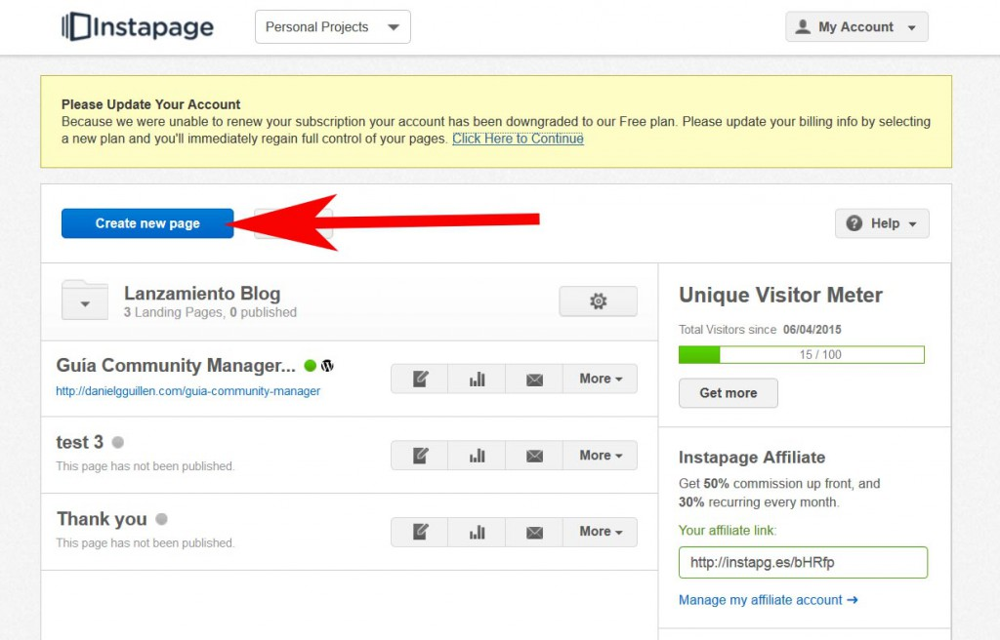
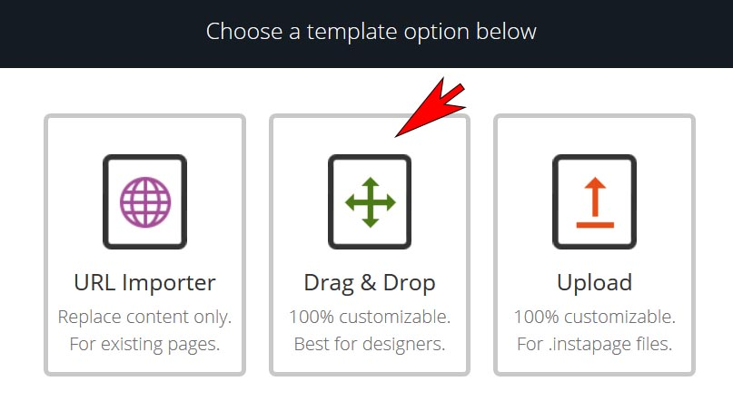
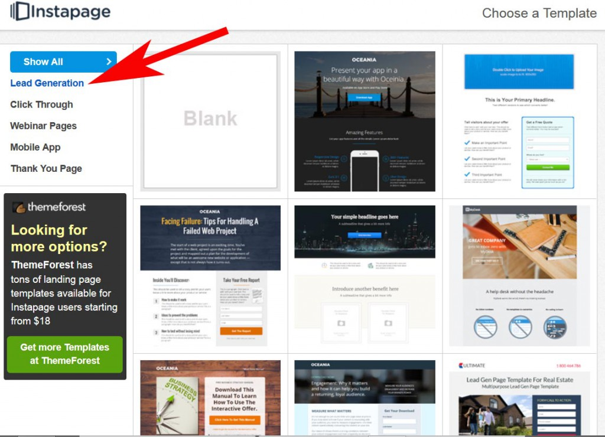
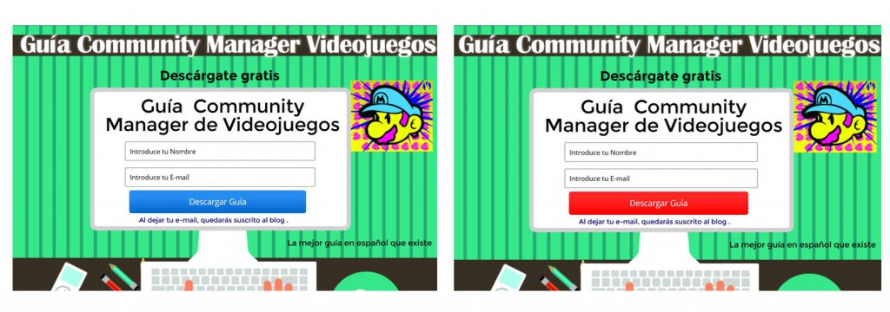
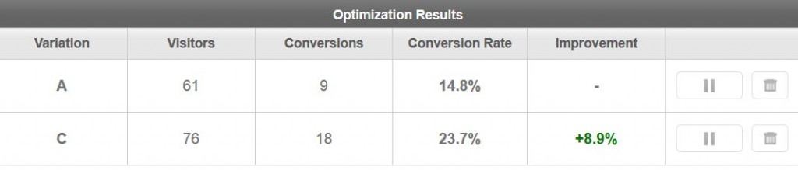

En el marketing actual una de las estrategias más potentes para generar expectación en el lanzamiento de un producto es la creación de una página de prelanzamiento para aumentar el interés de la comunidad.

Hoy vamos crear una página de prelanzamiento para tu videojuego de forma sencilla y efectiva mediante el uso de una de las herramientas que comenté en el post de Growth Hacking, se llama [Instapage](https://www.instapage.com/) y es una software increíble que recomiendo totalmente.

# Creando comunidad antes de lanzar

[Instapage](https://www.instapage.com/) nos da la oportunidad de empezar a generar comunidad incluso antes de anunciar el proyecto. Mediante una página de prelanzamiento podemos ir creando una lista de suscriptores interesados en recibir información de nuestro juego. Ya he comentado anteriormente la importancia de crear una lista de correo pronto para tener la oportunidad de realizar email marketing, es una estrategia muy buena que no debemos desaprovechar.

# Cómo crear una página de prelanzamiento para tu videojuego

 

\[bctt tweet="Con Instapage tenemos la ventaja de no necesitar saber nada de programación y además podemos tener la página lista en menos de 15 minutos. "\]

Éste software nos permite crear más tipos de páginas como:

- Generación de Leads
- Promoción de Apps
- Promoción de Webinars
- Páginas de Gracias

Por el momento vamos al lío.

En primer lugar debemos ir a su [página web](https://www.instapage.com) y darnos de alta con el email y la contraseña que elijamos. Una vez hecho ésto podemos empezar a crear nuestra página.

En el siguiente paso nos pedirá elegir una forma de creación de la página:

- La primera opción nos permite importar una página creada con Instapage que nos guste desde una url (para versión de pago)
- La segunda nos permite crear nuestra propia página web  (elige esta opción)
- La tercera nos permite importar una página web desde un archivo que tengamos creado de Instapage

Una vez elegida la 2º opción entraremos en otro apartado donde tendremos que elegir el tipo de página que queremos utilizar. En nuestro caso elegiremos **Lead Generation**, que significa obtener emails mediante un formulario en la página creada, ahora nos dará unos cuantos temas, recomiendo buscar alguno que os guste para luego modificarlo a vuestro gusto.

Una vez elegido vuestro tema y gracias a que Instapage nos permite modificar el diseño sin tocar código podemos ir adaptando el tema a nuestro gusto, podéis ver éste tutorial de la creación de una página para haceros una idea:

Al realizar la página de prelanzamiento debemos de tener en cuenta que su diseño tiene que estar totalmente optimizado para conseguir el mayor porcentaje de emails posibles, por ello debemos tener especial cuidado en crearla. Si queréis más información Unbounce tiene una [infografía](http://unbounce.com/landing-pages/perfect-landing-page-recipe/) que os puede ayudar a crear una página atractiva para el usuario.

## Creación de Test A/B en tus páginas de prelanzamiento

La función más interesante de [Instapage](https://www.instapage.com/) aparte de la sencillez en la creación de las páginas es que nos da la oportunidad de crear test A/B de manera sencilla.

Los **Test A/B** se refieren a **experimentar con dos variaciones para optimizar nuestras métricas**. Siendo una variación la ya establecida (A) generamos otra variación (B) en la que cambiemos por ejemplo el color de un botón. Posteriormente podemos analizar que color mejora nuestras métricas y adoptarlo en nuestro proyecto. Esta muy ligado a la experiencia de usuario y la finalidad es intentar mejorar la conversión.

La creación del Test A/B es tan sencilla como añadir una variación a la página que hemos creado modificando el color de una caja y establecerlo como la variación B. También podemos hacer test multivariantes creando otra página totalmente diferente y comparándola con la primera que hicimos.

Mediante éste tipo de test podemos ver la variación que nos ha funcionado mejor y adoptarla como referencia para poder seguir realizando test. [Instapage](https://www.instapage.com/) nos ofrece métricas sobre conversión que son muy interesantes.

Otro punto a tener en cuenta es que con [Instapage](https://www.instapage.com/) tenemos la oportunidad de instalar un código de Analytics para medir los datos.

## Lanzando nuestra página de prelanzamiento

Una vez tengamos una nuestra página lista lanzarla es muy sencillo, para ello tenemos varias opciones.

En mi caso como el blog es Wordpress uso ésta opción, mediante un [plugin](https://wordpress.org/plugins/instapage/) que se puede descargar del repositorio podemos mandar la página creada desde [Instapage](https://www.instapage.com/) hasta el [plugin](https://wordpress.org/plugins/instapage/) en Wordpress y simplemente lanzarla. Existe la opción también de lanzarla mediante un subdominio de [Instapage](https://www.instapage.com/) o elegir el dominio que quieras.

Espero que el post os haya parecido interesante, [Instapage](https://www.instapage.com/) es una herramienta muy potente que recomiendo utilizar, aunque la versión gratis solo permite recoger 100 emails mensuales podéis valorar la opción de pagar 29$ durante el período que queráis tenerla activa y luego cancelar la suscripción.

Un saludo!

Si te gustó éste post tal vez te pueda gustar:

- Guía para hacer Growth Hacking a tu videojuego
