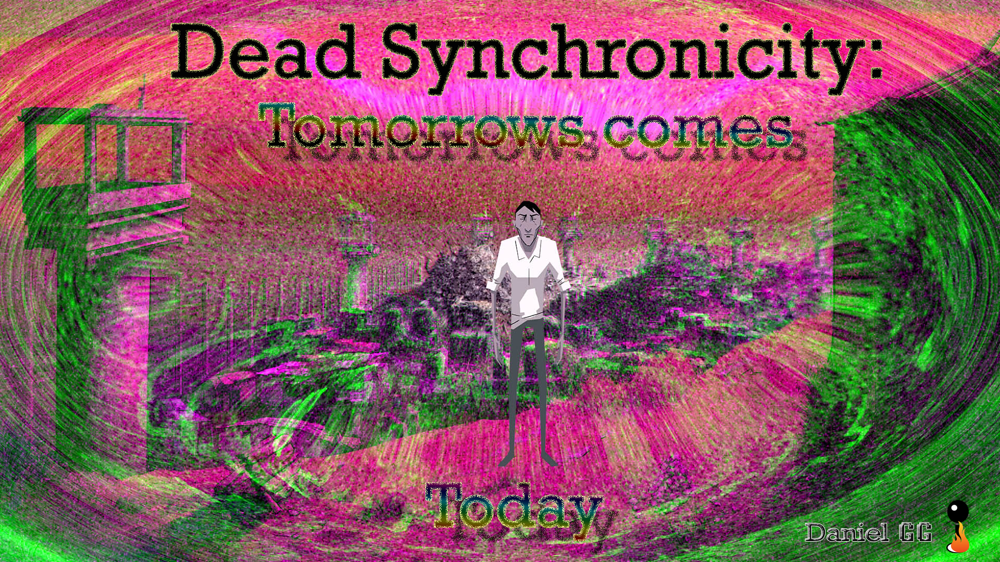
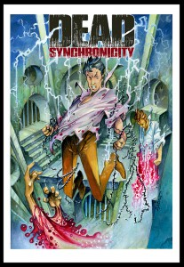
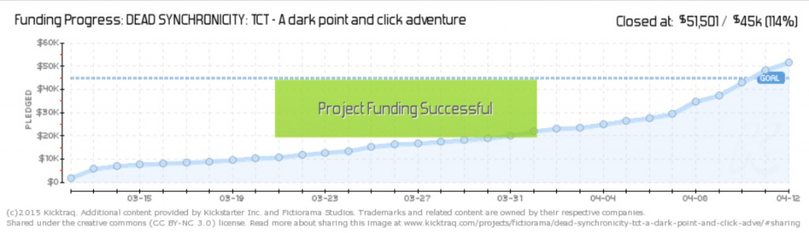
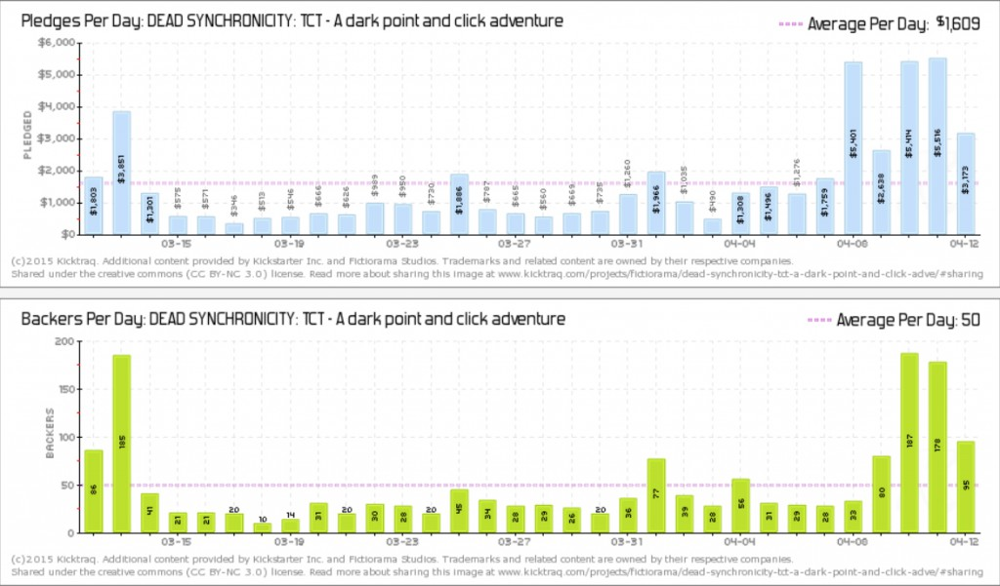
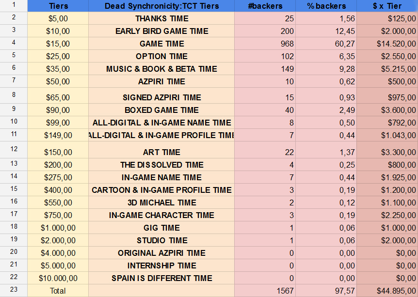

Empezamos con el primer post, he puesto especial esfuerzo y dedicación para crear un análisis completo que os de información muy valiosa y os haga volver a por más, espero que os guste y este post sea una referencia por calidad de los venideros.

Con este fin contacté con Luis Oliván, PR y Product Manager de **Fictiorama Studios**, para analizar con profundidad como hicieron y qué factores influyeron para sacar adelante la campaña de Kickstarter de su juego, [**_Dead Synchronicity: Tomorrows come Today_**](http://www.deadsynchronicity.com/), que será publicado el próximo **10 de Abril**.

El post hubiese sido imposible sin la colaboración de Luis Oliván, es por ello que quiero agradecerle especialmente a él y a su equipo la ayuda, en contra partida espero crear un contenido épico sobre vuestro juego y que os guste el post.

¡Al lío!

Comencemos por lo básico:

## **¿Qué es Kickstarter?**

Aunque la mayoría de vosotros lo sabéis no viene mal hacer un pequeño resumen.

Kickstarter es una plataforma de financiación en masa (crowdfunding) que ayuda a crear proyectos creativos. Esto significa que si un estudio, grupo o artista necesita conseguir cierta cantidad de dinero para poder realizar su proyecto tiene la oportunidad de realizar una campaña de recogida de fondos en esta plataforma.

Las personas que han apoyado a la campaña recibirán ciertas recompensas según la cantidad de dinero que hayan aportado siempre y cuando el proyecto consiga el objetivo monetario mínimo establecido para la campaña.

Una vez visto esto pasamos a ver el caso de hoy.

## **Fictiorama Studios y Dead Synchronicity**

Fictiorama Studios es una desarrolladora de videojuegos indie afincada en Madrid formada por un equipo de cuatro personas:

- Mario Oliván – Programador
- Martín Martínez – Artista
- Alberto Oliván –Escrito y compositor
- Luis Oliván –  Productor y PR Manager

Todos ellos amantes de las aventuras gráficas deciden empezar a trabajar en su primer título llamado [**_Dead Synchronicity: Tomorrows come Today_** ](http://www.deadsynchronicity.com/) que toma como base referencias del género como son _Monkey Island o Broken Sword._

Los pilares básicos de Dead Synchronicity se basan en ofrecer una aventura gráfica oscura, con un estilo narrativo serio, donde el diseño y la banda sonora acompañen al jugador en una aventura enmarcada en un escenario post-apocalíptico.

#### ¿A quién no le gusta lo post-apocalíptico?

Con este proyecto Fictiorama Studios ha sido capaz de conseguir  51,501$  de los 45,000$ que habían pedido en su campaña Kickstarter además de ser aprobado por la comunidad en Steam Greenlight.

Como veis parece interesante conocer como lo han hecho desde el punto de vista del marketing aplicado a videojuegos para conseguir tal impacto con su primer proyecto.

Para empezar os resumo los datos de su proyecto de Kickstarter

## **Kickstarter Dead Synchronicity:Tomorrows comes Today**

- Fecha:12 de Marzo-12 de Abril 2014 (31 Días)
- Objetivo: 45,000\$ para el desarrollo del juego
- Recaudado: 51,501\$
- Porcentaje recaudado: 114,46%
- Personas que han aportado al proyecto: 1606
- Media de aporte por persona: 32,06\$

## **Análisis Kickstarter**

Vamos a dividir el análisis en 3 partes:

1. Antes de lanzar el Kickstarter
2. Lanzamiento, desarrollo y final de la campaña
3. Datos de la campaña

Here we go!!

## 1\. Antes de lanzar la campaña

Es importante saber que la realización de un campaña de Kickstarter se prepara de 1 a 3 meses antes de lanzarla, sin embargo  antes incluso de juntar todo el material para realizar la campaña existen algunos puntos que pueden ser decisivos para la posterior consecución del proyecto.

En Fictiorama Studios Luis y su equipo empezaron a trabajar en el videojuego a tiempo completo a partir de noviembre de 2013, teniendo en mente que necesitarían conseguir fondos en Kickstarter para poder completar el juego.  Por ello crearon una web donde incluyeron un [blog de desarrollo del videojuego](http://www.deadsynchronicity.com/blog/) y perfiles en las redes sociales donde empezar a sacar contenido para que la gente fuese conociendo el juego poco a poco.

Recomiendo leer el blog de desarrollo, me parece un ejemplo muy bueno de marketing de contenidos buscando mejorar el denominado engagement o atracción de la comunidad.

Por otro lado tenían muy claro la importancia de tener una demo técnica donde se pudieran demostrar su capacidad para crear una buena aventura gráfica,  en el momento que dispusieron de una demo operativa asistieron en Londres a **AdventureX**, convención especializada de aventuras gráficas.  Allí hubo gente como **Tim Schafer** (creador de The Secret of Monkey Island) o **Charles Cecil** (creador de Broken Sword) referentes en el género, que se interesaron  y jugaron el juego, ayudando a mejorar su alcance, sin mencionar el extra de motivación al equipo.

Paralelamente en diciembre de 2013 mandaron la primera nota de prensa oficial sobre el juego a los medios, en las sucesivas notas que fueron enviando daban a conocer algunos detalles y de esta manera los medios ya tenían conocimiento del juego, en una de dichas notas avisaron de la proximidad de la campaña de Kickstarter y los medios se hicieron eco de ello creando una expectativa en la comunidad.

Fictiorama Studios también se puso en contacto con compañías que iban a realizar campañas en Kickstarter y que acaban o coincidían justo con la campaña de **_Dead Synchronicity_** consiguiendo algunos **shout-outs** a jugadores potenciales que pudieran estar interesados en aportar al proyecto.

Como vemos todas estas acciones buscan un único objetivo que se resume en conseguir el mayor número de artículos en medios y aumentar el alcance e impacto en redes sociales con el fin de tener un buen inicio al lanzar la campaña de Kickstarter.

##  2 Lanzamiento, desarrollo y final de la campaña

Como hemos comentado antes la campaña se empezó a preparar 3 meses antes de su salida, Luis Oliván se encargo de la mayor parte de comunicación y el resto del equipo apoyo en la preparación de la campaña.

Me gustaría destacar el arduo trabajo que representa crear una campaña de Kickstarter, el objetivo principal es ser visibles para recibir tráfico y convertirlo en aportaciones, para ello se debe crear un flujo constante de contenido de interés para los clientes potenciales durante toda la campaña, lo que significa mucho material de buena calidad, y Fictiorama Studios lo llevaba.

Al iniciar la campaña de Kickstarter tenían una demo jugable , la colaboración de Alfonso Azpiri (ilustración de más arriba) que causó bastante repercusión en los medios españoles, y un trailer que podemos ver a continuación:

**Trailer Dead Synchronicity: Tomorrows comes Today**

<iframe src="https://www.youtube.com/embed/a6lXZ9l8pvw" width="560" height="315" frameborder="0" allowfullscreen="allowfullscreen"></iframe>

En la actualidad el material gráfico y de vídeo es fundamental en una campaña de Kickstarter, puede suponer la diferencia entre que contribuyan a tu proyecto o no, por ello es de especial importancia tener un buen material que resulte interesante para la comunidad.

Hablando de la demo su cometido principal según las palabras de Luis Oliván es:

_“Si contribuyes a nuestro proyecto podremos hacer algo como esto… pero mejor”_

Y parece que a la gente le gustó, si estáis interesados podéis descargar la demo aquí:

**[http://www.deadsynchronicity.com/demo/](http://www.deadsynchronicity.com/demo/ 'Dead Synchronicity Demo')**

Al mismo tiempo que lanzaron la campaña en Kickstarter también pusieron el juego en Steam Greenlight para ver si el juego era aprobado, creando un flujo de tráfico desde Steam a Kickstarter. Finalmente el juego fue aceptado en Greenlight poco después de acabar la campaña de Kickstarter.

Continuando con el desarrollo de la campaña y tras tener un buen inicio, la parte complicada es la mitad de la campaña donde es difícil mantener la atención de la comunidad, para ello crearon mucho contenido inédito e interesante con el fin de mantener la visibilidad alcanzada en el principio de la campaña, algunos ejemplos:

**Composición de la banda sonora**

<iframe src="https://www.youtube.com/embed/FTKGlwU7Yfc" width="560" height="315" frameborder="0" allowfullscreen="allowfullscreen"></iframe>

**Un día en Fictiorama Studios**

<iframe src="https://www.youtube.com/embed/TYi5lnMAGN0" width="560" height="315" frameborder="0" allowfullscreen="allowfullscreen"></iframe>

El momento de la verdad viene con el final de la campaña y es donde la mayoría de los proyectos deben apretar más para dar el empujón final y poder conseguir la financiación. En el caso de Fictiorama Studios usaron una serie de acciones que fomentaron el aumento del dinero recaudado.

Una de ellas fue incluir un add-on de +5\$ consistente en una pequeña aventura de texto, este add-on se puede añadir a la contribución que ya has hecho, y puesto que las personas que ya han aportado se intuyen amantes de las aventuras gráficas bastante gente estuvo interesada.

Al mismo tiempo mandaron una nota de prensa anunciando los últimos días de la campaña con el fin de que los medios se hiciesen eco de la noticia, y así fue. Además Kickstarter avisa a las personas que estuvieron interesadas y no aportaron dinero para que aprovechen la oportunidad.

Finalmente un día antes del cierre de la campaña consiguieron rebasar el objetivo marcado y se procedió a abrir Paypal para aportaciones posteriores a la campaña.

Como vemos las campañas de Kickstarter son muy complejas y tener preparado un plan de marketing para la campaña se vuelve algo imprescindible para conseguir el objetivo.

## 3\. Datos de la campaña

Aunque antes os he puesto algunos datos básicos quiero compartir con vosotros un análisis un poco mas detallado del Kickstarter de [**_Dead Synchronicity: Tomorrows comes Today._**](http://www.deadsynchronicity.com/)

En la página **[Kicktrack](http://www.kicktraq.com)** podemos encontrar gráficos donde nos muestran datos muy interesantes de las campañas.

Visión General de la Campaña

Podemos observar el impacto de los días finales en la campaña, que se refleja perfectamente en el siguiente gráfico donde se muestra la cantidad de dinero diaria obtenida y la cantidad de personas que aportaron por día.

- Cantidad media conseguida por día: 1609\$
- Backers o patrocinadores medios por día: 50

El gráfico nos permite ver la importancia de un buen comienzo, la dificultad de conseguir aportaciones en la mitad de la campaña y el empujón final que representan las acciones a final de ésta.

A continuación un desglose de los backers o patrocinadores por tier, cada tier representa un nivel de recompensas según la cantidad aportada al proyecto, varían desde los 5$ a 10,000$.

Podemos observar que los tiers de 10$ a 35$ son los que más aportaciones han tenido y los tiers a partir de 4,000\$ no tuvieron mucha aceptación.

Nota:La diferencia existente entre el total recaudado en el gráfico anterior y el total mostrado en la página de Kickstarter se debe a que las aportaciones que no piden ninguna recompensa no son contabilizadas, algunos errores con tarjetas de crédito y la contabilización de los \$ extra de los add-ons.

## Conclusión

En resumen, se necesita mucho tiempo y esfuerzo para realizar una buena campaña de Kickstarter, pero la recompensa merece la pena. Mis felicitaciones a Fictiorama Studios por el éxito de la campaña y por el inminente lanzamiento de [_**Dead Synchronicity: Tomorrows comes Today**_](http://www.deadsynchronicity.com/) ¡seguro que os va a ir genial!

Enlaces a  [_**Dead Synchronicity: Tomorrows comes Today**_](http://www.deadsynchronicity.com/)

- Página web: [http://www.deadsynchronicity.com/](http://www.deadsynchronicity.com/)
- Twitter: [https://twitter.com/deadsynchro](https://twitter.com/deadsynchro)
- Facebook: [https://www.facebook.com/DeadSynchronicity](https://www.facebook.com/DeadSynchronicity)
- YouTube: [https://www.youtube.com/fictiorama](https://www.youtube.com/fictiorama)
- Kicktraq: [http://www.kicktraq.com/projects/fictiorama/dead-synchronicity-tct-a-dark-point-and-click-adve/](http://www.kicktraq.com/projects/fictiorama/dead-synchronicity-tct-a-dark-point-and-click-adve/)

Y eso es todo por hoy, menudo tocho me he marcado pero creo que es bastante interesante dar este tipo de visión sobre las campañas de Kickstarter, espero que el post te haya gustado si es así me ayudarías muchísimo compartiéndolo en Redes Sociales.
