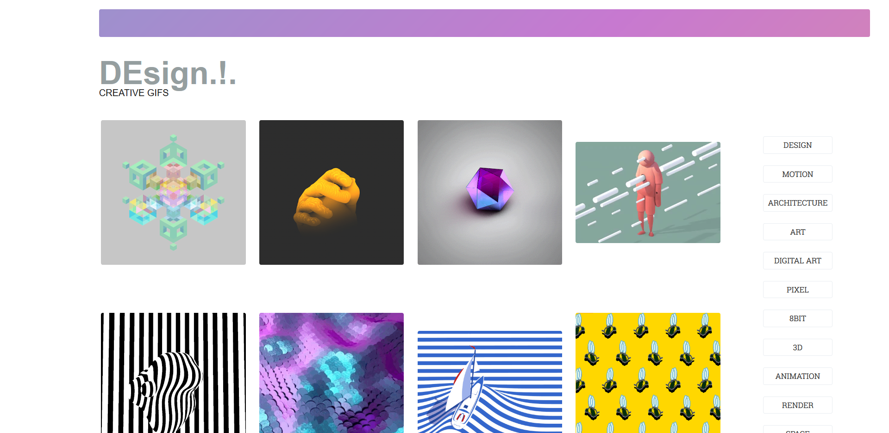
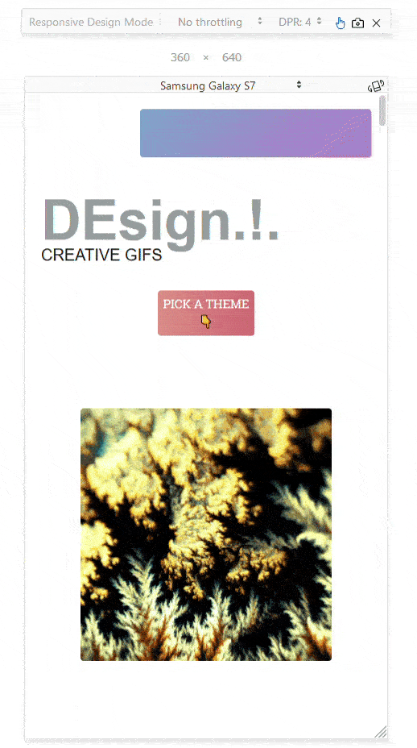

Hi guys!

I am in the process of applying for jobs as a Front-End Dev.

If you have been in the position of looking for a new job, you know how hard it is to keep the stamina up.

I am still going strong 💪

One of the companies I applied for asked to do a technical test for a javascript role.

The test consists of:

- Create list of Gifs with infinite scrolling.
- Use a framework like React, Angular.
- Use Giphy API to show the gifs.

I found the test interesting.

Who doesn't like gifs?

I also enjoy learning how to work with new API's, and Giphy's one is awesome.

I got sucked in on the test and even though the test only asked for a list of gifs, I decided to spend more time and create a website that people will enjoy.

Meet [DEsign.!.](http://dedd.co)

](http://dedd.co)

[DEsign.!.](http://dedd.co) is meant to be a source of inspiration to creative people.

There are some really cool tags you can check like architecture, pixel or vintage.

I used React for the Front-End.

There was some challenge stuff doing this project, with your permision and as reminder to myself, I going to do a review of some of them.

## Challenges doing DEsign.!.

**Asynchronous nature of Javascript**

I found problems when updating from one theme to the other(like going from vintage to pixel). This issue is the one that took me more time to figure out.

The problem was that when you click the button to change the theme, the API call was executed before the value was passed, giving an error.

How did I solve it?

I knew that in this cases you can use promises to chain functions. I also remember to see a [video from Wes Bos](https://www.youtube.com/watch?v=9YkUCxvaLEk&t=60s) explaining the new async/await API.

On my brain, it is much easier to user async/await to create a chain of function that will occur when changing the theme.

This fixed the problem, when someone clicks on the button, first, the value is passed, then the API call is executed.

😊

**Infinite Scrolling**

Implementing a simple Infinite Scrolling was pretty easy, using [Waypoint](https://www.npmjs.com/package/react-waypoint) you can fire a function whenever a user reaches a point on the website.

Then I update the offset of the API call so it doesn't repeat any GIF's when you are scrolling down.

**Mobile View**

Media Queries, everybody loves them...

I decided to create two different menus depending if you are using the site on mobile devices or desktop.

On mobile devices, the menu will hide and the gifs will show up when you click on a theme.

The way this is implement right now is not ideal, but it works.

Using [React-Responsive](https://www.npmjs.com/package/react-responsive), depending on the device it's viewing the website the menu will work in a mobile way or desktop way.

**AWS**

Not a difficulty per se, but since the company told me that they were using AWS I decided to give it a go to host the project.

I was scared of getting into the humongous AWS world, but being honest, I really enjoyed.

There is awesome documentation for everything.

I used S3 to host the website and Route53 for DNS Management.

## Conclusions

I enjoyed to create the product, and it gave me more ideas to work on.

I don't know if I get the job yet, I will update the post to let you know.

I hope you enjoyed to browse the gifs too, and let me know if you got any feedback!

The code for this project is on [Github](https://github.com/DanielGarciaGuillen/og).
