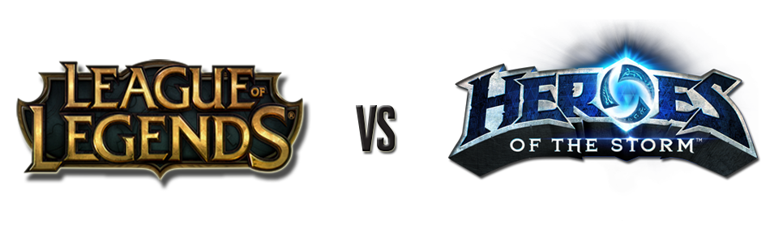

En este post voy a analizar algunos aspectos relacionados con el social media de dos franquicias de videojuegos que forman parte del género [MOBA:](http://en.wikipedia.org/wiki/Multiplayer_online_battle_arena)

- [League of Legends](http://leagueoflegends.com/) ([LOL](http://leagueoflegends.com/)) creado por [Riot Games](http://www.riotgames.com/), es el juego más jugado del mundo con 67 millones de jugadores mensuales.
- [Heroes of the Storm](http://us.battle.net/heroes/en/) ([HOTS](http://us.battle.net/heroes/en/)) creado por [Blizzard,](http://blizzard.com/) será lanzado el próximo 2 de Junio y pretende arrebatar parte del pastel a [LOL](http://leagueoflegends.com/).

Me gustaría analizar la manera en que [Blizzard](http://eu.blizzard.com/en-gb/) va a intentar hacerse un hueco en un mercado donde [Riot Games](http://www.riotgames.com/) está fuertemente establecido, para ello he analizado las redes sociales de ambos juegos con la finalidad de conocer el tipo de estrategias y contenidos que usan para tener mayor impacto y repercusión.

El análisis se divide en **3 Rounds**:

**Round 1: Análisis de Contenido en Redes Sociales**

**Round 2: Análisis Comunidad Online, crecimiento y evolución.**

**Round 3: Análisis Influencia e Impacto en Redes Sociales**

> NOTA: He usado para el análisis las cuentas de EEUU de Facebook y Twitter de ambos juegos.

# El combate MOBA del siglo:  LOL vs HOTS

## Round 1: Análisis de Contenido en Redes Sociales

En primer lugar he creado una tabla para tener organizado los diferentes medios que usan para comunicarse, en este análisis nos centraremos en Twitter y Facebook, en un próximo post veremos el comportamiento de ambas en YouTube.

> (M se refiere a millones, K a miles)

**RRSS**

**League of Legends**

**Seguidores/Likes**

**Página Oficial**

**[http://euw.leagueoflegends.com/es](http://euw.leagueoflegends.com/es)**

**Twitter**

[**https://twitter.com/leagueoflegends**](https://twitter.com/leagueoflegends)

**2,19M**

**Facebook**

[**https://www.facebook.com/leagueoflegends**](https://www.facebook.com/leagueoflegends)

[**12,4M**](https://www.facebook.com/leagueoflegends/likes)

**You Tube**

**[https://www.youtube.com/user/RiotGamesInc](https://www.youtube.com/user/RiotGamesInc)**

**6,78M**

**G+**

[**https://plus.google.com/+leagueoflegends**](https://plus.google.com/+leagueoflegends/posts)

**2,58M**

**Grupo Linkedin Riot**

**http://achot.io/NjHkY**

**52K**

**RRSS**

**Heroes of the Storm**

**Seguidores/Likes**

**Página Oficial**

[**http://eu.battle.net/heroes/es/**](http://eu.battle.net/heroes/es/)

**Twitter**

[**https://twitter.com/BlizzHeroes**](https://twitter.com/BlizzHeroes)

**203K**

**Facebook**

[**https://www.facebook.com/HeroesoftheStorm.es?brand_redir=1**](https://www.facebook.com/HeroesoftheStorm.es?brand_redir=1)

[**997K**](https://www.facebook.com/HeroesoftheStorm.es/likes)

**YouTube**

[**https://www.youtube.com/user/BlizzHeroes**](https://www.youtube.com/user/BlizzHeroes)

**195K**

**G+**

[**https://plus.google.com/+BlizzHeroes**](https://plus.google.com/+BlizzHeroes)

**4,5K**

**Grupo Linkedin Blizzard**

**http://achot.io/TmMxH**

**113K**

###   **¿A quién se dirigen sus cuentas de Redes Sociales?**

En ambas cuentas el público al que se dirigen es un público entre 15 y 35 años interesado en los videojuegos y los e-sport. Aquí podemos ver una comparación de sus cuentas de Twitter oficiales, ambas tienen muy parecido porcentaje del uso del inglés obviamente.

Fuente: [MetricSpot](http://metricspot.com/)

### **¿Con qué frecuencia actúan en Redes Sociales?**

**Twitter**

Tomando como referencia Twitter nos encontramos con que [LOL](http://leagueoflegends.com/) hace una media de 2,04 tweets diarios mientras que en [HOTS](http://us.battle.net/heroes/en/) esta media sube hasta 14,5 tweets diarios, esto nos hace una idea del esfuerzo que está haciendo [HOTS](http://us.battle.net/heroes/en/) por conseguir mayor impacto en Twitter como podemos ver en la siguiente imagen:

Fuente: [MetricSpot](http://metricspot.com/)

Me gustaría destacar algo que me he encontrado tras revisar los datos, [HOTS](http://us.battle.net/heroes/en/) intenta diferenciarse respecto a [LOL](http://leagueoflegends.com/) en el tipo de acciones que realizan en Twitter, [HOTS](http://us.battle.net/heroes/en/) usa mucho más la respuesta a tweets mientras que [LOL](http://leagueoflegends.com/) basa sus acciones en retweets. Además [HOTS](http://us.battle.net/heroes/en/) tiene una actividad mayor a lo largo de toda la semana, mientras que [LOL](http://leagueoflegends.com/) se centra más en el intervalo de Martes-Viernes.

Fuente: [MetricSpot](http://metricspot.com/)

Pensando que tal vez la estrategia de [HOTS](http://us.battle.net/heroes/en/) de usar más las respuestas puede contribuir a generar un mayor impacto social en Twitter los 2,19M de seguidores de [LOL](http://leagueoflegends.com/) hacen que su eficacia sea mayor que la de [HOTS](http://us.battle.net/heroes/en/) con sus 203K.

Respecto a la utilización de los Hashtag ambos andan parejos con un porcentaje de 30% de uso (algo que es susceptible de mejora) encontrando la principal diferencia en que [HOTS](http://us.battle.net/heroes/en/) esta haciendo una promoción enorme de su hashtah [#stormthedorm](https://twitter.com/hashtag/stormthedorm) buscando la promoción de torneos en ambientes de colegio y universidades de EEUU, mientras que [LOL](http://leagueoflegends.com/) usa su hashtag genérico [#leagueoflegends.](https://twitter.com/search?q=%23leagueoflegends&src=hash)

Fuente: [MetricSpot](http://metricspot.com/)

**Facebook**

Para el análisis en Facebook vamos a utilizar [Likealyzer](http://www.likealyzer.com) para extraer datos de relevancia. En primer lugar podemos analizar la actividad de cada cuenta.

He podido observar una tendencia parecida a Twitter en la cual [Heroes of Storm](http://us.battle.net/heroes/en/) intenta realizar más acciones con el fin de mejorar su posición respecto a [LOL](http://leagueoflegends.com/). En Facebook [LOL](http://leagueoflegends.com/) cuenta con un índice de 0,78% de post diarios y [HOTS](http://us.battle.net/heroes/en/) con un 0,92% de post diarios sin embargo los [12,4M](https://www.facebook.com/leagueoflegends/likes) de Likes de la cuenta de [LOL](http://leagueoflegends.com/) hace que sus acciones tengan mucho más valor que las de su competidor.

Fuente: [Likealyzer](http://www.likealyzer.com)

### **¿Qué tipo de contenidos comparte, y cuál genera más engagement?**

**Twitter**

En este apartado podemos analizar los últimos tweets más compartidos de cada uno, parece claro que la cantidad de followers de [LOL](http://leagueoflegends.com/) hace que sus tweets tengan una difusión mucho mayor que las de [HOTS](http://us.battle.net/heroes/en/).

Los tweet con mayor difusión en la cuenta de Twitter de [LOL](http://leagueoflegends.com/) son en su mayoría fan arts creados por los jugadores, podemos ver la importancia de la comunidad en los datos de los siguiente tweets que incluyen una imagen de un fan art realizado por jugadores.

> — League of Legends (@LeagueOfLegends) [Mayo 5, 2015](https://twitter.com/LeagueOfLegends/status/595706716651675648)

Otro fan art que ha funcionado muy bien ha sido:

> Beautiful Yasuo fan art by OrekiGenya. | [http://t.co/CyVkEi8ToV](http://t.co/CyVkEi8ToV) [pic.twitter.com/KIZTnmEhzB](http://t.co/KIZTnmEhzB) — League of Legends (@LeagueOfLegends) [abril 20, 2015](https://twitter.com/LeagueOfLegends/status/590258754869796864)

Además en interesante ver como el anuncio de una nueva skin para uno de sus personajes crea también mucha expectación.

> Arclight Vayne strikes down the unworthy | [http://t.co/FBhxebFGK9](http://t.co/FBhxebFGK9)[pic.twitter.com/xbWs1H5mIe](http://t.co/xbWs1H5mIe)
>
> — League of Legends (@LeagueOfLegends) [abril 21, 2015](https://twitter.com/LeagueOfLegends/status/590622557029715968)

Otro tweet que ha funcionado muy bien ha sido el referente al día internacional de Star Wars, usando el Hasthag  #StarWarsDay y haciendo un juego de palabras con un objeto del juego. Este tipo de acciones son las que sin duda tienen mayor repercusión como podemos ver en las interacciones realizadas con el tweet.

> Happy [#StarWarsDay](https://twitter.com/hashtag/StarWarsDay?src=hash)! [#MayThe4thBeWithYou](https://twitter.com/hashtag/MayThe4thBeWithYou?src=hash) [pic.twitter.com/mvdekSqWQk](http://t.co/mvdekSqWQk)
>
> — League of Legends (@LeagueOfLegends) [Mayo 4, 2015](https://twitter.com/LeagueOfLegends/status/595370760140554240)

Respecto a [HOTS](http://us.battle.net/heroes/en/) existen ejemplos también del buen funcionamiento de las creaciones de la comunidad como en este tweet de un streamer/youtuber del juego, no esta subido directamente por el canal oficial sino que fue retweeteado por [HOTS](http://us.battle.net/heroes/en/).

> No, Stitches.... That's not how we make friends in the Lane....... [@BlizzHeroes](https://twitter.com/BlizzHeroes) [#stitches](https://twitter.com/hashtag/stitches?src=hash) [#wowart](https://twitter.com/hashtag/wowart?src=hash) [#fanart](https://twitter.com/hashtag/fanart?src=hash) [#art](https://twitter.com/hashtag/art?src=hash) [pic.twitter.com/67RxViUDyO](http://t.co/67RxViUDyO)
>
> — Honey Nut KEKs (@QuelFabulous) [abril 22, 2015](https://twitter.com/QuelFabulous/status/591025358574583808)

Además usan otro tipo de estrategias mediante la alusión a aspectos que no tienen relación directa con el juego pero que mediante el uso de hashtags pueden tener una buena repercusión, en éste caso con el día de la tierra #EarthDay.

> In honor of [#EarthDay](https://twitter.com/hashtag/EarthDay?src=hash), plant a Treant! Enemies make great fertilizer [pic.twitter.com/YQmpX4LPn0](http://t.co/YQmpX4LPn0) — Heroes of The Storm (@BlizzHeroes) [abril 22, 2015](https://twitter.com/BlizzHeroes/status/590985952811581440)

Otro tweet que ha tenido muy buen alcance ha sido el anuncio de la fecha oficial de salida del juego, es normal dado la importancia del mensaje y la inclusión del trailer de lanzamiento del juego.

> Heroes of the Storm officially launches on June 2! [https://t.co/oRJPF73IGz](https://t.co/oRJPF73IGz)
>
> — Heroes of The Storm (@BlizzHeroes) [abril 20, 2015](https://twitter.com/BlizzHeroes/status/590138746760105984)

El tweet con mayor alcance de [HOTS](http://us.battle.net/heroes/en/) es el anuncio del nuevo personaje jugable que saldrá en el lanzamiento del juego, al ser un personaje importante dentro de la historia de la compañía ha tenido una repercusión enorme.

> .[@Warcraft](https://twitter.com/Warcraft) was only a setback. [pic.twitter.com/l8m3ocsrX0](http://t.co/l8m3ocsrX0)
>
> — Heroes of The Storm (@BlizzHeroes) [Mayo 5, 2015](https://twitter.com/BlizzHeroes/status/595642381497552896)

Podemos ver que el contenido visual es el que genera más impacto, y los fan arts son un factor fundamental para conseguir un mayor alcance, además los tweets que incluyen vídeo o los que usan hashtag tiene un mayor índice de retweets y respuestas.

**Facebook**

Al igual que con Twitter podemos observar los mejores post en términos de difusión y ver los contenidos que funcionan mejor.

En la [página de fans de LOL](https://www.facebook.com/leagueoflegends) podemos ver que el mismo contenido usado Twitter sobre una nueva skin para uno de sus personajes ha sido de los mejores en término de alcance. 

Como vimos en el apartado de Twitter el contenido creado por la comunidad funciona muy bien, en este caso podemos observar la gran difusión que ha tenido un cosplay de Jinx de un jugador.

Otro contenido que funciona muy bien son los posts donde buscan crear reacciones virales como en éste caso. Este tipo de contenidos tienen una probabilidad mucho mayor de hacerse virales gracias a la gran cantidad de seguidores de sus redes sociales.

Con este post han conseguido:

- Engagement de 137.042
- Me gustas 127.000
- 8838 comentarios
- 1300 veces compartido
- Tasa de engagement por cada 10k de fans de 110,3
- Engagement comparado con la media de LOL de 2,4x

Según podemos extraer de [likealyzer](http://www.likealyzer.com) los contenidos que mejor funcionan para [LOL](http://leagueoflegends.com/) en Facebook son las imágenes lanzadas desde las 9 a las 12 GTM y generan un engagement de 2.11% ( este dato corresponde a la división entre la gente que habla sobre dicho post y el total de likes). Es recomendable tener al menos un ratio del 7% para decir que tenemos un buen ratio por tanto existe margen de mejora amplio.

En [HOTS](http://us.battle.net/heroes/en/) podemos ver como el post de la fecha de lanzamiento que incluye el trailer es el post con mayor alcance .

- Engagement de 4.844
- Me gustas 3.495
- 319 comentarios
- 1035 veces compartido
- Tasa de engagement por cada 10k de fans de 49.5
- Engagement comparado con la media de [HOTS](http://us.battle.net/heroes/en/) de 4,7x

Otro post que ha funcionado muy bien ha sido la imagen que también usaron en Twitter sobre el día de la tierra.

Además he encontrado muy interesante la referencia a la serie más vista de los últimos años, Juegos de Tronos. Han utilizado a un personaje de [HOTS](http://us.battle.net/heroes/en/) para decir algo parecido al lema de la casa Lannister y les ha funcionado muy bien.

Para [HOTS](http://us.battle.net/heroes/en/) también son las imágenes las que mejor funcionan, sin embargo su mejor horario para lanzar post es de 12 a 15 GMT (en [LOL](http://leagueoflegends.com/) es de 9 a 12). Con sus acciones consiguen un engagement rate de un 4.8%, mejor que el 2.11% de [LOL](http://leagueoflegends.com/).

###  **¿De qué fuentes?**

Como hemos visto anteriormente el poder de la comunidad hace que tengamos que tenerla en cuenta como una fuente de contenido con un potencial increíble, la otra gran fuente de contenido debe ser la creación de material asociado a eventos importantes o referencias culturales que puedan volverse virales, siempre con contenido visual.

##  Round 2: Análisis Comunidad Online, crecimiento y evolución.

**Twitter**

Mediante el uso de la herramienta [Twitter Count](http://twittercounter.com/) podemos observar la evolución de ambas cuentas, es curioso ver como a pesar de la menor frecuencia de tweets que realiza [LOL](http://leagueoflegends.com/) aumenta en unos 1700 seguidores diarios frente a los 600 de HOS.**
Fuentes:**

- [**http://twittercounter.com/LeagueOfLegends**](http://twittercounter.com/LeagueOfLegends)
- [**http://twittercounter.com/BlizzHeroes**](http://twittercounter.com/BlizzHeroes?manual_update=1)

**Facebook**

Como vimos anteriormente el engage de [LOL](http://leagueoflegends.com/) (2,11%) es peor que el de [HOTS](http://us.battle.net/heroes/en/) (4,8%), sin embargo su crecimiento es mayor. Esto me hace pensar que debido a la enorme base de jugadores de [LOL](http://leagueoflegends.com/) es más fácil conseguir un crecimiento. 

## Round 3: Análisis Influencia e Impacto en Redes Sociales

He usado tres herramientas para analizar los índices de influencia de ambas marcas.

Mediante el índice [Klout](https://klout.com/) podemos medir el grado de influencia de una persona o una marca en las Redes Sociales. Como podemos observar que los índices de influencia de sus contenidos son muy parecidos:

- [LOL](http://leagueoflegends.com/):78
- [HOTS](http://us.battle.net/heroes/en/) 73

Usando [likelyzer.com](http://likealyzer.com/) podemos ver la calidad de las acciones que realiza cada juego en relación a la respuesta de la comunidad en Facebook,  los resultados son los siguientes:

- [LOL](http://leagueoflegends.com/):78
- [HOTS](http://us.battle.net/heroes/en/) 75

## Por último he usado [Kred](http://kred.com/) para obtener los datos de influencia específicos para Twitter, obteniendo los siguientes resultados:

Conclusiones del combate MOBA del siglo

Me ha parecido interesante observar que a pesar del esfuerzo que está realizando [Blizzard](http://blizzard.com/) para generar influencia en el lanzamiento [HOTS](http://us.battle.net/heroes/en/) sea [LOL](http://leagueoflegends.com/) el que genere mejores índices. Me hace pensar en la importancia de tener unos números tan grandes detrás. Siendo realistas las posibilidades de superar a [LOL](http://leagueoflegends.com/) en social media son muy bajas, sin embargo deduzco que la estrategia de [HOTS](http://us.battle.net/heroes/en/) va encaminada a conseguir un hueco en un mercado muy grande y que a corto/medio plazo tiene mucho potencial debido al auge de los E-sports.

Hasta aquí el combate MOBA del Siglo, espero que os haya parecido interesante conocer algunos datos sobre el social media de ambas marcas, existen muchas herramientas para poder analizar la estrategia que siguen y nos puede servir para entender mejor como funcionan sus comunidades. En el futuro me gustaría realizar más post de este tipo, y ya sabéis, si os ha gustado podéis suscribiros y recibiréis en vuestro correo mis posts semanales junto con contenido exclusivo para suscriptores.
