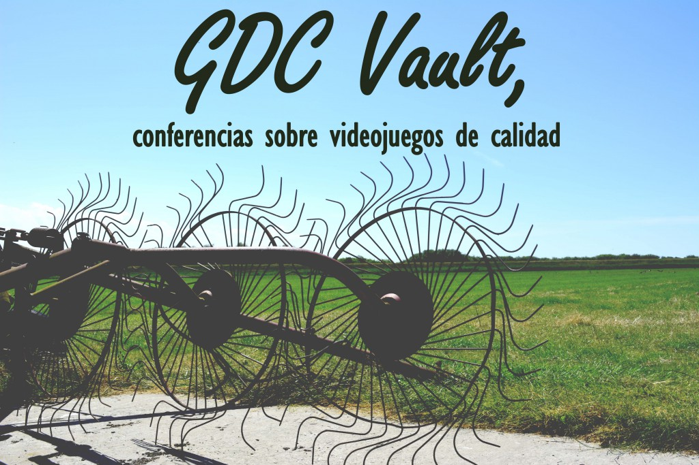

En el post de hoy me gustaría hablar sobre **[GDC Vault](http://www.gdcvault.com)**, ésta plataforma es una **fuente de conocimiento increíble** y nos da la oportunidad de conocer aspectos de la industria de videojuegos de parte de profesionales.

## ¿Que és [GDC Vault](http://www.gdcvault.com)?

En primer lugar la plataforma [GDC Vault](http://www.gdcvault.com) forma parte de la [GDC](http://www.gdconf.com/) ([Game Developers Conference](http://www.gdconf.com/)), el mayor evento sobre la industria de videojuegos para profesionales. En [GDC Vault](http://www.gdcvault.com) podremos disfrutar de las conferencias que se realizan en las [GDC](http://www.gdconf.com/) de manera que podemos ver a grandes ponentes explicarnos como trataron un determinado tema del desarrollo de su videojuego.

En segundo lugar comentar que existen dos opciones al usar [GDC Vault](http://www.gdcvault.com), pagando o sin pasar por caja. Cuando pagamos tenemos acceso a todo el contenido disponible, sin embargo el coste es elevado ([495$ anuales](http://www.gdcvault.com/inquiry/)). Si decidimos no pagar nos encontramos que el número de conferencias es mucho menor, pero podemos encontrar joyas entre las conferencias gratuitas que nada tienen que envidiar a las de pago. Decir que todas las conferencias son en Inglés.

Hace algún tiempo encontré un post de [Francisco Souki](https://twitter.com/fjsouki), Game Designer de [Schell Games](http://www.schellgames.com/) donde contaba que cada semana en su estudio se realiza una proyección de charlas de [GDC Vault](http://www.gdcvault.com), de manera que la gente aprenda de los conferenciantes. Lo interesante es que llevan un listado de las conferencias que ven y las van poniendo un rating según la calidad del ponente y las opiniones de los espectadores. Me parece una idea genial, así tenemos un filtro para ver las conferencias que de verdad nos interesan. Aunque la mayoría son conferencias del módulo de pago, existe otras muchas gratis que merecen la pena.

Enlace a la hoja de cálculo de [GDC Vault](http://www.gdcvault.com) con las conferencias **[aquí.](https://docs.google.com/spreadsheets/d/1AbJapBXOo7F_YqPXb0bv7UMH9NN62AMQp3gPtNGVfao/htmlview?pli=1#)**

 \[bctt tweet="GDC Vault nos permite escuchar a ponentes top y aprender del desarrollo de videojuegos."\]

Por último me gustaría poneros algunas conferencias que me han gustado:

- [Concrete Practices to be a Better Leader](http://www.gdcvault.com/play/1012346/Concrete-Practices-to-be-a) de Bryan Sharp
- [Designing Games for Game Designer](http://www.gdcvault.com/play/1015305/Designing-Games-for-Game) de Stone Librande
- [The 5 Domains of Play: Applying psychology's big 5 motivation domains to games](http://www.gdcvault.com/play/1015595/The-5-Domains-of-Play) de Jason Vandenberghe

Un saludo y espero que disfrutéis viendo estas conferencias tanto como yo.

PD: Si te ha gustado el post, tal vez te interese el análisis que hice sobre el marketing de Guacamelee.

- Análisis Guacamelee! El marketing de Juan Aguacate
