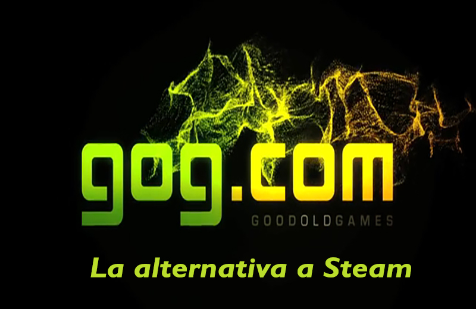

[GOG.com](http://www.gog.com/) (Good Old Games) es una **plataforma** de **distribución digital** para PC propiedad del estudio polaco CD Projekt (creador de The Witcher). Su especialidad es rescatar juegos descatalogados y re-editarlos para poder usarlos en los nuevos equipos y venderlos a unos precios competitivos.

Además y lo que más nos puede interesar es que a partir de 2013 también ejercen de publisher independiente lo que permite lanzar nuestro juego en su plataforma, al estilo [Steam Greenlight](https://steamcommunity.com/greenlight). También existe la posibilidad de que te adelanten dinero para pulir el juego y sacarlo por su plataforma devolviendo dicha cantidad mediante tus ventas.

_Trailer The Witcher 3_

<iframe src="https://www.youtube.com/embed/7i23ZDoxClk" width="560" height="315" frameborder="0" allowfullscreen="allowfullscreen"></iframe>

### **Historia de [GOG.com](http://www.gog.com/)**

Todo empieza cuando en los noventa Marcin Iwinski y Michal Kicinski fundan [CD Projekt](http://en.cdprojektred.com/) con la finalidad de ser un distribuidor minorista de videojuegos en Polonia.

Paralelamente en aquellos tiempos en Polonia era usual el pirateo de juegos debido al alto precio del hardware, lo que hacía que los jugadores pirateasen los videojuegos antiguos que podían jugar en sus ordenadores. En ese germen se les ocurrió la idea de crear una distribuidora de videojuegos antiguos a precios muy asequibles ofreciendo con la compra del juego un montón de extras como póster, manuales y mapas. De esta manera consiguieron reconducir parte del pirateo a compras digitales tal y como ha hecho Steam en los últimos tiempos.

Tras ver que la fórmula funcionaba en 2008 rebautizan el proyecto como [GOG](http://www.gog.com/) (Good Old Games) y empezaron a firmar acuerdos con algunas distribuidoras importantes con la finalidad de aumentar el catálogo ofreciendo videojuegos antiguos de calidad.

## GOG a la caza de Steam

Existen otras características que identifican a GOG como una plataforma que intenta diferenciarse de Steam en el lanzamiento de videojuegos como son:

- El precio es igual para todas las regiones, al contrario que Steam [GOG.com](http://www.gog.com/) ofrece el mismo precio haciendo una conversión directa de las divisa.
- Remodelan los juegos antiguos para que funcionen en los nuevos equipos
- Garantía de devolución del dinero de 30 días, si tras consultar su servicio técnico el juego sigue sin poder ser jugable te devuelven el dinero
- DRM Free ([Digital Rights Management](http://en.wikipedia.org/wiki/Digital_rights_management)), lo que significa que puedes descargarte el juego directamente sin tener que usar un launcher online, este aspecto es muy importante debido a que va en contra de todo lo que la industria está haciendo para proteger los videojuegos de copias ilegales, sin embargo al ser juegos antiguos les funciona muy bien.

No existen muchos datos sobre ventas ya que como hace Steam no publican sus datos, sin embargo en el vídeo promocional de su 5 cumpleaños podemos extraer algunos datos.

<iframe src="https://www.youtube.com/embed/iNORr7t5st4" width="560" height="315" frameborder="0" allowfullscreen="allowfullscreen"></iframe>

- Unos 18 millones de juegos vendidos de 2008 a 2013
- Más de 50 millones de jugadores la han visitado
- 876 juegos disponibles hasta 2014

### Sobre su plataforma de lanzamiento para Indies

Creo que es interesante analizar el funcionamiento de su plataforma de lanzamiento y ver qué nos ofrece.

Al mandarles nuestro juego analizan si éste puede gustar al público de [GOG.com](http://www.gog.com/) en temas como profundidad u originalidad y nos contestarán en unas dos semanas si quieren publicarlo o no.  Además [GOG.com](http://www.gog.com/) ofrece la posibilidad de darnos por adelantado cierta cantidad de dinero con la finalidad de poder pulir o terminar nuestro juego.

¿No os parece genial?

Existen dos maneras de gestionar los **derechos** sobre nuestro **videojuego** dependiendo si pedimos adelanto de dinero:

- Standard de **70/30** (Desarrollador/GOG) sin adelanto de dinero
- Si pides un **avance de dinero** el porcentaje cambia a **60/40** hasta que se devuelva el importe que te han prestado, tras esto se vuelve al standard 70/30

Cuando el juego sale a la venta en** [GOG.com](http://www.gog.com/)** **realizan** una **campaña promocional de social media** a través de Facebook, Twitter y G+. Además ponen el juego como imagen principal en la página web, un artículo en la página principal y el trailer del juego en su canal de YouTube. Se encuentran abiertos también a eventos especiales o acciones de marketing que podamos proponer.

Algunas compañías con las que tienen acuerdos son:

- - - [Activision](http://en.wikipedia.org/wiki/Activision)
      - [Atari](http://en.wikipedia.org/wiki/Atari)
      - [Codemasters](http://en.wikipedia.org/wiki/Codemasters)
      - [Deep Silver](http://en.wikipedia.org/wiki/Deep_Silver)
      - [Disney Interactive](http://en.wikipedia.org/wiki/Disney_Interactive)[\[48\]](http://en.wikipedia.org/wiki/GOG.com#cite_note-GOGDisney-48)
      - [Electronic Arts](http://en.wikipedia.org/wiki/Electronic_Arts)
      - [Epic Games](http://en.wikipedia.org/wiki/Epic_Games)
      - [LucasArts](http://en.wikipedia.org/wiki/LucasArts)
      - [Nordic Games](http://en.wikipedia.org/wiki/Nordic_Games_%28company%29)
      - [Oddworld Inhabitants](http://en.wikipedia.org/wiki/Oddworld_Inhabitants)
      - [Remedy Entertainment](http://en.wikipedia.org/wiki/Remedy_Entertainment)
      - [Sierra On-Line](http://en.wikipedia.org/wiki/Sierra_On-Line)
      - [Square Enix](http://en.wikipedia.org/wiki/Square_Enix)
      - [Trilobyte](http://en.wikipedia.org/wiki/Trilobyte)
      - [Ubisoft](http://en.wikipedia.org/wiki/Ubisoft)
      - [Valiant Entertainment](http://en.wikipedia.org/wiki/Valiant_Entertainment)
      - [Warner Bros. Interactive Entertainment](http://en.wikipedia.org/wiki/Warner_Bros._Interactive_Entertainment)[\[55\]](http://en.wikipedia.org/wiki/GOG.com#cite_note-55)

Hemos visto un pequeño resumen sobre esta plataforma, ofrece cosas muy interesantes y en los últimos años están viviendo un crecimiento importante gracias al auge de las descargas digitales.

**[GOG.com](http://www.gog.com/)** se ofrece como una alternativa muy interesante a Steam.

¿Conocéis otras plataformas de distribución de videojuegos interesantes?
