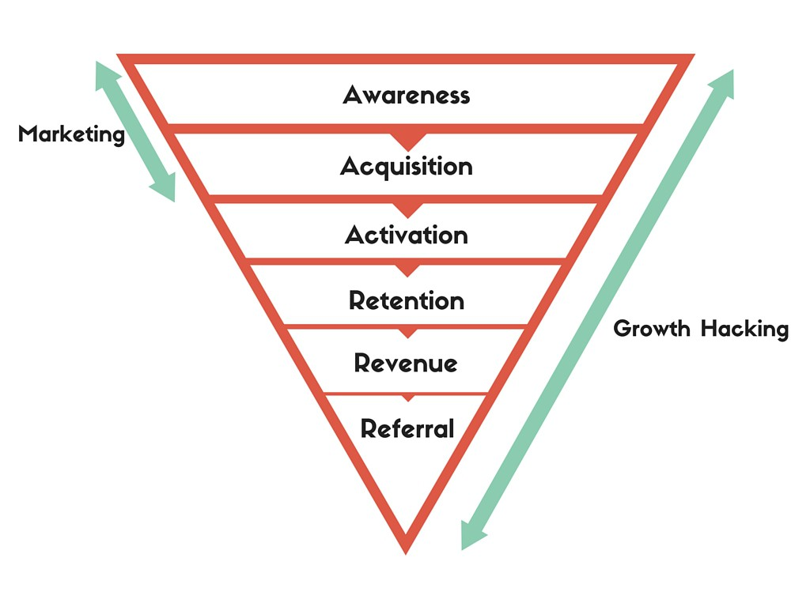

Hi! I hope you are doing well.

I am pretty sure that you have listened about growth hacking.

And then you ask yourself.

**_What is the difference between Growth Hacking and Marketing?_**

I going to clarify today so you will never ask yourself again.

The truth is that marketing has changed so fast in the past 5 years that is hard to keep up. There is not much content out there to explain the difference.

This post is going to give you a basic understanding of the main differences between both.

**Is Growth Hacking the new Marketing?**

Yes

But...

I want to explain you exactly why I say that.

Imagine yourself ten years ago.

Your birthday is in two weeks, and of course, you want a video game for your PS3 (remember it is 2006).

You are looking for an RPG that will give you a legendary experience.

So you buy a couple of magazines to see the latest reviews. You find out a game called The Elder Scroll IV: Oblivion. The screenshots look stunning.

Then you go to check gamespot.com and you find out that they have a banner on the website announcing the game. You click on it and see that they are offering a bonus if you do a pre-order of the game (A Tshirt).

A couple of days later you go to the store to do pre-order of the game.

You came back to your house excited and hoping to get the game one day before the launch.

Now...

I am going to show you the difference.

When we think about marketing for video games we think on the increase of the **awareness** (review magazine/banner GameSpot). And get the people excited about the game so the company can sell as many copies as possible, **customer acquisition**.

**That's marketing.**

Pretty easy, right?

But things has changed a lot. Even video games have experimented a huge change.

When we talk about Growth Hacking applied to video games we are looking for a holistic approach.

Holistic? WT....

This approach tries to involve more that the awareness and acquisition.

If you are familiar with Funnels, I am sure that you see where I am going.

**Marketing** used to focus on the **two top layers of the funnel.**

**Growth** approach focuses on the **big picture of the business.**

The growth team focuses on the increase of a determinate metric that has a higher impact on the business.

The best growth teams are able to interact with any layer of the funnel, looking for the higher area of impact they can focus at the moment.

Marketing teams analyze the entire funnel too, but their main focus is awareness and acquisition.

This new perception of the marketing has been able to happen because in the last 5 years there have been a few huge changes.

## **4 Facts about the rising of Growth Hacking for Video Games**

Data and Software

Companies like [Game Analytics](http://www.gameanalytics.com/), [Mix Panel](https://mixpanel.com/) or [Flurry](https://developer.yahoo.com/) enable to analyze every action during the game.

The data collected provides insights about the behavior of the players that are useful for the company to increase the metrics.

Speed and capability of in-game changes

Related to agile methodologies, the speed of the software development enable the companies to changes things in the game to increase the metrics.

Mobile Devices:

Mobile games have been a huge accelerator. It is known that companies that make mobile games are one of the most advanced companies in terms of understanding player's behaviour.

Ads Networks

Companies like [Facebook](https://developers.facebook.com/products/app-monetization/audience-network/), [Tapjoy](https://home.tapjoy.com/) or [Unity Ads](http://unity3d.com/es/services/ads) are changing the way to advertise. The ability to target consumers with Ads Networks is a game changer and there is a huge market in programmatic advertising going on.

## Growth vs Product

There is another important thing to mention.

Growth teams have the capability to change the product.

Marketing teams don't.

If the Growth team thinks there is an in-game mechanic that should be tested, they have the opportunity to do it and see if results is an increase of the metrics.

They are an active part of the game.

## Conclusion

We can say that Growth Hacking is the evolution of marketing.

The technology allows us to measure every step of the funnel to get a better understanding of the players.

That's why it is amazing to see how we can improve our games by knowing how to interpret the data.

I hope you get a better understand about the difference between both.

_If you are involved in any of the parts of the funnels or have any thoughts about the post, leave a comment bellow_.
