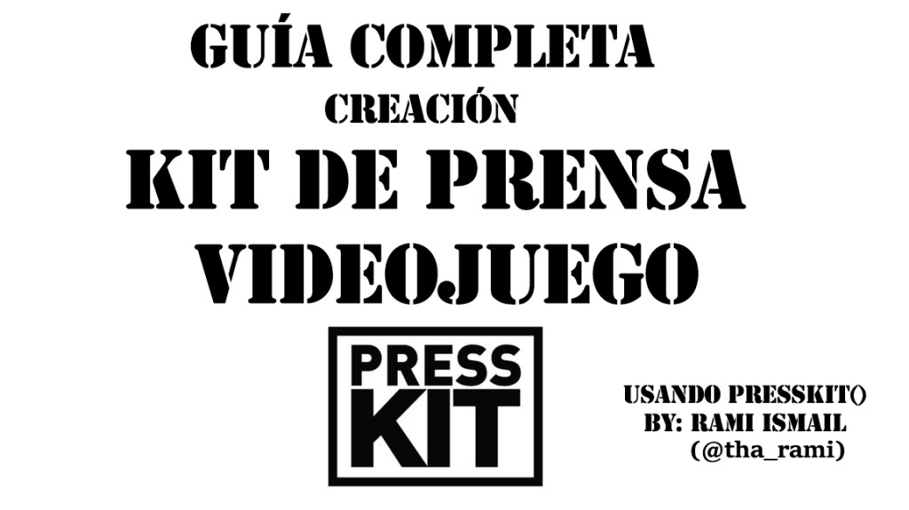

En el mundo de los videojuegos es normal que tras una noche de descontrol con los amigos surja la idea de la creación de un videojuego, la mayoría de las veces el grupo se crea a partir de programadores o diseñadores. Cuando llega el momento de promocionar el juego los integrantes desconocen totalmente el mundo del marketing y suele ocurrir que se convierte en una tarea que implica mucho más tiempo del que se pensaba.

Por ello hoy vamos a ver como crear un Kit de Prensa de videojuego de forma sencilla entendiendo cual es su función, que debemos incluir en él y los aspectos que debemos cuidar al realizarlo. El Kit de Prensa de videojuego que vamos a ver es online.

# ¿Qué es un Kit de Prensa de videojuego?

Un Kit de Prensa de videojuego es un conjunto de información cuyo objetivo es facilitar el trabajo de los medios cuando desean elaborar un artículo relacionado con tu videojuego, en él debemos incluir de forma sencilla toda la información relativa a nuestro videojuego y además generar interés para intentar aumentar la cobertura del título.

Me gustaría enseñaros un par de ejemplos de Kits de Prensa de videojuego bien hechos para que podáis haceros una idea general:

- [Kit de Prensa de Shovel Knight](http://yachtclubgames.com/shovel-knight-press-kit/)
- [Kit de Prensa de Tower of Guns](http://www.towerofguns.com/presskit/sheet.php?p=Tower_of_Guns)

Si ya tenéis la imagen mental de un Kit de Prensa de videojuego podemos pasar al contenido que debe de tener.

## Información esencial que debe contener un Kit de Prensa de videojuego

Existen determinados contenidos que son necesarios en un Kit de Prensa de videojuego, vamos a ver uno a uno dichos elementos haciendo comentarios sobre ellos y tomando como ejemplo [Tower of Guns](http://www.towerofguns.com/presskit/sheet.php?p=Tower_of_Guns) juego creado por el estudio [Terrible Posture Games](http://blankslatejoe.tumblr.com/).

(Podéis ver su [diario de desarrollo](http://blankslatejoe.tumblr.com/) en el link del estudio)

> NOTA: Si pincháis sobre cada elemento os llevará a la parte correspondiente del _Kit de Prensa de videojuego_.

- **[Ficha Técnica](http://www.towerofguns.com/presskit/sheet.php?p=Tower_of_Guns#factsheet)**

En ella debemos reunir todos los datos principales de nuestro videojuego de forma clara y concisa:

- Empresa creadora del juego
- Fecha de lanzamiento
- Página oficial del juego
- Email de contacto
- Redes Sociales
- Plataformas
- Precio

- **[Descripción](http://www.towerofguns.com/presskit/sheet.php?p=Tower_of_Guns#description)**

Es el texto que primero aparecerá, debe de conseguir en pocas frases ilustrar el concepto del juego y hacer que el lector conozca en que consiste. Es importante intentar escribir el máximo de texto en 3º persona de manera que los medios puedan hacer corta y pega directamente y les ahorremos trabajo.

- **[Historia](http://www.towerofguns.com/presskit/sheet.php?p=Tower_of_Guns#history)**

En este apartado escribiremos un párrafo explicando el origen del juego y algunas cosas sobre su desarrollo además podemos incluir referencias a los integrantes del estudio que lo ha creado.

- **[Características](http://www.towerofguns.com/presskit/sheet.php?p=Tower_of_Guns#features)**

Debemos conseguir crear interés mostrando las características únicas que tiene nuestro proyecto.  En el ejemplo de [Tower of Guns](http://www.towerofguns.com/presskit/sheet.php?p=Tower_of_Guns) (pinchar en [Características](http://www.towerofguns.com/presskit/sheet.php?p=Tower_of_Guns#features)) vemos como resaltan la aleatoriedad del juego al no tener escenarios predefinidos, los bonus que existen al hacer determinadas acciones o la rapidez de las partidas.

- **[Videos](http://www.towerofguns.com/presskit/sheet.php?p=Tower_of_Guns#trailers)**

Es un apartado fundamental, como pudimos ver en el post de El combate MOBA del Siglo el contenido visual es el que mejor funciona,  la realización de un buen tráiler es básico para conseguir la atención del lector. Podemos ver el trailer de [Tower of Guns](http://www.towerofguns.com/presskit/sheet.php?p=Tower_of_Guns) y la manera de señalar las mejores características del juego.

<iframe src="https://www.youtube.com/embed/lE8dfwSRsW0" width="560" height="315" frameborder="0" allowfullscreen="allowfullscreen"></iframe>

-  **[Imágenes y Screenshots](http://www.towerofguns.com/presskit/sheet.php?p=Tower_of_Guns#screenshots)**

Otro apartado muy importante, es necesario que las imágenes estén cuidadas y representen la esencia del juego. Los medios las usarán en sus comunicados y queremos dar una imagen acorde al juego.  Las imágenes deben estar renombradas para ser legibles por cualquier persona, además es recomendable crear un .zip para poder descargarlas todas en un click. Podeís ver un ejemplo de como lo ha hecho [Tower of Guns](http://www.towerofguns.com/presskit/sheet.php?p=Tower_of_Guns) a continuación:

\[sociallocker id=770\][www.towerofguns.com/presskit/Tower\_of\_Guns/images/images.zip](http://www.towerofguns.com/presskit/Tower_of_Guns/images/images.zip)\[/sociallocker\]

- **[Logo e Iconos](http://www.towerofguns.com/presskit/sheet.php?p=Tower_of_Guns#logo)**

Al igual que con las imágenes debemos crear un archico .zip para facilitar su descarga. Si damos los logos vectorizados mejor.

- **[Premios y Reconocimientos](http://www.towerofguns.com/presskit/sheet.php?p=Tower_of_Guns#awards)**

En este apartado pondremos los premios o reconocimientos que el estudio o el juego tenga con la finalidad de dar credibilidad al juego.

- **[Artículos Seleccionados](http://www.towerofguns.com/presskit/sheet.php?p=Tower_of_Guns#quotes)**

Si hemos sido mencionados por la prensa podemos incluir links a dichas menciones o incluir las críticas en el propio Kit de Prensa de videojuego.

- **[Links Adicionales](http://www.towerofguns.com/presskit/sheet.php?p=Tower_of_Guns#links)**

Podemos poner links a nuestra página principal del videojuego, a la página de la compañía o a nuestras redes sociales.

- **[Sobre Desarrollador](http://www.towerofguns.com/presskit/sheet.php?p=Tower_of_Guns#about)**

Una pequeña descripción sobre el estudio y las personas que lo componen.

- **[Créditos](http://www.towerofguns.com/presskit/sheet.php?p=Tower_of_Guns#credits)**

Mención al equipo que ha hecho posible el juego y sus respectivas Redes Sociales o emails de contacto.

- **[Contacto](http://www.towerofguns.com/presskit/sheet.php?p=Tower_of_Guns#contact)**

Email de contacto de la persona encargada de las relaciones públicas.

## ¿Cómo hacer un Kit de Prensa de Videojuego?

Existe dos opciones principales, la primera sería crear un Kit de Prensa de videojuego propio haciendo el diseño y la programación nosotros mismo, implicaría mucho tiempo y en un principio no es recomendable. La segunda opción es usar **[presskit()](http://dopresskit.com/)** creado por Rami Ismail ([@tha\_rami](http://twitter.com/tha_rami)) del estudio indie [Vlambeer](http://www.vlambeer.com/). Mediante este Kit de Prensa de videojuego podremos crear uno en muy poco tiempo y con un diseño profesional, éste Kit se ha hecho muy famoso entre los desarrolladores indie y se puede ver que lo usan muy a menudo.

#### **Ventajas de presskit()**

- Bonito, optimizado y eficiente, puedes crear tu kit de prensa en 30-60 minutos.
- Sencillo de configurar si conoces algo de FTP, edición de texto y edición de imagen.
- Sencilla instalación mediante un archivo.
- Creado usando el feedback de medios y desarrolladores indies.
- Integración con [Promoter](http://promoterapp.com/) y [Google Analytics](http://analytics.google.com/).

Como vemos es una opción muy buena, gratuita y sencilla.

## Instalación de presskit()

1-**Descargamos presskit()** desde [su página](http://dopresskit.com/) y obtendremos un archivo .zip llamado dopresskit\_install.zip que debemos **descomprimir**. Al descomprimirlo obtendremos un único archivo denominado **install.php**

2-**Creamos** una **carpeta** vacía en nuestro servidor y **subimos** mediante **FTP** el archivo **install.php** a nuestro servidor.

3-Empieza la **instalación** directamente **desde** el **navegador** mediante el script install.php.

**TIP**: Si has subido install.php a una carpeta llamada press en el servidor de tu página www.pjprueba.com puedes entrar mediante la dirección **http://pjprueba.com/press/install.php** para empezar la instalación.

4-**Sigue** las **instrucciones** en la pantalla. En la instalación se **descargará e instalará todo automáticamente**. Desde ese momento podrás completar los diferentes apartados, no refresques la página, se guardará tu progreso automáticamente. La edición del archivo \_data.xml será la que mayor tiempo te llevará, contiene toda la información, textos y links que usarán los medios

5- **Añade nuevos proyectos**. Cuando hayas terminado de crear tu página de prensa puedes añadir proyectos. Para crear un nuevo proyecto **duplica el archivo \_template** que el script ha creado y **renombralo con el nombre del proyecto**. El nombre del proyecto debe tener las letras minúsculas y los espacios en blanco deben ser sustituidos por barras bajas.

**Tip**: Si tu proyecto se llama **Resume Wars**, debemos renombrar la carpeta duplicada con el nombre **\`\`resume\_wars´´**. El proyecto aparecerá y clikando sobre él podremos completar los pasos necesarios para crear nuestro kit de prensa.

6-**Actualiza tu presskit()**, puedes añadir nuevos ajustes continuamente, para ello puedes **repetir los pasos del 1 al 3**. En vez de encontrarte con la pantalla de instalación te será presentada la **pantalla de actualización** para tus nuevos ajustes.

Como vemos no es muy difícil de realizar, si tenéis dudas también podéis consultar el [manual en pdf](http://dopresskit.com/manual.pdf).

Para terminar me gustaría comentar dos opciones que tiene **presskit()** que lo hacen muy interesante en términos de marketing, la **integración** con **Promoter** y **Google Analitycs**.

**[Promoter](http://www.promoterapp.com/)**

Es una herramienta que nos permite conocer cualquier análisis, mención o noticia que se muestre en Internet sobre nuestro videojuego. De esta manera podremos tener un control de nuestra presencia en Internet. Además **presskit()** nos permite la opción de añadir menciones que nos interesen a nuestro kit de prensa automáticamente, de ésta manera quedan totalmente integrados [Promoter](http://www.promoterapp.com/) y nuestro Kit de Prensa.

Para integrar [Promoter](http://www.promoterapp.com/) con nuestro kit de prensa debemos pinchar en "_Edit"_ para ir a la página de opciones. Una vez allí debemos activar la opción de presskit() integration. Seguimos las instrucciones y editamos el archivo data.xml. Cualquier mención marcada como pública en [Promoter](http://www.promoterapp.com/) será añadida a la página automáticamente.

**[Google Analytics](http://www.google.es/intl/es/analytics/)**

La integración de **presskit()** con [Google Analytics](http://www.google.es/intl/es/analytics/) nos permite conocer las fuentes de tráfico y otra infinidad de datos que nos pueden ser de mucha ayuda.

Para integrar ambos lo único que debemos hacer es entrar en nuestra cuenta en Analytics, buscamos nuestro número de seguimiento ID que debe ser algo como AA-12345678-9 y lo añadimos al archivo data.xml mediante el siguiente tag:

**<analytics>AA-12345678-9</analytics>**

De esta manera podremos obtener una cantidad inmensa de datos.

Espero que os haya gustado y os animéis a montar vuestro propio Kit de Prensa, si tenéis alguna duda podeís contactarme por redes sociales o en el formulario de contacto del blog.
