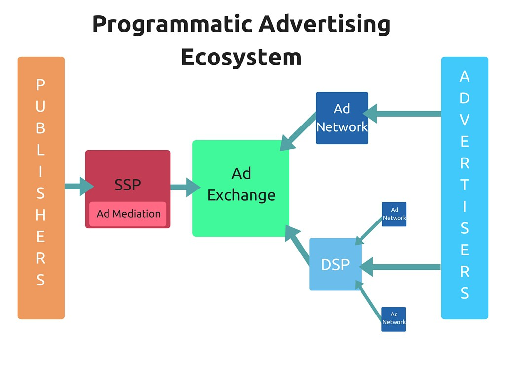

I am sure that you have heard listening about programmatic advertising lately.

But...

**_How can it help you with your video game?_**

Today you will learn how to enter in this market.

There is an incredible world around it, and it seems like most marketers don't really understand how it works.

I don't blame them, it was hard for me to get a good grasp of it too.

Therefore, I think this post will be interesting for a lot of people that wants to understand how this relatively new market works and why it is so important.

## **What is programmatic advertising?**

The simple definition is:

**It is the automated process of media buying/selling using technology.**

The key to programmatic advertising is that it allows companies to nail their target audience while there is no need to have somebody purchasing Ads full-time. Also, the use of programmatic advertising increases the efficiency and decreases the cost of buying Ads significantly.

Let me give you an example.

A car brand puts an Ad on TV.

They try to target their audience by showing it on the channel and time with the majority of their optimal target viewers.

How many people that see the Ads do you think are actually their target? 60%? 30%?

Now imagine another situation.

Same brand, same Ad. But this time, they put the Ad on Facebook and they are able to target their ideal customer.

Male, between 35 and 45, with a management position who lives around urban areas and likes to visit car websites.

_Which Ad do you think would get better results?_

**Programmatic advertising is about targeting the right people.**

That's why [Google reports that 83% of all display buys will be programmatic by 2017](https://www.thinkwithgoogle.com/topics/programmatic.html).

So...

## **Introduction to Programmatic Advertising**

Beaware!

This is not an easy topic to understand.

#### **Explaining the system**

Today's post is going to give you a basic understanding of the different components that integrated into the programmatic advertising market.

There is a blurred line between some of the platforms/services.

Programmatic advertising  is changing so fast that platforms need to integrate services to get ahead.

Let's get started!

## **Where Offer Meets Demand**

### Ad Exchanges

They are a neutral part of the computer system where the Ads are traded. It enables publishers to sell and advertisers to buy Ad space in different media.  Think about it like huge pools of Ad impressions ready to be exchanged (often through real-time bids).

Companies like [Google](https://www.doubleclickbygoogle.com/solutions/digital-marketing/ad-exchange/), [Yahoo](https://advertising.yahoo.com/index.htm) or [AppNexus](http://www.appnexus.com) power these exchanges.

## **Demand Side**

This side represents the marketers, agencies or companies that want to buy Ad impressions.

### Ad Networks

They are marketplaces that connect advertisers with publishers that want to host advertisements. They buy packages of Ad impressions from the Ad Exchanges/publishers and resell them to companies that want to buy Ads.

Ad Networks specialized in video games are [AdColony](http://www.adcolony.com), [Tapjoy](https://home.tapjoy.com/) or [UnityAds](https://unity3d.com/services/ads).

### Demand-side platforms (DSP)

DSPs are technology platforms that aggregate Ad Networks and Ad Exchanges.

DSP help buyers to evaluate and bid for online media on an impression-by-impression basis across multiple sources of inventory.

The main difference between DSPs and Ad Networks is that with DSPs you can control all the ads that you buy in one platform, instead of doing it on various Ad Networks. Also, they provide more data, and it becomes easier to optimize campaigns.

Lately, the line between DSPs and Ad Networks has become blurry because some DSPs have started to offer the same services as the Ad Networks and vice-versa.

Some of the more famous DSPs providers are [Double Click by Google](https://www.doubleclickbygoogle.com), [DataXu](https://www.dataxu.com/) or [AppNexus](https://www.appnexus.com/en).

## **Supply side**

This side is where publisher goes to sell displays for money.

### Supply-side platform

SSPs are used to maximize the price of the ads that publishers offer.

Similar to Demand Side Platforms.

The difference is that while DSPs are used by marketers to buy Ad impressions in a cheaper and more efficient way, SSPs are used by publishers to maximize the selling price of their impressions.

Publishers have the opportunity to let the SSPs manage their inventory, the SSPs connect with the Ad Exchange platforms offering their Ad space for a required amount hoping that somebody will buy it.

Some of the companies that provide this software are [OpenX](http://openx.com/product/ssp/), Rubicon Project or PubMatic.

### Ad Meditation

Ad Mediation are SSPs specially dedicated to mobile apps.

They allow App Developers to find the best Ad Networks to work with.

Some of the Ad Meditation companies are [AerServ](https://www.aerserv.com/),  [Fyber ](http://www.fyber.com/)or [MoPub](http://www.mopub.com/).

## **Data management platforms**

It is the software that storage and analyzes the data related to the buy/sell of Ad impressions.

Some agencies use their own DMP while other use the DMP that integrated with the DSP/SSP.

DMPs provide data to the DSP/SSP to make the best purchase/sell decision possible.

Congrats! You made this far.

This image is a brief summary of the agents that operate on the Programmatic Advertising Market. Between those agents, there is a huge amount of companies that provide services, but I think I should keep it simple for now.

The truth is that there is a huge amount of companies that perform diverse tasks (as retargeting o data supply) between those agents.

As you can see the programmatic advertising ecosystem is complex.

In addition to this, there are private exchanges between both sides of the market too.

In the second part,  I will explain things like Real Time Bids, the different types of Data and other important aspects that you should know in case you want to learn more about programmatic advertising.

_Finally, if you have an experience with programmatic advertisement,  leave your thoughts in a comment bellow._
