 Hey! let me ask you something.

Have you heard about Git?

If you are interested in software engineering like me, you probably did, but you don't know what it is or how to use it.

Today, you will learn how to use Git & GitHub.

Git is a version control system that allows you to keep a constant log of the changes you do in your code.

It can also save your ass if you delete your local files.

Together with Github, it is an amazing way to create your online presence as a developer.

This post is going to teach you a basic workflow so you can start to create your credentials and get familiar with Git and GitHub.

### **Installing Git**

First, we have to install Git.

You can do it from this [link](https://git-scm.com/download/).

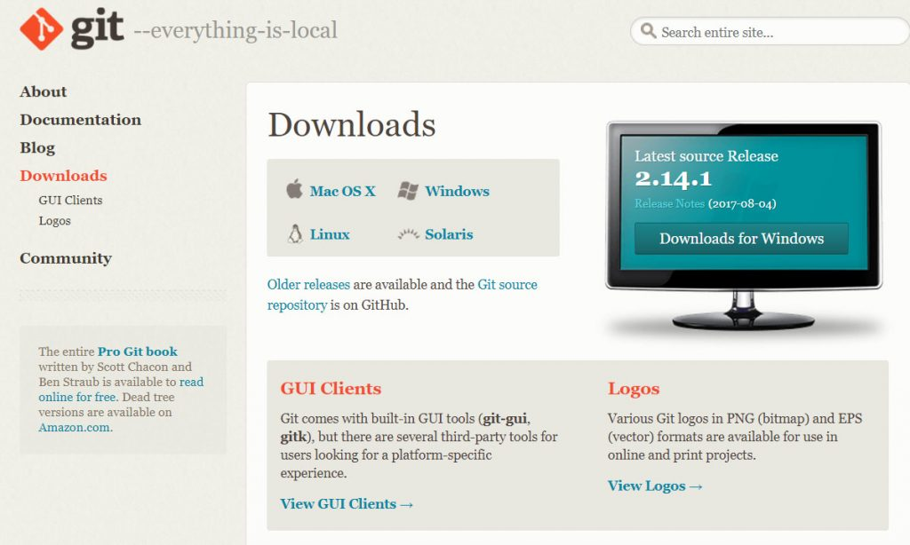

Choose your operating system and install it.

Now GitHub.

### **What is Github?**

Many people think Git and GitHub are the same.

Nope.

You can find the following description in stack overflow:

"**Git** is a free and open source distributed **version control system** designed to handle everything from small to very large projects with speed and efficiency".

"**GitHub** is a web-based **Git repository hosting service**, which offers all of the distributed revision control and source code management (SCM) functionality of Git as well as adding its own features."

You can think about it in terms of Git being the tool, and Github the place where you will store the repositories created with the tool.

Now.

### **Setting up a Github Account**

Go to [Github](https://github.com) and register:

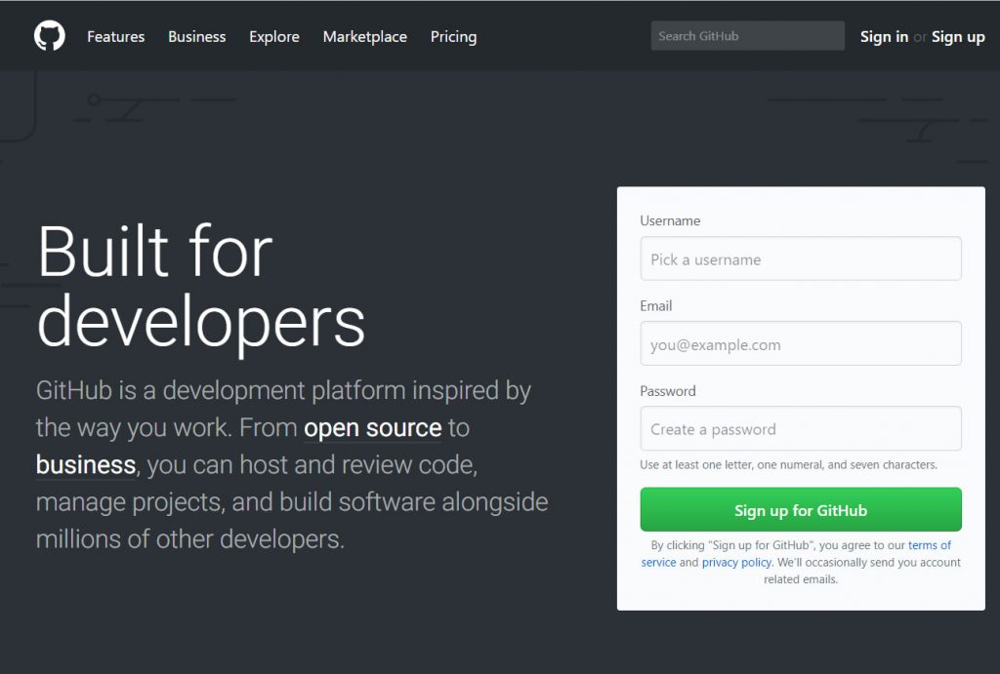

Github will ask you to verify your email.

Go to your email and click verify.

When you are done, you got everything in place to learn the basic workflow.

## **The simplest workflow to start with Git & Github**

This is how we will interact with Git/Github. There are other ways to work with Git & GitHub, in this case, we will focus on one.

Get ready, grab some coffee or cookies or whatever you want and let's go.

## **1- Create a new repository in GitHub**

You can do this by login into Github and go to [github.com](https://github.com/).

Then click on the green button that says **New repository**.

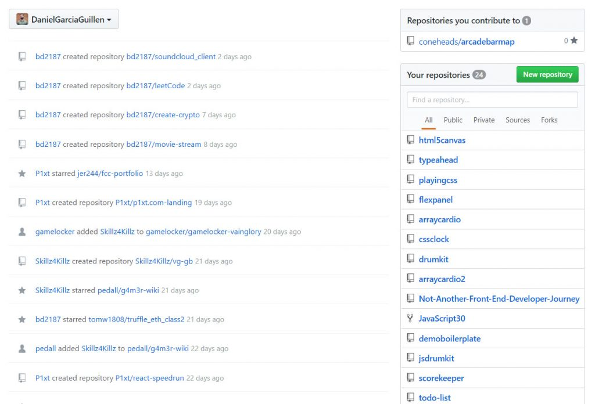

After that, it's going to ask you to enter a name, this is how your repository is going to be called.

Here you can see how I create a repository named **freebeer**.

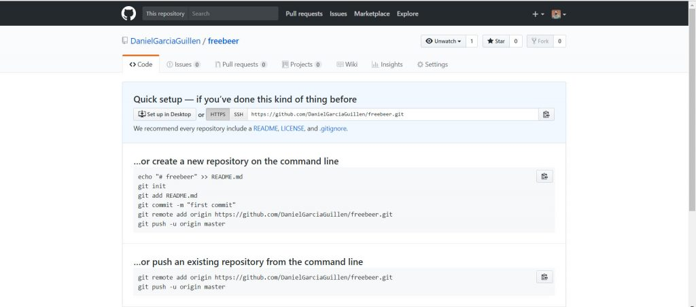

BOOOM!

You have created a repository.

Your repository is on Github(remote), and we want to start working (locally) with it.

Now.

## **2 - Create a folder to store your repo locally.**

To do this, **create a folder** on your computer with the **name freebeer**.

We have to navigate to the folder using the Command Line.

**In Windows:**

Search for command prompt in your start menu.

Once inside, you will have to find the folder you have created.

You need to know these simple commands to find it.

- If you need to access a folder, you will use cd nameofthefolder to access it.
- If you need to go back one folder, you will use cd ..
- If you feel lost, use dir to see the archives that you have in the current folder.

In the next screenshot you can see how I used:

1. cd.. to go back (unnecessary but I want to show you what it does).
2. dir to see the items in the folder.
3. cd Daniel to access the Daniel folder (inside is freebeer folder)
4. cd freebeer to access the freebeer folder

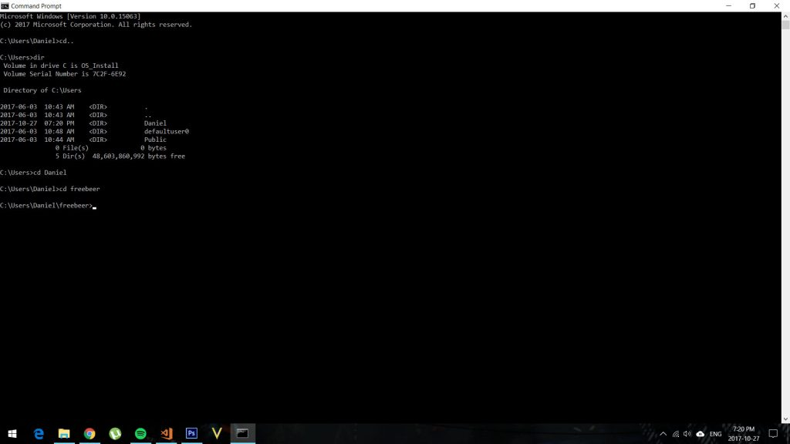

**On Mac:**

Look for terminal in the spotlight bar.

- You need to know these simple commands.
- If you need to access a folder, you will use cd nameofthefolder to access it.
- If you need to go back one folder, you will use cd ..
- If you feel lost, use ls to see the archives that you got in the current folder.

Now you are in the folder freebeer on the command line.

## **3 - Create freebeer repo.**

Now you will follow the same exact instructions that Github showed us before.

echo "# freebeer" >> README.md

git init

git add README.md

git commit -m "first commit"

git remote add origin https://github.com/DanielGarciaGuillen/freebeer.git

git push -u origin master

In the next screenshot, I copy pasted the same text. The entire text.

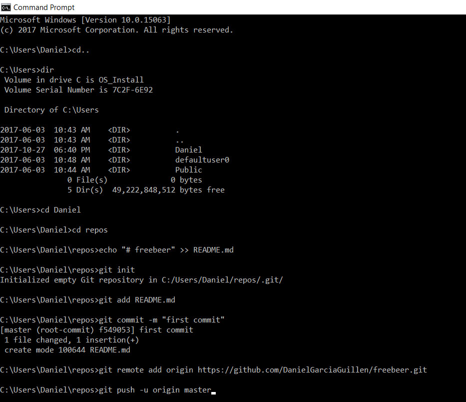

I know there is a lot of stuff that you don't know there, but we will keep it simple for now.

Here is the thing.

When you push enter, you will have created a local repository on the folder and it is now connected to the repository on Github.

I pressed enter, OMG.

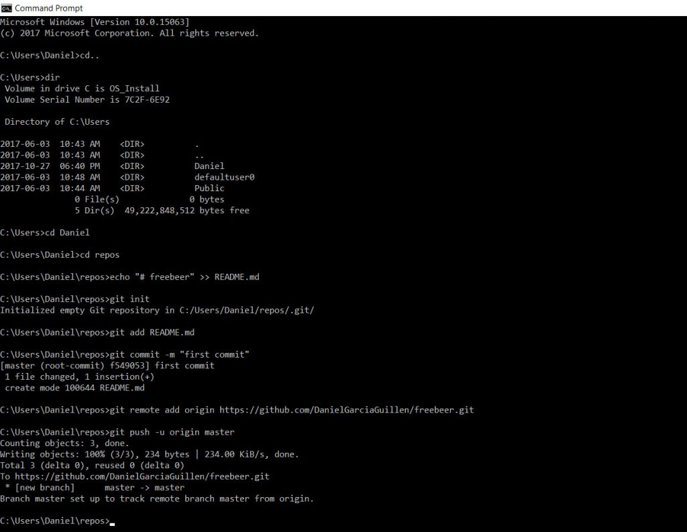
Yeeeea!!

Now go to GitHub and check the repository freebeer.
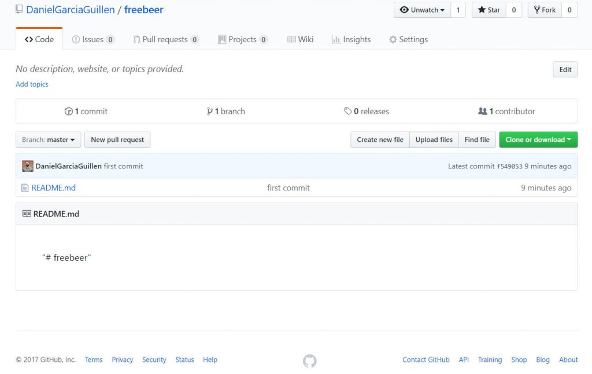

It worked,  we create a local document called README.md in our folder freeber and we sent it to GitHub.

## **5 - A normal day in a developers life**

Now you can open the folder with your code editor and start to work on your project.

We have the README.md inside already.

In our example, we are going to create a basic website with a text.

I create a file called index.html and I add the code to create the website with our text.

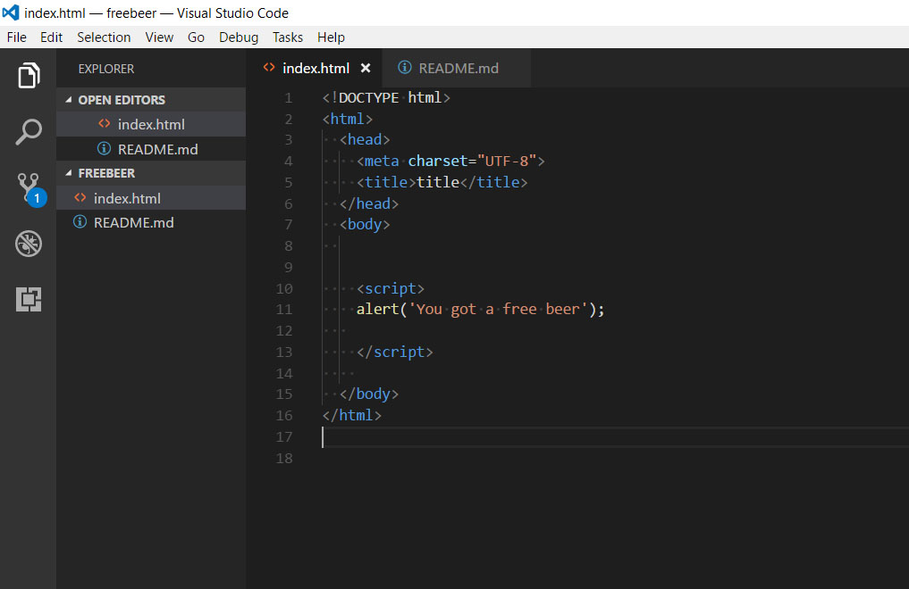

Save the code in your code editor.

You have modified your code locally, now you want to send it to GitHub.

In the command shell, navigate to the freebeer folder. (If you closed the command shell, use the step 2 command to navigate to the folder again).

To send our code to GitHub.

We will use the following workflow:

- Git status to see if there is any change in the code
- Git add to add the items to the local repo.
- Git commit -m "description of the change" to commit the item.
- Git push to send our local repository to our remote repository.

You can see here how I used **git status** to see if the change was saved. It shows how we have an item called index.html that is not added.

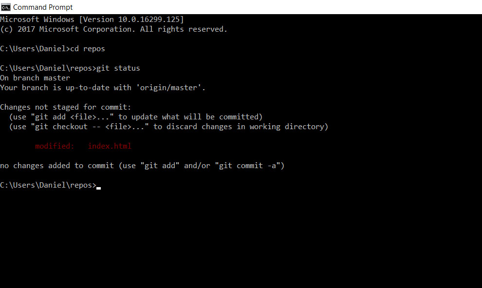

Then I used **git add index.html** to add the document to our local repository.

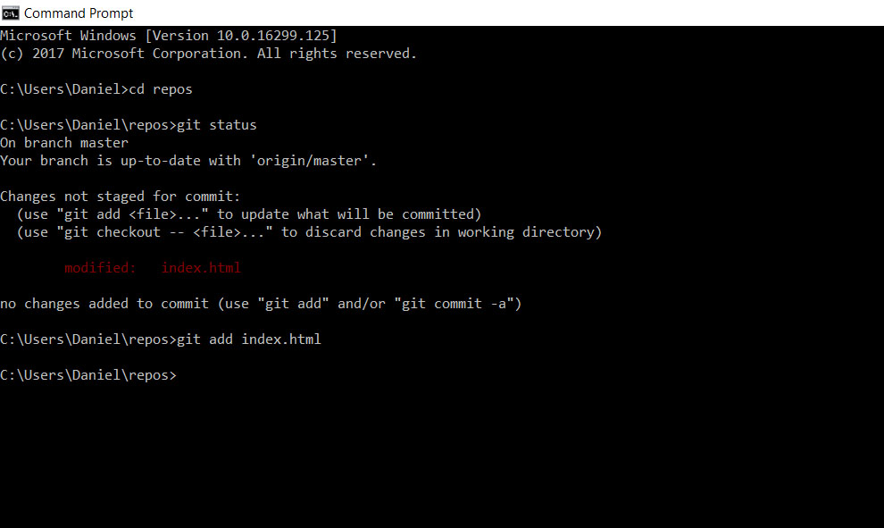

After this step, I commit the change with **git commit -m "**added index to freebeer repository**"**.

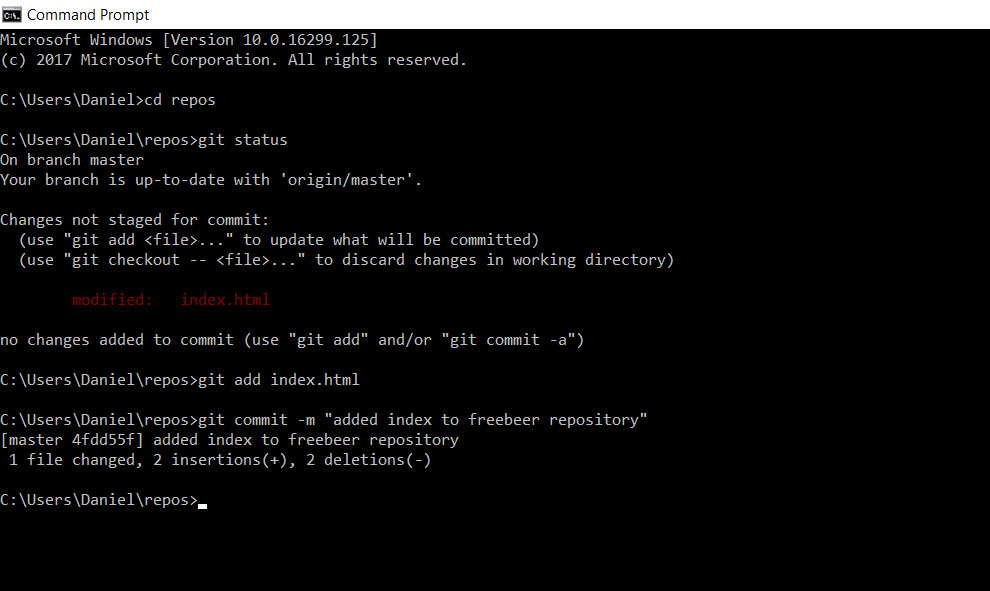

And the last step, I used **git push** to send our local repository to our remote repository on GitHub.

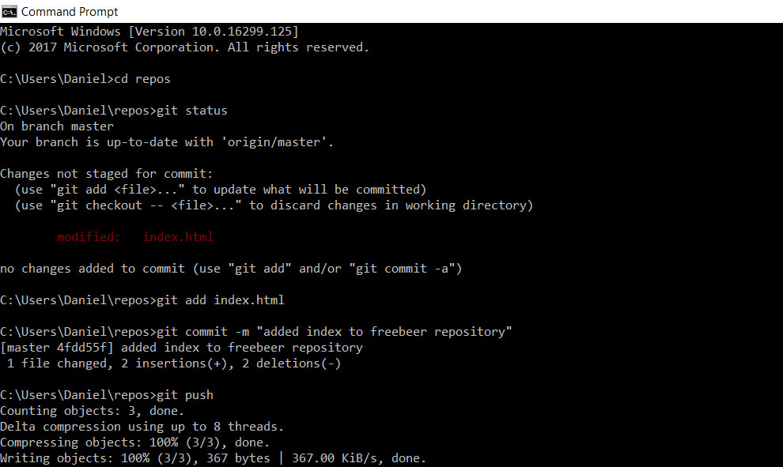

Done!

Now if we check our Github repository we will see that index.html is there.

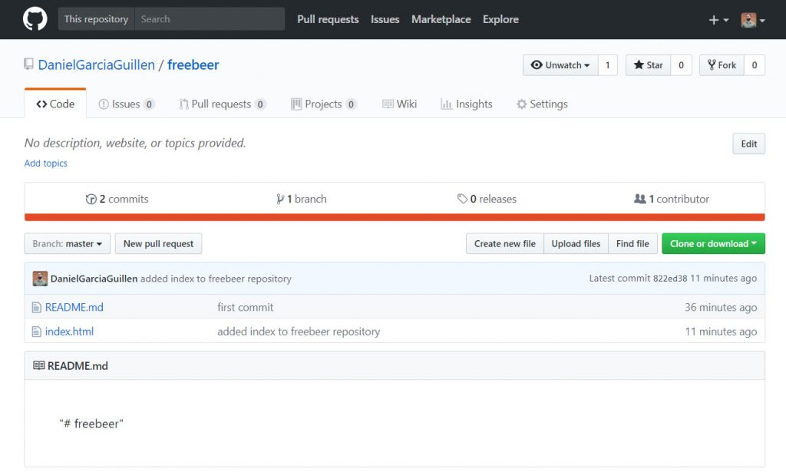

## **Conclusion**

Once you have done this steps, you can keep working and repeat the step 5 to keep your project update in Git & GitHub.

Using Git and GitHub is a fundamental day-to-day part of a developer. If you create a routine where you integrate Git & GitHub in your workflow, even with our simple steps, you can start to feel confident to explore other alternatives.

If you have any questions about this workflow, leave a comment and I will be happy to help you.

## **\# Bonus Github Pages**

Go to the Setting tab on your repo.

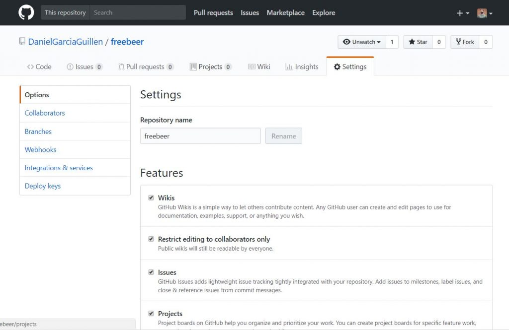

Scroll down until you find GitHub Pages and select master branch.

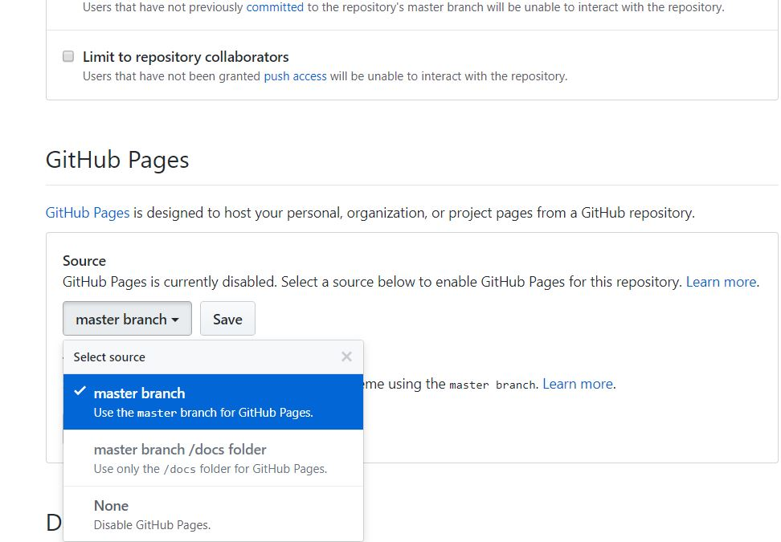

Boom!

Now Github has created a website where the code is executed!

Go to the link and check your website. You are awesome!
