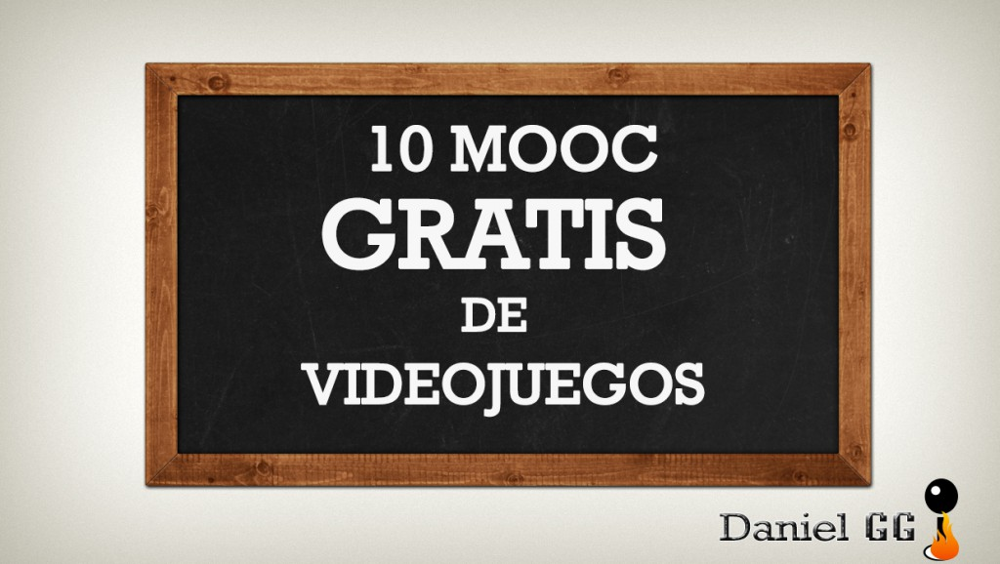
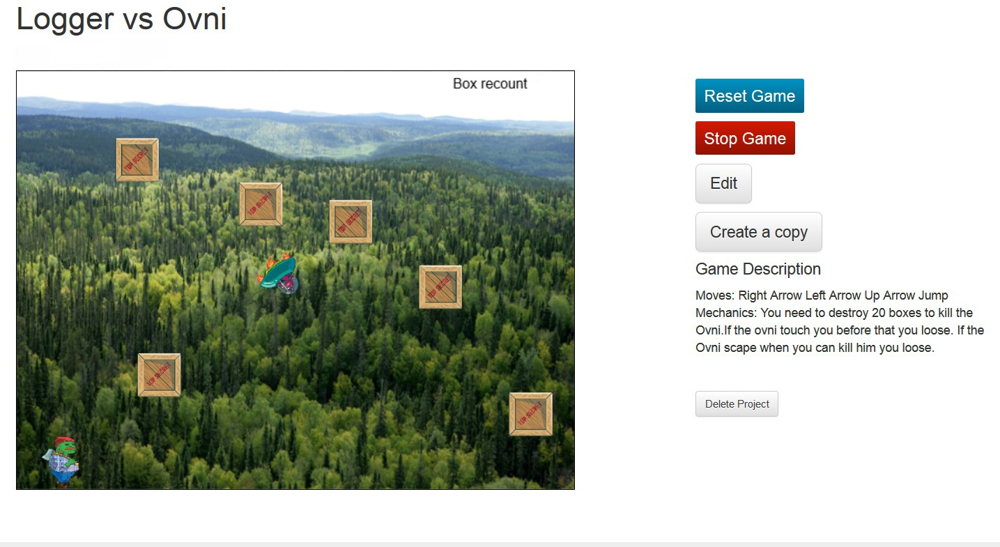

Hoy me gustaría enseñaros unos cuantos MOOC de videojuegos que os permitan mejorar el conocimiento que tenéis.

## MOOC:

Suena a moco si lo dices en español, pero la realidad es que las siglas corresponden a **massive open online course** o curso en línea masivo abierto.Estos MOOC nos permiten acceder a cursos que ofrecen diferentes universidad del mundo de forma gratuita y con temarios muy diversos, en nuestro caso videojuegos.

Por desgracia no existe ningún MOOC relacionado con el marketing aplicado a videojuegos,  sin embargo si existen algunos cursos que nos pueden enseñar facetas de los videojuegos que no estamos acostumbrados a ver como gamers.

Tal vez estés pensando que no merecen la pena, pero créeme si te digo que me han ayudado a ver determinados aspectos de los videojuegos desde otra visión, aun teniendo sus pros y contras.

## Puntos Positivos:

1. Alrededor del MOOC se suele **crear una comunidad** (foros, grupos de steam, guilds etc..) que hacen que el contenido del curso gane mucho, por ejemplo en el curso de [MIT](http://web.mit.edu/) de [Introduction to Game Design](https://www.edx.org/course/introduction-game-design-mitx-11-126x#.VOYDhy719yQ) pude crear un videojuego sencillo sin tener ni idea de programación y **recibir feedback** en el foro para mejorarlo.
2. Me parecen una buena idea para **conocer facetas** que nos interesan pero nos son **desconocidas**, puedes servir como comprobante para ver si te gusta la materia y seguir tras el curso tu aprendizaje.
3. Requieren un tiempo limitado, alrededor de **3-5 horas semanales**, y el **contenido** es plenamente **interactivo**. No te vas a encontrar Pdf´s de 60 páginas que leer. Las universidades crean **vídeos explicativos** por cada tema que hacen los cursos mucho más entretenido.
4. El sistema de corrección en la mayoría de los MOOC (tener en cuenta que hay cientos/miles de alumnos a la vez) se basa en la **corrección de trabajos de tus compañeros**, es interesante ver los puntos de vista de gente de todo el mundo.
5. Poder realizar cursos con **universidades del todo el mundo** es increíble, como comenté antes, en el curso del [MIT](http://web.mit.edu/) te ofrecen un software en la intranet para realizar el videojuego, en otros te ofrecen contenido añadido por si quieres profundizar, en general el **nivel es muy bueno para ser gratuitos**.
6. **Gratis**: por la cara te llevas una formación que presencialmente te valdría unos cuantos euros, además existe la posibilidad de pagar para recibir un certificado en el que se verifica tu identidad, sino lo pagas te dan un certificado que corrobora que has completado el curso.

## Puntos Negativos

1. Los MOOC en su mayoría tienen un **tiempo limitado de realización** de tareas y por ello debes tener la responsabilidad de completar el curso en el plazo estipulado.
2. La **mayoría** están en **Inglés con subtítulos en Inglés**, si no tienes un nivel medio/alto en algunos cursos es complicado seguir el temario. Existen algunos en español como veremos después pero son minoría.
3. En algunos casos como en [Coursera](https://es.coursera.org/) el intento de monetización hace que muchas veces te confundas con las diferentes formas que existen de completar el curso.

En su mayoría estos cursos se alojan en plataformas dedicadas especialmente a ello, os dejo algunas de las más conocidas:

- [Coursera](https://www.coursera.org/)
- [Edx](https://www.edx.org/)
- [Udemy](https://www.udemy.com/)
- Miriada X Español

## 10 MOOC de videojuegos:

Nota: Alguno cursos son en el segundo semestre del año, por lo que os pongo las ediciones pasadas.

## [\-Online Games: Literature, New Media, and Narrative](https://www.class-central.com/mooc/544/coursera-online-games-literature-new-media-and-narrative) Inglés

Este MOOC de la [Univeridad de Vanderbilt](http://www.vanderbilt.edu/) en Estados Unidos fue el primero que hice. Se basa en un **análisis de la narrativa** en los **videojuegos** desde una faceta literaria romántica.

Usando los textos de Tolkien analizan como se traduce el lenguaje de los libros a las películas del **Señor de los Anillos** y al MMO de El Señor de los Anillos Online.

A medida que avanza el curso vas haciendo lecturas de los libros y otros textos además te piden que realices determinadas quest en el videojuego y ver determinados momentos de las películas para comparar como se representa algunos pasajes.

Destacar que se crearon comunidades de ayuda en los servidores de El Señor de los Anillos Online y me ayudaron mucho en la realización de algunas quest que me costaron completar por ser nivel 10 (¡Lowies al poder!). Un ambiente magnífico entre la gente de dichas comunidades con un espíritu de ayuda y de pasarlo bien, ¡incluso celebré el festival de la cerveza ingame con ellos!

Mi opinión personal es que este MOOC merece la pena, a pesar del esfuerzo que hay que realizar para seguir el ritmo, te permite hacer un análisis de la dificultad que representa pasar de un medio de difusión a otro y como se usan determinados elementos de la narrativa para crear videojuegos.

## [\-Introduction to Game Design](https://www.edx.org/course/introduction-game-design-mitx-11-126x#.VOYDhy719yQ) Inglés

Este curso es mi preferido hasta la fecha, lo imparte el [MIT](http://web.mit.edu/). En el curso te van enseñando a lo largo de 6 semanas como desarrollar tu propio videojuego pasando tus ideas del papel al software que ellos te proveen.

Lo que me encantó de este curso fue la posibilidad de crear mi propio videojuego sencillo, a mitad del curso mi concepto no estaba muy claro, pedí feedback en el foro del curso y recibí la ayuda de un chico que me ayudó con determinadas reglas que no sabía ejecutar en el juego. Finalmente tras unos 15 horas de desarrollo nació mi primer videojuego yea!!!

Además este curso tiene el añadido de que en la corrección de los ejercicios puedes jugar a los juegos de los demás y ver algunos auténticos juegazos creados por otros alumnos.

### Mi juego: Logger Vs Ovni

Te pones el la piel de un leñador loco atacado por un Ovni

En el juego tienes que destruir 20 cajas sin que el Ovni te coja, si te coge mueres. Si consigues destruir 20 cajas puedes matar al Ovni pero éste se alejará de ti, si se escapa también mueres. Hardcore eee!! El juego era super frenético, bueno todo lo que podía serlo.

Mi opinión como podéis imaginar es que este MOOC es muy recomendable si quieres ver como se hace un juego sencillo y no tienes ni idea de programación como yo.

## [\-Understanding Video Games (Coursera)](https://www.mooc-list.com/course/understanding-video-games-coursera) Inglés

Este curso es impartido por la [University of Alberta](https://www.mooc-list.com/university-entity/university-alberta)  y realiza un análisis teórico sobre diferentes aspectos de los videojuegos como: mecánicas de juego, historia, teoría interpretativa, cultura de juegos,  violencia, sexo, raza etc..

Yo realicé este curso, personalmente prefiero los cursos que son más prácticos puesto que éste analiza teóricamente los aspectos de éstos. Es recomendable si estas interesado en conocer como se tratan algunos aspectos sociales en los videojuegos.

## [\-Videogames and Learning](https://www.coursera.org/course/videogameslearning) Inglés

MOOC ofrecido por [University of Wisconsin-Madison](http://www.wisc.edu/), no he tenido la oportunidad de hacerlo pero por la descripción y los comentarios de la gente me hace pensar que se basa en el análisis de aspectos sociológicos como el MOOC anterior.

Os dejo por aquí una review publicada en Gecon.es sobre el curso.

## [\-Gamification Desing](https://iversity.org/en/courses/gamification-design-2015) Inglés Abril 2015

A las personas interesadas en Gamificación este curso les vendrá genial, impartido por gente como Isidro Rodrigo y Victor Manrique.  Tiene muy buena pinta y espero poder apuntarme.  Tratarán temas como la experiencia de usuario, el engagement, mecánicas de gamificación o storytelling.

## [\-Robots y Videojuegos en las aulas: Scratch y Arduino para profesores](https://www.mooc-list.com/course/robots-y-videojuegos-en-las-aulas-scratch-y-arduino-para-profesores-mir%C3%ADada-x)  Español

Impartido por la [Universitat Pompeu Fabra](https://www.mooc-list.com/university-entity/universitat-pompeu-fabra) y esta dirigido a profesores relacionados con el ámbito tecnológico y a gente con interés en ver como funciona el programa Scratch y las placas Arduino para el diseño de robots y videojuegos.

## [\-Design and Development of Games for Learning](https://www.edx.org/course/design-development-games-learning-mitx-11-127x#.VOYDii719yQ) Inglés Abril 2015

Ofrecido por [MITx](https://www.edx.org/school/mitx) esta destinado a personas interesadas en el diseño y desarrollo de videojuegos para el ámbito educacional. Dura nueve semanas y se necesitan alrededor de 9 a 10 horas semanales para completarlo.

## [\-Diseño, Organización y Evaluación de videojuegos y gamificación](https://www.mooc-list.com/course/dise%C3%B1o-organizaci%C3%B3n-y-evaluaci%C3%B3n-de-videojuegos-y-gamificaci%C3%B3n-mir%C3%ADada-x) Español

Impartido por la [Universidad Europea de Madrid](https://www.mooc-list.com/university-entity/universidad-europea-de-madrid) este MOOC de videojuegos trata de acercar el diseños y la gamificación a las personas sin conocimientos. Me ha parecido un curso correcto para iniciarse en el mundillo, trata temas como la financiación, el arte o la evaluación.

## [\-Rhetoric and Composition: The Persuasive Power of Video Games as Paratexts (ACC)](https://www.mooc-list.com/course/rgmooc-2-rhetoric-and-composition-persuasive-power-video-games-paratexts-acc) Inglés

Este MOOC trata la temática de la retórica y la persuasión en los videojuegos, los autores del curso ven en los videojuegos un nuevo medio socio-político que tiene impacto en el mundo físico. Impartido por [Arapahoe Community College](https://www.mooc-list.com/university-entity/arapahoe-community-college).

## [\-Serious Game Design and Development](https://www.class-central.com/mooc/2705/iversity-serious-game-design-and-development) Inglés

Este curso intenta explicar como las mecánicas de los videojuegos se pueden usar para enseñar, entrenar, publicitar o cualquier otro fin más serio a parte del entretenimiento.Como en el curso del [MIT](http://web.mit.edu/) el alumno tendrá que construir su propio videojuego a lo largo de las clases contando con el apoyo de la comunidad.

* * *

Como vemos existen varios MOOC de videojuegos sin embargo la mayoría son en inglés y puede suponer un problema, si además alguien conoce algún curso relacionado con videojuegos que me avise por los comentarios y lo añadiré.

Espero que os haya gustado el post, conocer otros aspectos de los videojuegos es una gran oportunidad que nos ofrece este tipo de cursos, sin tener que salir de casa.

EDIT: Acabo de ver la noticia de que Microsoft ha lanzado 6 cursos MOOC con temáticas como construir aplicaciones en la nube o programación C#, podéis consultarlos [aquí](https://www.edx.org/school/microsoft)
