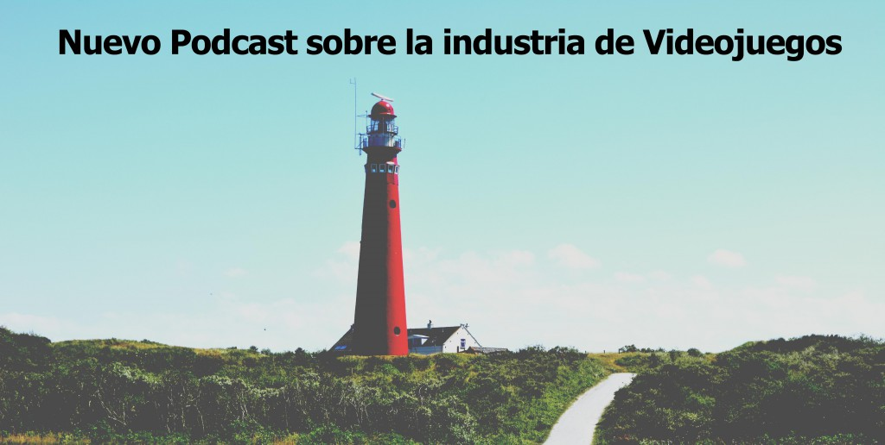

¿Os acordáis del post sobre el primer mes del blog?

Allí comenté que estaba trabajando en un nuevo proyecto del que no podía decir nada hasta ahora. Tras conseguir cerrar algunas cosas me encanta anunciar que:

La primera semana de Junio lanzaré un **nuevo Podcast sobre la industria de Videojuegos donde tendrás la oportunidad de conocer a profesionales de la industria y escuchar de primera mano cómo llegaron a su posición, que motivación se necesita para alcanzar los objetivos o que herramientas usan en el día a día.** Todo ello de forma gratuita y semanal.

Para aquellos que no sepan lo que es un Podcast es un archivo de audio gratuito que puedes escuchar mientras estas haciendo deporte o de camino al trabajo.

# **Podcast sobre la industria de Videojuegos**

Este proyecto me hace especial ilusión por dos factores, el primero por tener la oportunidad de entrevistar a referentes del sector para poder aprender de ellos y entender que actitud/aptitud se necesita para ser un profesional de referencia en la industria. El segundo y más importante es para daros a conocer a todos vosotros esta información y tener la capacidad de ampliar la difusión del contenido.

Me gustaría ir entrevistando semanalmente a diferentes perfiles profesionales para poder ir tomando conciencia de la realidad de la industria de primera mano, para ello os animo a contactarme si pensáis que tenéis contenido interesante que ofrecer o si os gustaría que entrevistase a alguien en concreto.

El Podcast estará subido cada jueves para que podáis disfrutarlo, por lo tanto el próximo día 4 de Junio tenéis una cita con servidor y el primer invitado del Podcast, [José Raluy](https://twitter.com/jose_raluy), Senior Producer de [Mercury Steam](http://es.wikipedia.org/wiki/MercurySteam) y pieza fundamental en la salida de juegos como [Castelavania: Lord of Shadow](http://es.wikipedia.org/wiki/Castlevania:_Lords_of_Shadow). La entrevista a José ha sido una muestra de profesionalidad y saber hacer que seguro os gustará, estad atentos y podréis aprender información muy útil de un profesional como él.

En otro orden de cosas el próximo post de blog tendrá un contenido muy interesante que os hará replantearos el marketing de vuestro videojuegos.

Si no queréis perderos la salida del Podcast ni el próximo post del blog podéis suscribiros y recibiréis un email semanalmente con las actualizaciones del blog y contenido exclusivo por ser suscriptores.

Un saludo gente!
