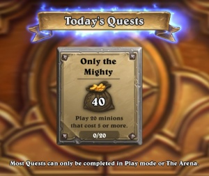
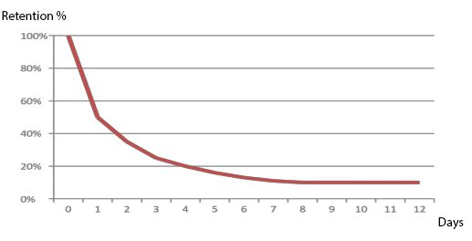

Let me tell you something interesting about the F2P industry.

Most of the games are killed.

Many companies have 10+ teams creating new prototypes, most of them are executed.

I guess you have an idea why...

_Do you really know the reason behind this?_

Nowadays the F2P market is harder than ever, there are 180+ games submitted to the AppStore every day,  big companies want to be sure they nail their next game.

Today I am going to break down one of the first things that companies considered when they want to release a new game.

## Product Market Fit

What does it mean?

_Product Market Fit is when players are highly engaged with the game that you are offering..._

_then, you can start to increase user acquisition._

I know.

How do you measure that?

There are three lead indicators to know if you have achieved Product Market Fit with your game.

**1- Leading Survey**

If you survey your players about the game:

_How many players will be disappointed if they could no longer play your game?_

If 40% or more say _very disappointed_, you have a product close to Product Market Fit.

**2-Leading Indicator & Engagement Data**

What action are players are doing that aligns with the core value of the game?

In a game like Hearthstone could be complete the daily missions.

This lead the players to play more games and get gold to increase the progression in the game, both of them related to the core value that the company wants you to experience.

The third indicator gives companies a very useful insight about the behavior of the players.

**3-Retention Curve**

This curve represents the % of active of players over time on a game. If the curve flats at one point, you have found a market or audience for your game.Most companies focus on achieve a retention curve that reduces the chunk of players, that means you have a product that will become easier to grow later on.

To increase retention there is many mechanics that you can use, I recommend you check this post by Deconstructionoffun.

It is pretty hard to get a good retention curve from the beginning, regularly companies try to test their games before do a full release with a Soft Launch.

## When everything comes together

What if the game has an amazing retention curve, the players are highly engaged with the core value of the product, they spend a lot of time playing every day and they log more that 6 times per day.

Congrats!

You have Product Market Fit and you are ready to get thousand or hopefully millions of players to your game.

As we saw in the [last post](http://danielgguillen.com/growth-f2p/), growth is never done, after reach product market fit your audience is going to be constantly changing, you must keep up working on improving the game.

_What do you think about product market fit? Please share your thoughts in a comments bellow._
