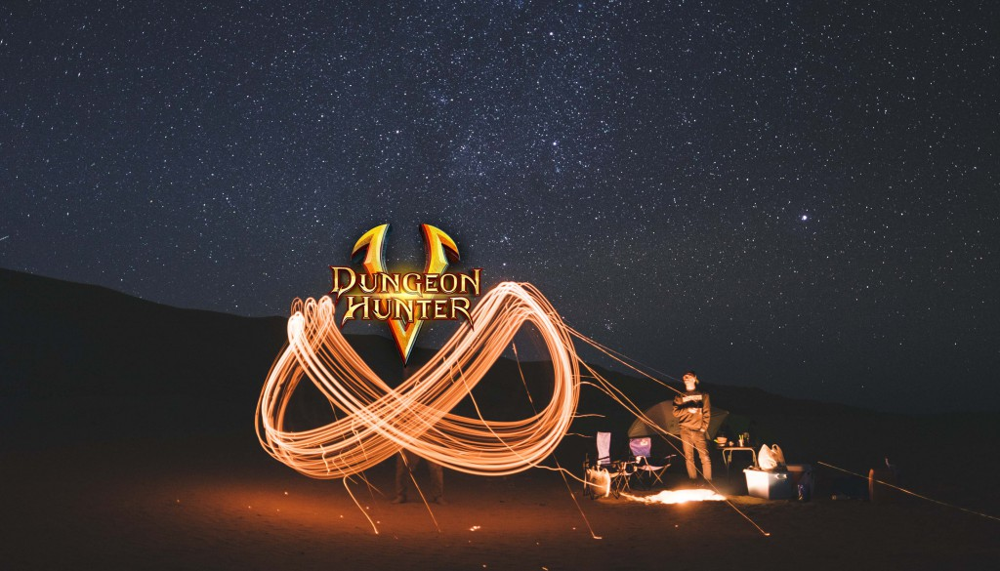
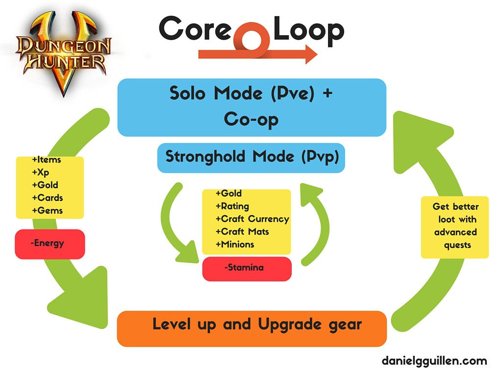

## 

I am sure that you have been thinking about how big companies improve their revenue.

_You want to know how to improve the metrics of a top game, right?_

Today I will show you how, with one of the biggest hits of Gameloft, [Dungeon Hunter 5](http://dungeonhunter5.com/).

The truth is that these companies don’t use any special tactics; rather, it is a process that allows them to achieve little improvements at a time.

It is much more useful to focus on getting little improvements than to look for a big change.

This is because while a big change can be hard to get, little improvements can add a compound effect over time.

In this post, we are looking for those little things that can add little increments on the metrics.

My intention is that you will adopt the same mindset when looking for improvements for your game. That way, you will be able to increase the revenue of your own app.

## **The challenge**

I do not have the metrics to quantify the probability to increase x metric.

In this particular case, I will aim to identify ways to increase the metrics by understanding in-game consumer psychology.

Many times these tests will result in failure, but it's not a problem if you learn and understand why. At the same time, if one of these tests lead to success, we should also know and understand why.

I will analyze how Gameloft drives its players to achieve different goals on Dungeon Hunter 5.

I will then make a hypothesis about some aspects of the game that could lead to improving the metrics.

I hope you enjoy this in-depth essay.

Here we go!

# **Deconstructing DH5 Mechanics**

### **1-First Time User Experience (FTUE)**

This is one of the most critical points in any app.

The onboarding of new players is something dramatically important: [69.3% of the players who uninstall a game is because they didn't enjoy it](http://www.digitalinformationworld.com/2015/09/infographic-why-mobile-apps-are-being-uninstalled.html).

First time user experience should aim to reduce that number as much as possible.

The key goal, at this point, is to get the largest % of people experiencing the core value of the game, as quickly and as often as possible.

Most game companies understand this. That's why instead of a large text explaining the mechanics of the game, they throw you directly into the game.

This is the case with Dungeon Hunter 5.

You can check out the most important things of the onboarding in this video. I summarize the FTUE in a 3-minute video explaining how game companies drive you towards the core value of the game. I sped up some parts.

<iframe src="https://www.youtube.com/embed/56inUJrpn1M" width="560" height="315" frameborder="0" allowfullscreen="allowfullscreen"></iframe>

As you can see, the onboarding is a path designed to get you into the core value of the game as quickly as possible, and hopefully it get you engaged as well.

It is interesting how they highlight all of the rewards that you can get when you beat the boss.

The game is way more complex than this, but you don’t need to know that just yet.

Let's see how does Dungeon Hunter 5 works.

### **2-Core Loop**

After seeing the FTUE, we can get into the Core Loop of the Game. In the first few minutes of gameplay, the game will drive you towards the core loop.

The core loop represents how players define the game and it is the most important thing in the game.

Dungeon Hunter 5 core loop.

The core loop incorporates:

\-Solo, where you can get rewards by doing missions.

\-Stronghold, where you can raid against another player's Stronghold.

(They recently added the co-op mode where you can play with other people).

Both mechanics share most of the rewards, but they serve different purposes. In Stronghold, you can earn ratings to climb up on the global leaderboard, while Solo Mode give you the best items and materials.

### **3-Funnel Analysis**

It is important to do a review of the entire funnel.

I put special attention on the aspects of the game that has more impact on engaging its players.

In the presentation below, you will be able to understand the different ways to impact the behaviour of the players to increase the metrics.

<iframe style="border: 1px solid #CCC; border-width: 1px; margin-bottom: 5px; max-width: 100%;" src="//www.slideshare.net/slideshow/embed_code/key/NoGiyLuUt3kFSJ" width="595" height="485" frameborder="0" marginwidth="0" marginheight="0" scrolling="no" allowfullscreen="allowfullscreen"></iframe>

As you can see, there is a well-established funnel to increase the metrics. Once we are able to fully understand how Dungeon Hunter 5 works, it is time to move on.

# **Experiments to improve DH5 Metrics**

As I discussed earlier, I don't have the opportunity to get more extensive data about the game than I can with [App Annie](https://www.appannie.com/en/apps/ios/app/dungeon-hunter-5/) or [Mobile Action](https://www.mobileaction.co/app/ios/us/dungeon-hunter-5/885823239).

But I created a few experiments that could lead to an increase in the metrics.

These hypotheses are not silver bullets.

They should be tested, and the best way to increase any metric is by understanding the reasons for the success/failure of the test.

## Experiment 1 - New Referral System

**Objective:**

Test if a new referral system could become a new meaningful source of customer acquisition.

**Hypothesis**

If the experiment results in a success, the acquisition of players will increase by x amount.

**Experiment Design**

This system consists of a new referral program where you invite a new friend to play with you. When the new player reaches level 5, the player who sent the invitation will get 3 VIP Ranks instantly. At the end of the month, if the player doesn't invite another player, the VIP Rank is reset. In case the player invites another player the following month, the VIP Rank will increase another 3 VIP Ranks.  At the 3rd month, the player will get VIP Rank 10 (Max) if he has successfully invited 3 other players who have reached level 5.

1. Decide rewards based on achievement and engineer the new system.
2. Create a specific landing page to announce the new referral system + content on social media networks and others.
3. Design content tailored for the promotion + the new interface.

**Metric**

Number of users acquired by the referral system.

**Expected Resources (estimated hours)**

\[su\_table\]

Marketing

Engineering

Design

4

20

3

\[/su\_table\]

**Expected Results**

Increase of Daily Active Users by 4%.

**Gut Feeling (1 to 5)**

4

## Experiment 2 - Highlight more valuable action when player is back from AFK

**Objective:**

Test if highlighting the most valuable action towards monetization increases the ARPDAU.

**Hypothesis**

If the experiment results in a success, the ARPDAU will increase by x amount.

**Experiment Design**

When the player is back from being AFK, we drive them towards the action that is more likely to increase the monetization of the player. First, we need to identify the action that directly drives more revenue and identify the behaviour that we want to promote. As an example, players who play the seasonal mission are more likely to spend money in hard currency, so we need to highlight the new mission/rewards while they are AFK.

1. Talk to data scientist to get insights about the best action to highlight
2. Analyze the best time to show it
3. Create the highlight and test it

**Metric**

ARPDAU

**Expected Resources (estimated hours)**

\[su\_table\]

Marketing

Engineering

Design

0

8

2

\[/su\_table\]

**Expected Results**

Increase of ARPDAU by 1.5%

**Gut Feeling (1 to 5)**

3

## Experiment 3 - Redesign Daily Reward System

**Objective:**

Test if a new daily reward system will increase the retention and time per session.

**Hypothesis**

If the experiment results in a success, the MAU and time per session will increase.

**Experiment Design**

The new daily reward system will be similar to the existing one. The main difference is that if you aren't able to play one day, you have the opportunity to still get the reward. The way to get these daily rewards back must be something that makes the player experience the core value of the game. For example: complete all daily missions.

This system can be used for the daily chest that gives you hard currency too.

This system tries to eliminate the fear to lose daily rewards by hardcore players. A few of them get discouraged from playing, knowing that they can't achieve a determinate daily reward.

Establish a limit per week based on the data.

1. Talk to data science department to get insight about the weekly behaviour of the players.
2. Establish the mechanism of the new system.
3. Engineer the new daily reward system and design.
4. Announcing the new system by creating content and promote it on the usual channels.

**Metric**

MAU and time per session.

**Expected Resources (estimated hours)**

\[su\_table\]

Marketing

Engineering

Design

4

15

4

\[/su\_table\]

**Expected Results**

Increase of MAU by 2% and increase time per session by 2.5%.

**Gut Feeling (1 to 5)**

4

## Experiment 4 - Create chest with limited amount available

**Objective:**

Test if limited amount in a chest can increase the revenue.

**Hypothesis**

If the experiment results in a success, the revenue per seasonal campaign will increase.

**Experiment Design**

The creation of a special chest with a limited amount of global purchases creates a scarcity effect on the players that don't want to miss the opportunity to get it. This chest can contain a higher probability of dropping best items than the normal ones.

The amount should be established with regards to the other seasonal in-game campaign launches.

1. Talk to business performance managers to learn more about the performance of the last campaigns.
2. Establish the amount and items of the new chest.
3. Engineer the chest countdown and the design.
4. Create content specific for the promotion and share it within usual channels.

Investigate if it would be worth it to add a global reward/mission to the entire DH5 player base if the amount of chests available reaches 0.

**Metric**

Revenue per campaign

**Expected Resources (estimated hours)**

\[su\_table\]

Marketing

Engineering

Design

8

20

7

\[/su\_table\]

**Expected Results**

Increase revenue per campaign by 5% and increase the viral effect.

**Gut Feeling (1 to 5)**

3

# How to extract the best learning of the Experiments

### **Success/Fail**

Be prepared for a lot of failures.

The purpose of the experiments is to test a hypothesis.

Don't get discouraged by the failures.

### Impact

How close were you to your predictions, and by how much?

### Why

The most important question.

Why do the experiments succeed or fail?

Asking this question forces you to think about how your users might be reacting to certain experiments that you are running.

It doesn't only generate new learning, but also new experiment ideas, that you can then go ahead and run.

# Conclusion

The great thing about this approach is that you can do it too. Think about a few things that you want to test and put them into action.

But...

Always remember, the most important thing is to learn about your experiments to get a better understanding of your product, customers, and channels.

_Do you have any questions about the analysis or ways to increase the revenue of a game? Leave them below in the comments section._
