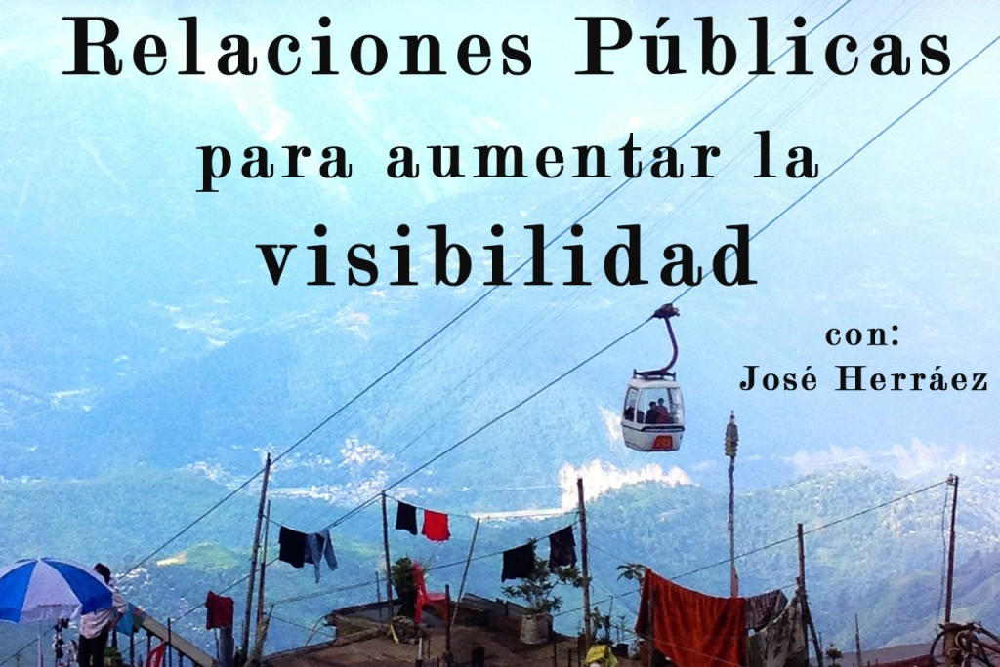

Hoy es un día especial, en el episodio número tres de **[Game Stuff](https://itunes.apple.com/es/podcast/game-stuff/id1001925699?l=en)** tengo el placer de entrevistar a **[José Herráez](https://twitter.com/jherraez)**, PR de **[Tequila Works](http://www.tequilaworks.com/)** y actual encargado de la comunicación de **[Rime](https://twitter.com/RiMEGame)**. Digo que es un día especial porque llevo tiempo siguiendo a José  y creo que es uno de los mejores relaciones públicas en el sector de los videojuegos que existe en España.

En el episodio de hoy José nos dará las claves para entender la labor de un Relaciones Públicas dentro de empresas multinacionales como **[Sega](http://www.sega.es/)** y las diferencias de hacerlo en estudios indie como **[Tequila Works](http://www.tequilaworks.com/)**. Además nos contará qué se necesita para crear un buen plan de comunicación. Otra duda que queda resulta si escuchas el podcast es la gestión de un plan de comunicación sin una fecha fija de lanzamiento, bastante habitual en la industria de videojuegos.

<iframe id="audio_4655891" style="border: 1px solid #EEE; box-sizing: border-box; width: 100%;" src="https://www.ivoox.com/player_ej_4655891_4_1.html?c1=ff6600" width="300" height="200" frameborder="0" scrolling="no" allowfullscreen="allowfullscreen"></iframe>

Como veis, en la entrevista se tratan temas muy interesantes que os serán de utilidad y además de la mano de un profesional como José. Agradecer a José que se mostrase siempre dispuesto a realizar la entrevista, muchas gracias!

Hablando específicamente del **[Game Stuff](https://itunes.apple.com/es/podcast/game-stuff/id1001925699?l=en)** me gustaría agradeceros a todos la buena acogida,  en los dos capítulos anteriores he tenido la oportunidad de conocer vuestras impresiones y estoy muy contento del feedback. Espero poder ir mejorando cada semana e ir trayendo cada vez profesionales más interesantes. Si tenéis alguna recomendación podéis poneros en contacto conmigo en **[danielgg@danielgguillen.com](mailto:danielgg@danielgguillen.com)**.

Además recordaros que si os gusta **[Game Stuff](https://itunes.apple.com/es/podcast/game-stuff/id1001925699?l=en)**  la mejor manera que existe para poder ayudarme y llegar a más gente es darme una valoración de 5 estrellas en **[Itunes](https://itunes.apple.com/es/podcast/game-stuff/id1001925699?l=en)** (si pensáis que se lo merece) o darle a like en **[Ivoox](http://www.ivoox.com/podcast-game-stuff_sq_f1174207_1.html)**. De ésta manera si consigo varias valoraciones conseguiré salir como destacado y será un gran trampolín para el podcast.

En el episodio de hoy hablamos de las siguientes herramientas:

- Cuaderno y bolígrafo, la principal herramienta para no olvidarse de las ideas o reuniones
- **[Hootsuite](http://www.hootsuite.com/)**, gestor de redes sociales
- **[Google](https://www.google.es)** y **[Google Alerts](https://www.google.es/alerts)** para conocer que dicen de tu videojuego

En el episodio de hoy hablamos sobre los siguientes profesionales:

- **Clara Ramírez**
- **Mike Hayes**
- **[Hideo Kojima](http://es.wikipedia.org/wiki/Hideo_Kojima)**

En el episodio de hoy hablamos sobre la siguiente bibliografía:

- **[Todo lo que hay que saber de Videojuegos y Marketing](http://www.amazon.es/gp/product/8493955922/ref=pd_lpo_sbs_dp_ss_3?pf_rd_p=556244407&pf_rd_s=lpo-top-stripe&pf_rd_t=201&pf_rd_i=8473566955&pf_rd_m=A1AT7YVPFBWXBL&pf_rd_r=1Z9WCD1PTSWCT69E8HBX)** de **[Jorge Huguet Rodríguez](http://www.amazon.es/s/ref=dp_byline_sr_book_1?ie=UTF8&field-author=Jorge+Huguet+Rodr%C3%ADguez&search-alias=stripbooks)**  y **[Juan José González López-Huerta](http://www.amazon.es/s/ref=dp_byline_sr_book_2?ie=UTF8&field-author=Juan+Jos%C3%A9+Gonz%C3%A1lez+L%C3%B3pez-Huerta&search-alias=stripbooks)**
- **[Marketing Hero](http://www.amazon.es/Marketing-herramientas-comerciales-videojuegos-profesionales/dp/8473566955)** de **[Juan Carrillo Marqueta](http://www.amazon.es/s/ref=dp_byline_sr_book_1?ie=UTF8&field-author=Juan+Carrillo+Marqueta&search-alias=stripbooks)** y **[Ana Sebastián Morillas](http://www.amazon.es/s/ref=dp_byline_sr_book_2?ie=UTF8&field-author=Ana+Sebasti%C3%A1n+Morillas&search-alias=stripbooks)** 

En el episodio de hoy hablamos de los siguientes videojuegos:

- **[The Witcher 3](http://www.thewitcher.com/)**
- **[Batman: Arkham Knight](https://www.batmanarkhamknight.com/es)**
- **[Metal Gear Solid 5](http://www.konami.jp/mgs5/tpp/certification.php5)**
- **[Army of Two](http://es.wikipedia.org/wiki/Army_of_Two)**
- **[Commando](https://en.wikipedia.org/wiki/Commando_%28video_game%29)**
- **[Valkyria Chronicles](http://es.wikipedia.org/wiki/Valkyria_Chronicles)**
