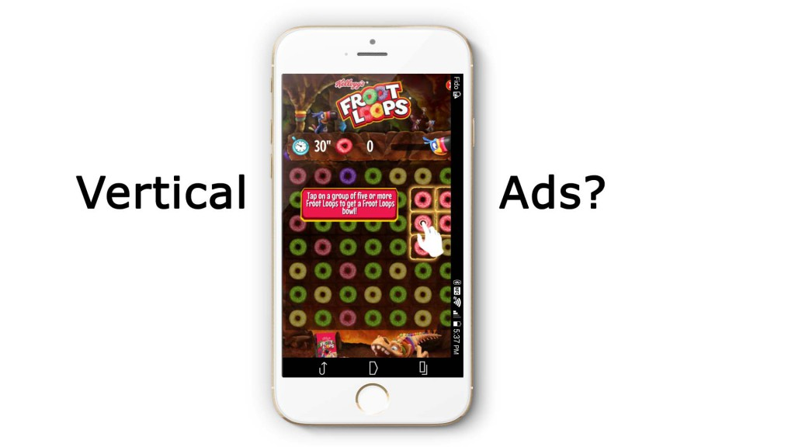
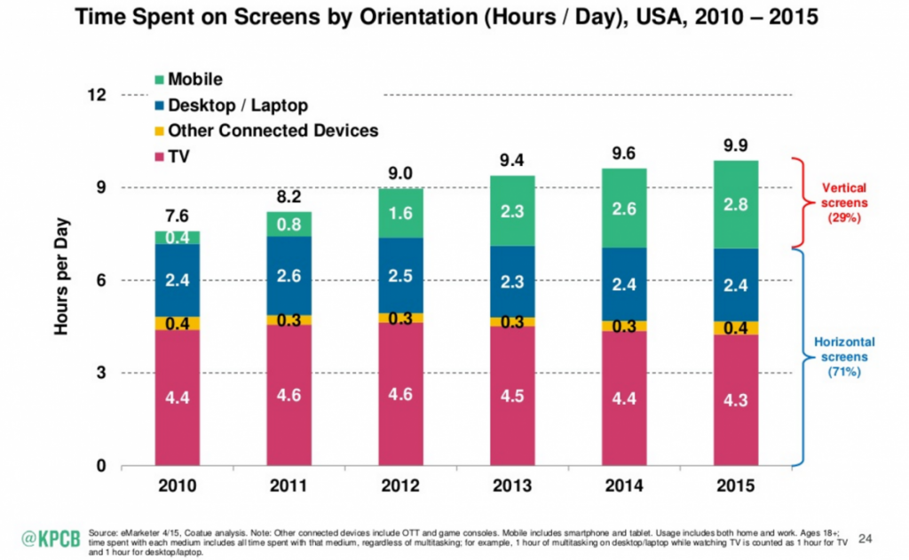

Today's post is going to be short.

**_When was the last time you see a Vertical Ad in a mobile game?_**

Probably you don't remember.

That's because:

1.  It wasn't especially good
2.  It didn't feel native to the vertical screen

But here is the key part.

When a studio set up a marketing strategy sometimes they don't think in the big picture.

It is important that instead of focus on the things that they usually do, they try to get a new approach.

With the rise of the Cost per Installation, they should focus on new ways of getting noticed by customers.

One of the more hot topics lately is creating influencer campaigns.

As an example check [Seriously pos](https://medium.com/@stalbs/taking-youtube-seriously-1191fbd9f0db#.yvum1ipos)t about the influencer campaign they did the last October.

Today I want to share some insights about a new ways to reach your audience.

## Vertical Ads for Video Games

Vertical ads give you the opportunity to create specific ads that fit the entire screen on mobile devices.

In fact, full-screen vertical video ads on Snapchat have a 9x completion rate vs Horizontal Mobile Ads ([Source](http://www.slideshare.net/kleinerperkins/internet-trends-v1/25?src=clipshare)).

Also, there is an increase in the time spent in the vertical orientation. The main reason is the increase of mobile devices as you can see bellow.

Another important factor is the use that millennials do of social platforms like [Periscope](https://www.periscope.tv/) and [Snapchat](https://www.snapchat.com/). These platforms are specially designed for vertical content.

[IGN](http://ca.ign.com/articles/2015/08/26/ign-is-coming-to-snapchat) is taking advantage of the rise of Snapchat and is focusing on creating content specially design for the platform. This strategy is particularly useful when the 60% of the users of [Snapchat](https://www.snapchat.com/) are millennials.

If you want to see how vertical content is getting powerful, download [Snapchat](https://www.snapchat.com/) and check IGN channel.

## Conclusion

Vertical Ads shouldn't be ignored if you are trying to engage with millennials.

Create native content to mobile devices could be a new way to reach your target audience.

_If you have any question or experience related to this type of content, leave a comment bellow._
