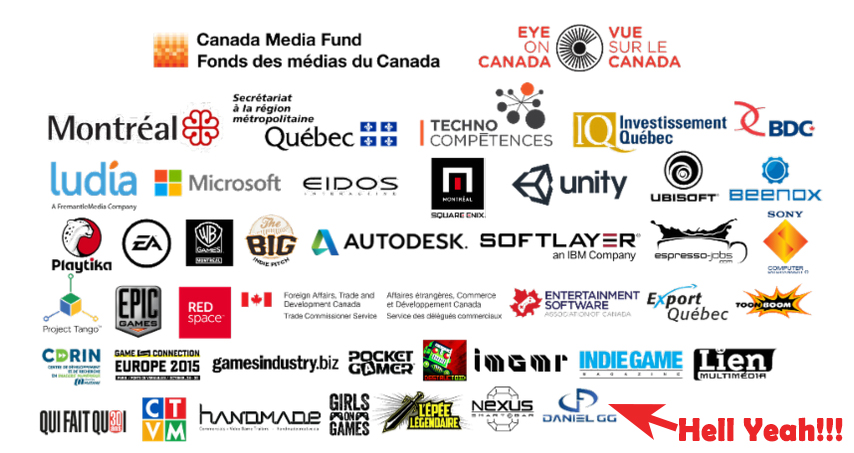
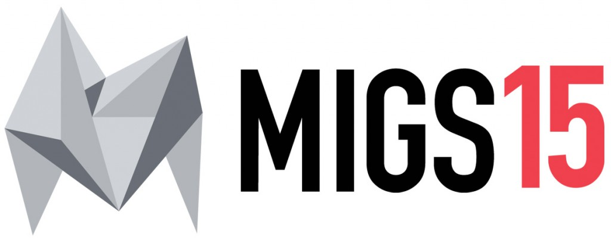

Hola a todos, en el post de hoy quiero daros un poco de info sobre la conferencia a la que voy a asistir la próxima semana.

La [Montreal International Game Summit](http://migs15.com/en/) es una conferencia de videojuegos dedicada a profesionales que se celebrará del 15 al 17 de Noviembre. He tenido la oportunidad de conseguir un pase de prensa y tengo la intención de realizar una cobertura del evento para que podáis conocer tanto la organización como las novedades que se presenten en la feria.

La página web del evento se encuentra [aquí](http://migs15.com/en/).

Al evento van a asistir figuras muy potentes y voy a intentar realizar entrevistas al estilo de Game Stuff (algo mas cortas) para conocer la opinión y la experiencia de profesionales del sector de videojuegos. Algunos de los asistentes a la conferencia son:

- [Tania Short](http://migs15.com/en/speakers/77-tanya-short), desarrolladora Indie que tras realizar un kickstarter de éxito dentro de poco lanzará [Moon Hunters](http://niveloculto.com/moon-hunters-forja-tu-leyenda/).
- [Jason DellaRoca](http://migs15.com/en/speakers/183-jason-della-rocca), veterano de la escena de videojuegos, director de [IGDA](https://www.igda.org/) durante 9 años, actualmente dirige la aceleradora de videojuegos [Execution Labs](http://executionlabs.com/).
- [Ben Kane](http://migs15.com/en/speakers/269-ben-kane), desarrollador Indie que se hizo conocido por [DLC Quest](http://store.steampowered.com/app/230050/?l=spanish).
- [Vander Caballero](http://migs15.com/en/speakers/319-vander-caballero) CEO de [Minority Media](http://www.weareminority.com/), creadores de [Papo & Yo](http://niveloculto.com/analisis-papo-yo/).
- [Steve Escalante](http://migs15.com/en/speakers/225-steve-escalante) jefe de publishing en Versus Evil que lanzarón [BEDLAM](http://niveloculto.com/analisis-bedlam/).

Estoy seguro que la conferencia va a ser increíble y voy realizar una buena cobertura sobre ella. Tengo pensando realizar algunos [Periscope](https://www.periscope.tv/)  para que podáis ver en directo los juegos y conferencias, para ello podéis seguirme en [Twitter](https://twitter.com/dangguillen) y os avisará automáticamente de cuando esté en directo.

Además quiero anunciar que gran parte de la cobertura del evento la podréis seguir en [niveloculto.com](http://niveloculto.com/).

Un saludo cordial.
