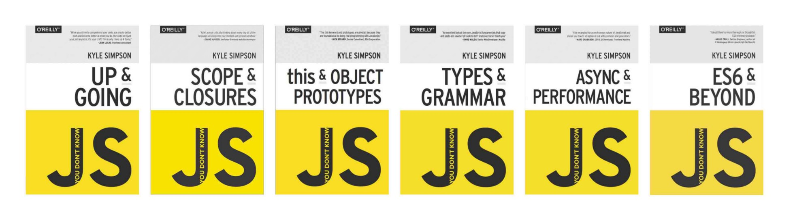

Hey!

I am giving the second lecture to this books, [You don't know JS by Kyle Simpson.](https://github.com/getify/You-Dont-Know-JS)

Having a deep understanding of Javascript is mandatory if you want to become a front-end developer.

Everybody (including me) wants to see stuff on the screen, objects moving etc.. but at the end, what we do is work in Javascript and sometimes we have to stop and get back to basics to cement the principles of the language.

That's why I am reading for the second time the You Don't Know JS books.

They are truly awesome, the author explains concepts super clearly and with examples.

I feel like I would get much more value if after reading them  I do a small post as a reminder of the subjects that I believe are important.

And hopefully, you will find it useful too.

In case you want to check the series, you can read it for free on [GitHub](https://github.com/getify/You-Dont-Know-JS).

## JS: Up and Going

### **Executing a program**

When you write a statement like a = b \* 2, the computer doesn't understand it per se.

The way the computer understand this information is either using an interpreter or a compiler to translate the code to commands a computer can understand.

In some computer languages, the translation of code is typically line by line from top to bottom, which is called interpreting the code.

Other languages compiled the code ahead of time so the program runs later.

Even tho Javascript is thought to be interpreted,  Javascript actually compiles the program on the fly and then run the compiled code.

### **Values & Types**

These are the built-in types of values in javascript:

- String
- Number
- Boolean
- Null and Undefined
- Object
- Symbol (new ES6)

You can use typeof to examine a value and check what type it is.

_var a = 2;_

typeof* a  "number"*

When using typeof, it doesn't ask for the type of the value a is, but rather for the type of value currently in a.

Only values have types in Javascript, variables are just simple containers for those values.

Also interesting is that typeof null will return "object" instead of "null". This is a bug from javascript that is more likely to never get fixed.

### **Coercion **

When you have operands of an operator that are a different type, how does javascript deal with them?

It would try to convert one of them to the equivalent value of the other to be able to compare them.

There are two different types of coercions, explicit and implicit.

**Explicit coercion** is the conversion form of one type to the other in a simple way, like :

_var a  =  "20";_

_typeof a; "string"_

_var b = Number(a);_

_typeof b; "number"_

**Implicit coercion** is when the type of conversion can happen as more of a non obvius side effect of some other operation.

_var a = "22";_

typeof _a;  "string"_

_var b = a \*2;_

typeof _b: "number"_

### **Thuthy & Falsy**

In Javascript, there is values that have a truthy & falsy nature.

Falsy values:

- "" (empty string"
- 0, -0, NaN (invalid number)
- null, undefined
- false

Any other value that is not in the falsy list it would be truthy.

### **Equality**

There are four equality operators: ==, ===, != and !==.

The difference between == and === is that == check for value equality and === check for both value and type equality.

**When to use == or ===:**

- If either value in a comparison could be the true or false value, avoid == and use ===.
- If either value in a comparion could be of these especific values (0, "", or \[ \]), avoid == and use ===.
- In all other cases, use ==.

### Conclusion

If you want to learn Javascript, this series of books are awesome.

Next one on the list, Scope & Closures.
